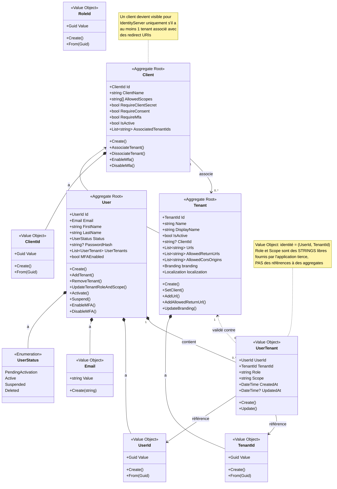
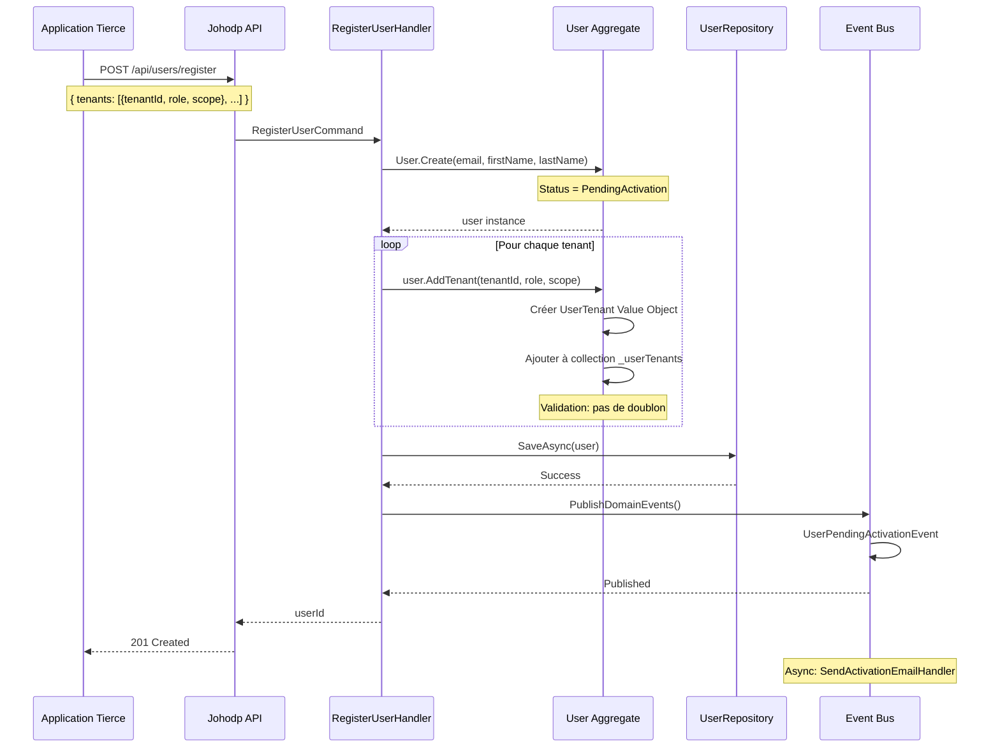
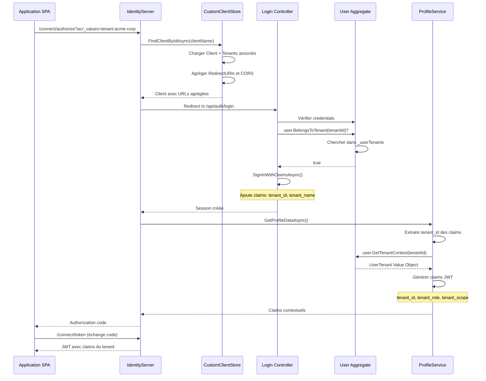
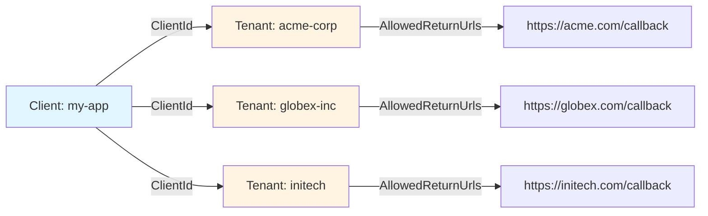
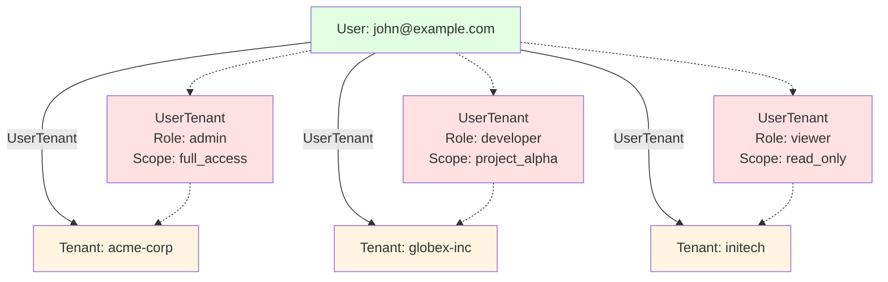
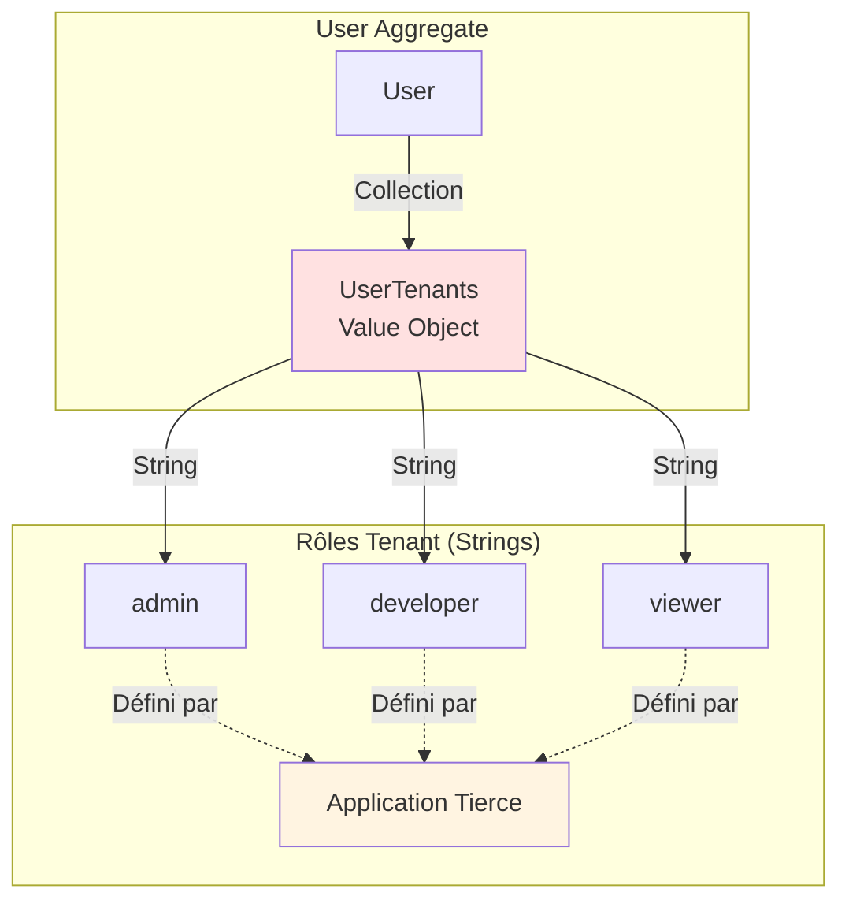
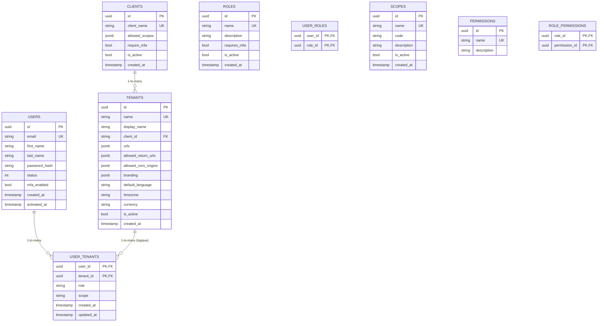
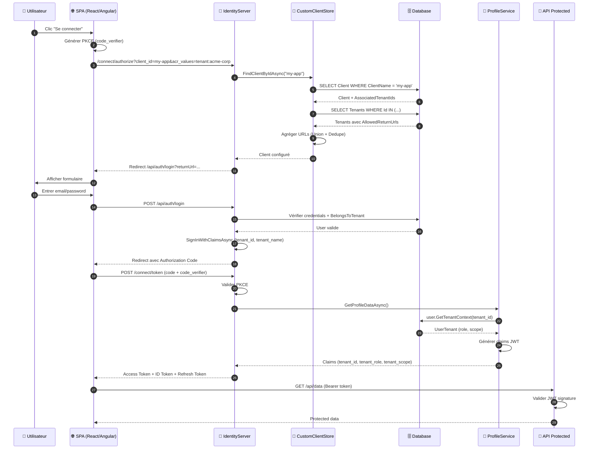

# Modèle de Domaine Johodp

## Vue d'ensemble des relations

## Diagramme de séquence : Création d'utilisateur multi-tenant

## Diagramme de séquence : Connexion avec tenant spécifique

## Relations clés

### 1. Client ↔ Tenant (1-to-many)

**Règles** :
- Un Client peut avoir plusieurs Tenants
- Un Tenant appartient à UN SEUL Client
- Les redirect URIs sont gérées au niveau Tenant
- IdentityServer agrège dynamiquement les URIs de tous les tenants

### 2. User ↔ Tenant (many-to-many via UserTenant)

**Règles** :
- Un User peut appartenir à plusieurs Tenants
- Chaque association a un **Role** et un **Scope** distincts
- UserTenant est un **Value Object** (identité = combinaison UserId + TenantId)
- Role et Scope sont des **strings libres** (pas de validation stricte)

### 3. User : Rôles tenant uniquement

**Note importante** :
- **Rôles tenant** (`UserTenant.Role`) : Strings libres pour l'application tierce
- Johodp n'a PAS de rôles système internes
- L'application tierce décide de tous les rôles et leur signification

## Architecture persistance

## Flux OAuth2 complet avec architecture

## Règles métier clés

### ✅ Client

1. Un Client sans Tenant n'est **pas visible** pour IdentityServer
2. Les redirect URIs sont **agrégées** depuis tous les tenants associés
3. Un Client peut avoir `RequireMfa = true` pour forcer MFA sur tous ses utilisateurs

### ✅ Tenant

1. Un Tenant **doit** avoir au moins une `AllowedReturnUrl` pour être opérationnel
2. `Name` est normalisé en lowercase et doit respecter le format `[a-z0-9-]+`
3. Les CORS origins sont des URIs d'**autorité uniquement** (pas de path)

### ✅ User

1. Un User ne peut pas se connecter à un Tenant s'il n'a pas de `UserTenant` correspondant
2. Le JWT contient **uniquement** les claims du tenant de connexion (isolation)
3. MFA peut être activé par utilisateur via `MFAEnabled`

### ✅ UserTenant

1. **Value Object** : son identité est la combinaison `(UserId, TenantId)`
2. `Role` et `Scope` sont des **strings libres** fournis par l'application tierce
3. Pas de validation stricte : l'application tierce décide des valeurs

## Points d'attention DDD

| Concept | Type DDD | Justification |
|---------|----------|---------------|
| User | Aggregate Root | Frontière transactionnelle, a son propre cycle de vie |
| Tenant | Aggregate Root | Frontière transactionnelle, configuration indépendante |
| Client | Aggregate Root | Frontière transactionnelle, configuration OAuth2 |
| UserTenant | **Value Object** | Identité = (UserId, TenantId), pas d'ID propre |
| Email | Value Object | Immuable, égalité par valeur |
| ClientId, TenantId, UserId | Value Object | Strong typing, validation |
| UserStatus | Enumeration | Ensemble fini de valeurs avec comportement |

## Glossaire

- **Aggregate** : Cluster d'entités avec une racine et une frontière transactionnelle
- **Value Object** : Objet sans identité propre, défini par ses attributs
- **Entity** : Objet avec identité unique persistante
- **Domain Event** : Événement métier significatif (UserActivatedEvent, etc.)
- **Invariant** : Règle métier qui doit toujours être vraie
- **Ubiquitous Language** : Vocabulaire partagé entre dev et métier
