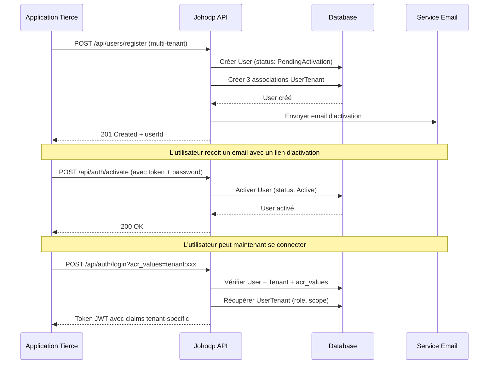

# API de création d'utilisateur multi-tenant

## Vue d'ensemble

L'API permet maintenant de créer un utilisateur et de l'associer à **plusieurs tenants en une seule requête**, avec un **role** et un **scope** spécifiques pour chaque tenant.

## Endpoint

```
POST /api/users/register
Content-Type: application/json
```

## Structure de la requête

### Format complet (multi-tenant)

```json
{
  "email": "user@example.com",
  "firstName": "John",
  "lastName": "Doe",
  "tenants": [
    {
      "tenantId": "guid-tenant-1",
      "role": "admin",
      "scope": "full_access"
    },
    {
      "tenantId": "guid-tenant-2",
      "role": "user",
      "scope": "read_only"
    },
    {
      "tenantId": "guid-tenant-3",
      "role": "manager",
      "scope": "department_sales"
    }
  ]
}
```

### Format legacy (single tenant - backward compatibility)

```json
{
  "email": "user@example.com",
  "firstName": "John",
  "lastName": "Doe",
  "tenantId": "guid-tenant-1"
}
```

**Note**: En mode legacy, le système ajoute automatiquement `role="user"` et `scope="default"`.

## Propriétés

| Propriété | Type | Requis | Description |
|-----------|------|--------|-------------|
| `email` | string | ✅ | Email de l'utilisateur (unique) |
| `firstName` | string | ✅ | Prénom |
| `lastName` | string | ✅ | Nom |
| `tenants` | array | ❌ | Liste des associations tenant-role-scope |
| `tenantId` | guid | ❌ | GUID du tenant (legacy, deprecated) |

### Structure `UserTenantAssignment`

| Propriété | Type | Requis | Description |
|-----------|------|--------|-------------|
| `tenantId` | guid | ✅ | GUID du tenant |
| `role` | string | ✅ | Rôle fourni par l'application tierce |
| `scope` | string | ✅ | Périmètre/Scope fourni par l'application tierce |

## Réponse

### Succès (201 Created)

```json
{
  "userId": "guid-user",
  "email": "user@example.com",
  "status": "PendingActivation",
  "tenantCount": 3,
  "message": "User created successfully. Activation email will be sent."
}
```

### Erreurs

| Code | Description |
|------|-------------|
| 400 | Requête invalide (email manquant, role/scope vide, etc.) |
| 409 | L'email existe déjà |
| 500 | Erreur serveur |

## Flux complet



## Claims JWT générés

Lors du login sur un tenant spécifique, le token JWT contient :

```json
{
  "sub": "guid-user",
  "email": "user@example.com",
  "given_name": "John",
  "family_name": "Doe",
  "tenant_id": "guid-tenant-1",
  "tenant_role": "admin",
  "tenant_scope": "full_access"
}
```

**Important** : Le token contient **uniquement** les claims du tenant sur lequel l'utilisateur s'est connecté.

## Exemples d'utilisation

### 1. Utilisateur multi-tenant avec rôles différents

**Cas d'usage** : Un consultant qui travaille pour plusieurs clients

```json
{
  "email": "consultant@agency.com",
  "firstName": "Jane",
  "lastName": "Smith",
  "tenants": [
    {
      "tenantId": "client-a-guid",
      "role": "architect",
      "scope": "project_alpha"
    },
    {
      "tenantId": "client-b-guid",
      "role": "developer",
      "scope": "project_beta"
    },
    {
      "tenantId": "client-c-guid",
      "role": "reviewer",
      "scope": "all_projects"
    }
  ]
}
```

### 2. Employé avec accès à plusieurs départements

**Cas d'usage** : Un manager qui gère plusieurs départements

```json
{
  "email": "manager@company.com",
  "firstName": "Bob",
  "lastName": "Johnson",
  "tenants": [
    {
      "tenantId": "dept-sales-guid",
      "role": "manager",
      "scope": "region_north"
    },
    {
      "tenantId": "dept-marketing-guid",
      "role": "viewer",
      "scope": "all_campaigns"
    }
  ]
}
```

### 3. Support technique multi-client

**Cas d'usage** : Agent de support avec accès limité à plusieurs clients

```json
{
  "email": "support@provider.com",
  "firstName": "Alice",
  "lastName": "Brown",
  "tenants": [
    {
      "tenantId": "customer-1-guid",
      "role": "support_agent",
      "scope": "tickets_only"
    },
    {
      "tenantId": "customer-2-guid",
      "role": "support_agent",
      "scope": "tickets_only"
    },
    {
      "tenantId": "customer-3-guid",
      "role": "support_agent",
      "scope": "tickets_only"
    }
  ]
}
```

## Gestion après création

### Ajouter un nouveau tenant

```http
POST /api/users/{userId}/tenants
Content-Type: application/json

{
  "tenantId": "new-tenant-guid",
  "role": "viewer",
  "scope": "read_only"
}
```

### Modifier role/scope d'un tenant

```http
PUT /api/users/{userId}/tenants/{tenantId}
Content-Type: application/json

{
  "role": "admin",
  "scope": "full_access"
}
```

### Supprimer un tenant

```http
DELETE /api/users/{userId}/tenants/{tenantId}
```

## Validations

### Côté API

- ✅ Email unique
- ✅ Tous les `tenantId` doivent exister
- ✅ `role` et `scope` ne peuvent pas être vides
- ✅ Format email valide

### Côté Domaine

- ✅ `User.AddTenant()` vérifie que le tenant n'est pas déjà associé
- ✅ `role` et `scope` doivent être non vides (exception `ArgumentException`)

## Considérations de sécurité

1. **Authentication API** : TODO - Ajouter authentification par API Key pour les applications tierces
2. **Rate Limiting** : TODO - Limiter le nombre de créations par minute
3. **Validation des roles** : Les roles sont des strings libres fournis par l'application tierce
4. **Validation des scopes** : Les scopes sont des strings libres fournis par l'application tierce

## Migration depuis l'ancienne API

L'ancienne API avec `tenantId` unique reste supportée pour la rétrocompatibilité :

```json
{
  "email": "user@example.com",
  "firstName": "John",
  "lastName": "Doe",
  "tenantId": "tenant-guid"
}
```

Sera automatiquement converti en :

```json
{
  "email": "user@example.com",
  "firstName": "John",
  "lastName": "Doe",
  "tenants": [
    {
      "tenantId": "tenant-guid",
      "role": "user",
      "scope": "default"
    }
  ]
}
```

## Notes techniques

- Les associations `UserTenant` sont stockées dans une table dédiée avec une clé composite `(UserId, TenantId)`
- Les `role` et `scope` sont stockés comme `VARCHAR(100)` et `VARCHAR(200)` respectivement
- Les timestamps `CreatedAt` et `UpdatedAt` sont gérés automatiquement
- Les FK vers `users` et `tenants` ont `ON DELETE CASCADE`

## Fichiers de test

- `multi-tenant-user-creation.http` : Tests complets de création multi-tenant
- `tenant-role-scope-claims.http` : Tests des claims JWT par tenant
- `tenant-user-validation.http` : Tests de validation avec role/scope
