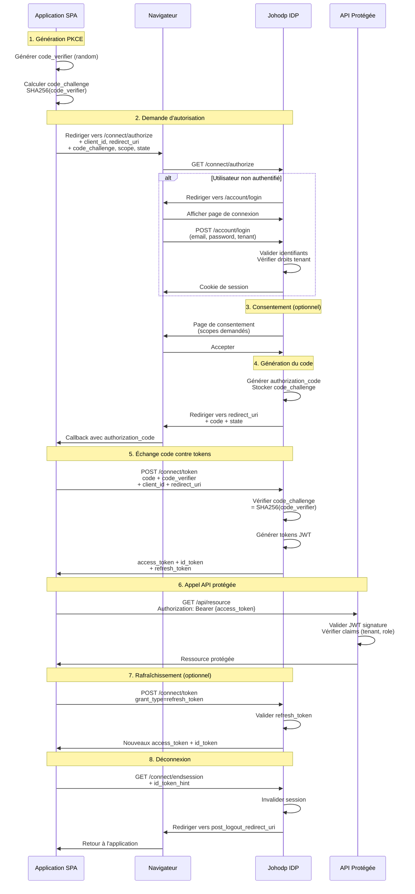

# Johodp - Identity Provider avec Architecture DDD

Fournisseur d'identité (IDP) moderne basé sur .NET 8, Duende IdentityServer 7, et PostgreSQL, utilisant les principes du Domain-Driven Design (DDD).

## 📋 Table des matières

- [Vue d'ensemble](#vue-densemble)
- [Prérequis](#prérequis)
- [Installation rapide](#installation-rapide)
- [Architecture](#architecture)
- [Fonctionnalités](#fonctionnalités)
- [Authentification et autorisation](#authentification-et-autorisation)
- [Multi-tenancy](#multi-tenancy)
- [Tests et développement](#tests-et-développement)
- [Structure du projet](#structure-du-projet)
- [Ressources](#ressources)

## 🎯 Vue d'ensemble

Johodp est un serveur d'identité complet offrant :

- **Authentification OAuth2/OIDC** avec support PKCE pour applications SPA
- **Multi-tenancy** avec isolation des utilisateurs par tenant
- **Gestion des rôles et permissions** avec valeurs par défaut
- **Architecture DDD** pour une logique métier claire et maintenable
- **ASP.NET Core Identity** intégré avec support MFA
- **API REST** pour la gestion des utilisateurs et clients

## 📦 Prérequis

- .NET 8.0 SDK
- PostgreSQL 12+
- Docker (optionnel pour PostgreSQL)

## 🚀 Installation rapide

### 1. Configuration de PostgreSQL avec Docker

```bash
docker run --name johodp-postgres \
  -e POSTGRES_PASSWORD=password \
  -e POSTGRES_DB=johodp \
  -p 5432:5432 \
  -d postgres:15
```

### 2. Restaurer les dépendances

```bash
dotnet restore
```

### 3. Appliquer les migrations

**Bash/Shell:**
```bash
dotnet ef database update --project src/Johodp.Infrastructure --startup-project src/Johodp.Api
```

**PowerShell:**
```powershell
dotnet ef database update --project src/Johodp.Infrastructure --startup-project src/Johodp.Api
```

**Ou utiliser les scripts fournis:**
```bash
# Bash/Shell
./init-db.sh

# PowerShell
.\init-db.ps1
```

### 4. Lancer l'application

```bash
dotnet run --project src/Johodp.Api
```

L'API sera disponible sur :
- HTTP : `http://localhost:5000`
- HTTPS : `https://localhost:5001`

## 🏗️ Architecture

Le projet suit une architecture en couches basée sur les principes DDD :

### Couches applicatives

| Couche | Responsabilité | Contenu |
|--------|----------------|---------|
| **Johodp.Domain** | Logique métier | Agrégats (`User`, `Client`), Value Objects (`UserId`, `Email`, `ClientId`), Events |
| **Johodp.Application** | Cas d'utilisation | Commands/Queries (CQRS), DTOs, Interfaces de repository |
| **Johodp.Infrastructure** | Implémentation technique | EF Core, Repositories, Duende IdentityServer, Services |
| **Johodp.Api** | Présentation | Contrôleurs REST, Configuration, Endpoints |

### Concepts DDD

**Agrégats:**
- `User` : Utilisateur avec rôles, permissions, et tenant
- `Client` : Application cliente OAuth2/OIDC

**Value Objects:**
- `UserId`, `Email`, `ClientId`, `ClientSecret`, `ScopeId`, `PermissionName`

**Domain Events:**
- `UserRegisteredEvent`, `UserEmailConfirmedEvent`, `ClientCreatedEvent`

## ✨ Fonctionnalités

### API Endpoints disponibles

#### 🔐 AccountController (`/account/*`)

Contrôleur de gestion des comptes utilisateurs avec interface web (Razor Pages) et API REST.

**Pages Web (Razor):**

| Endpoint | Méthode | Description | Authentification |
|----------|---------|-------------|------------------|
| `/account/login` | GET | Affiche le formulaire de connexion avec support multi-tenant via `acr_values` | Non requise |
| `/account/login` | POST | Authentifie l'utilisateur, crée automatiquement le compte si inexistant, applique l'isolation tenant | Non requise |
| `/account/register` | GET | Affiche le formulaire d'inscription | Non requise |
| `/account/register` | POST | Crée un nouveau compte utilisateur avec tenant wildcard par défaut | Non requise |
| `/account/logout` | GET | Déconnecte l'utilisateur et redirige vers OIDC logout | Requise |
| `/account/claims` | GET | Affiche tous les claims de l'utilisateur courant (debug) | Requise |
| `/account/forgot-password` | GET | Affiche le formulaire de demande de réinitialisation | Non requise |
| `/account/forgot-password` | POST | Génère un token de réinitialisation (affiché en console en dev) | Non requise |
| `/account/reset-password` | GET | Affiche le formulaire de réinitialisation avec token | Non requise |
| `/account/reset-password` | POST | Réinitialise le mot de passe avec le token fourni | Non requise |
| `/account/access-denied` | GET | Page d'accès refusé | Non requise |

**API REST:**

| Endpoint | Méthode | Description | Authentification |
|----------|---------|-------------|------------------|
| `POST /api/auth/login` | POST | Connexion via API JSON avec support tenant (`acr_values` en query param). Crée automatiquement l'utilisateur si inexistant. Retourne un cookie d'authentification. | Non requise |

**Paramètres de tenant:**
- `acr_values=tenant:TENANT_ID` dans l'URL de retour (login web) ou en query param (login API)
- Absence de `acr_values` → Tenant wildcard (`*`) avec accès à tous les tenants
- Validation tenant stricte : utilisateur avec tenant spécifique ne peut accéder qu'à son tenant

#### 👥 UsersController (`/api/users/*`)

Gestion des utilisateurs via pattern CQRS (Commands/Queries avec MediatR).

| Endpoint | Méthode | Description | Authentification |
|----------|---------|-------------|------------------|
| `POST /api/users/register` | POST | Enregistre un nouvel utilisateur via command CQRS | Non requise |
| `GET /api/users/{userId}` | GET | Récupère les informations d'un utilisateur par ID via query CQRS | Non requise |

**Body exemple (Register):**
```json
{
  "email": "user@example.com",
  "firstName": "Jean",
  "lastName": "Dupont",
  "password": "P@ssw0rd!"
}
```

#### 🔑 ClientsController (`/api/clients/*`)

Gestion des clients OAuth2/OIDC (applications clientes).

| Endpoint | Méthode | Description | Authentification |
|----------|---------|-------------|------------------|
| `GET /api/clients/{clientId}` | GET | Récupère les détails d'un client OAuth2 (scopes, URIs, paramètres) | Non requise |
| `POST /api/clients/{clientId}/redirect-uris` | POST | Ajoute une URI de redirection autorisée pour le client | Non requise |
| `DELETE /api/clients/{clientId}/redirect-uris` | DELETE | Supprime une URI de redirection du client | Non requise |

**Body exemple (Add Redirect URI):**
```json
{
  "redirectUri": "http://localhost:4200/callback"
}
```

**Réponse Client:**
```json
{
  "id": "guid",
  "clientName": "Mon Application",
  "allowedScopes": ["openid", "profile", "email", "johodp.api"],
  "allowedRedirectUris": ["http://localhost:4200/callback"],
  "allowedCorsOrigins": ["http://localhost:4200"],
  "requireClientSecret": false,
  "requireConsent": true,
  "isActive": true,
  "createdAt": "2025-11-18T00:00:00Z"
}
```

#### 🏢 TenantController (`/api/tenant/*`)

Configuration et personnalisation par tenant (branding, langue, format).

| Endpoint | Méthode | Description | Authentification |
|----------|---------|-------------|------------------|
| `GET /api/tenant/{tenantId}/branding.css` | GET | Génère un fichier CSS personnalisé avec couleurs, logo et images du tenant (variables CSS) | Non requise |
| `GET /api/tenant/{tenantId}/language` | GET | Retourne les préférences linguistiques du tenant (langue, format date/heure, timezone, devise) | Non requise |

**Réponse Branding CSS:**
```css
:root {
    --primary-color: #667eea;
    --secondary-color: #764ba2;
    --font-primary-color: #333333;
    --font-secondary-color: #666666;
    --logo-base64: url('data:image/png;base64,...');
    --image-base64: url('data:image/png;base64,...');
}
```

**Réponse Language:**
```json
{
  "tenantId": "acme-corp",
  "defaultLanguage": "fr-FR",
  "supportedLanguages": ["fr-FR", "en-US", "es-ES"],
  "dateFormat": "dd/MM/yyyy",
  "timeFormat": "HH:mm",
  "timezone": "Europe/Paris",
  "currency": "EUR"
}
```

**Note:** Les endpoints tenant retournent actuellement des données mockées. TODO: Implémenter la persistance en base de données.

### Endpoints Duende IdentityServer (OIDC/OAuth2)

| Endpoint | Description |
|----------|-------------|
| `GET /.well-known/openid-configuration` | Document de découverte OIDC avec tous les endpoints |
| `GET /connect/authorize` | Endpoint d'autorisation OAuth2 (flux Authorization Code + PKCE) |
| `POST /connect/token` | Exchange authorization code → access token + id token + refresh token |
| `GET /connect/userinfo` | Récupère les informations utilisateur avec access token |
| `POST /connect/revocation` | Révoque un access token ou refresh token |
| `POST /connect/introspect` | Inspecte et valide un token |
| `GET /connect/endsession` | Déconnexion OIDC (logout) |

### Authentification et autorisation

#### Pages de gestion de compte

| Route | Description |
|-------|-------------|
| `/account/login` | Connexion avec email et mot de passe |
| `/account/register` | Création de compte |
| `/account/forgot-password` | Demande de réinitialisation de mot de passe |
| `/account/reset-password` | Réinitialisation avec token |
| `/account/logout` | Déconnexion |
| `/account/claims` | Page de debug affichant les claims de l'utilisateur |

#### API d'authentification

**Connexion via API :**
```bash
POST /api/auth/login
Content-Type: application/json

{
  "email": "user@example.com",
  "password": "P@ssw0rd!"
}
```

**Réponse :** Cookie `Set-Cookie: .AspNetCore.Identity.Application=...` avec une durée de vie de 7 jours.

### OAuth2/OIDC avec PKCE

Le serveur supporte le flux **Authorization Code + PKCE** pour les applications SPA et mobiles.

#### Clients configurés

| Client ID | Type | Grant Type | Description |
|-----------|------|------------|-------------|
| `johodp-spa` | Public | Authorization Code + PKCE | Application SPA (React, Angular, Vue) |
| `swagger-ui` | Public | Authorization Code + PKCE | Interface Swagger UI |
| `johodp-client-credentials` | Confidentiel | Client Credentials | Service backend (M2M) |

#### Scopes disponibles

| Scope | Type | Claims inclus |
|-------|------|---------------|
| `openid` | Identity | `sub` |
| `profile` | Identity | `given_name`, `family_name` |
| `email` | Identity | `email`, `email_verified` |
| `johodp.identity` | Identity | `tenant_id`, `role`, `permission` |
| `johodp.api` | API Resource | Tous les claims ci-dessus |

#### Diagramme de séquence du flux PKCE

Le diagramme suivant illustre le flux complet d'authentification Authorization Code + PKCE entre une application SPA, l'Identity Provider Johodp, et l'API protégée :



#### Détails du flux PKCE

**1. Générer les paramètres PKCE (PowerShell) :**
```powershell
$verifier = -join ((65..90) + (97..122) + (48..57) + 45 + 95 | Get-Random -Count 128 | % {[char]$_})
$sha256 = [System.Security.Cryptography.SHA256]::Create()
$hash = $sha256.ComputeHash([System.Text.Encoding]::ASCII.GetBytes($verifier))
$challenge = [Convert]::ToBase64String($hash).TrimEnd('=').Replace('+', '-').Replace('/', '_')

Write-Host "Code Verifier: $verifier"
Write-Host "Code Challenge: $challenge"
```

**2. Initier l'autorisation (navigateur) :**
```
http://localhost:5000/connect/authorize?response_type=code&client_id=johodp-spa&redirect_uri=http%3A%2F%2Flocalhost%3A4200%2Fcallback&scope=openid%20profile%20email%20johodp.identity%20johodp.api&code_challenge=CODE_CHALLENGE&code_challenge_method=S256&state=RANDOM_STATE&nonce=RANDOM_NONCE
```

**3. Échanger le code contre un token :**
```bash
POST /connect/token
Content-Type: application/x-www-form-urlencoded

grant_type=authorization_code&client_id=johodp-spa&code=AUTHORIZATION_CODE&redirect_uri=http%3A%2F%2Flocalhost%3A4200%2Fcallback&code_verifier=CODE_VERIFIER
```

**Voir le fichier `src/Johodp.Api/httpTest/pkceconnection.http` pour des exemples complets.**

## 🏢 Multi-tenancy

### Isolation par tenant

Johodp supporte le multi-tenancy via le paramètre OIDC standard `acr_values` :

**Format:** `acr_values=tenant:TENANT_ID`

### Comportement

| Scénario | TenantId utilisateur | Accès autorisé |
|----------|---------------------|----------------|
| Aucun `acr_values` spécifié | `*` (wildcard) | Tous les tenants |
| `acr_values=tenant:acme` | `*` (wildcard) | Tenant `acme` autorisé |
| `acr_values=tenant:acme` | `acme` | Tenant `acme` autorisé |
| `acr_values=tenant:acme` | `contoso` | ❌ Accès refusé |
| Aucun `acr_values` | `acme` | Tous les tenants autorisés |

### Exemples d'authentification

**Sans tenant (accès wildcard) :**
```bash
# Via API
POST http://localhost:5000/api/auth/login
Content-Type: application/json

{
  "email": "user@example.com",
  "password": "P@ssw0rd!"
}

# Via OIDC
GET http://localhost:5000/connect/authorize?response_type=code&client_id=johodp-spa&...
```
→ Utilisateur créé avec `TenantId = "*"`

**Avec tenant spécifique :**
```bash
# Via API
POST http://localhost:5000/api/auth/login?acr_values=tenant:acme-corp
Content-Type: application/json

{
  "email": "user@example.com",
  "password": "P@ssw0rd!"
}

# Via OIDC
GET http://localhost:5000/connect/authorize?...&acr_values=tenant:acme-corp
```
→ Utilisateur créé avec `TenantId = "acme-corp"`

### Claims JWT personnalisés

Les tokens JWT incluent les claims suivants (scope `johodp.identity` requis) :

| Claim | Description | Valeur par défaut |
|-------|-------------|-------------------|
| `tenant_id` | Identifiant du tenant | `"*"` si non spécifié |
| `role` | Rôles de l'utilisateur | `"reader"` si aucun rôle |
| `permission` | Permissions de l'utilisateur | `"reader"` si aucune permission |

**Exemple de payload JWT :**
```json
{
  "sub": "1bb71afc-e622-42f4-b3fd-df4956ebb3eb",
  "email": "user@example.com",
  "given_name": "John",
  "family_name": "Doe",
  "tenant_id": "acme-corp",
  "role": ["admin", "user"],
  "permission": ["users:read", "users:write"],
  "scope": ["openid", "profile", "email", "johodp.identity", "johodp.api"]
}
```

## 🧪 Tests et développement

### Tester avec PowerShell

```powershell
# Connexion sans tenant
$body = '{"email":"test@example.com","password":"P@ssw0rd!"}'
$resp = Invoke-WebRequest -Uri 'http://localhost:5000/api/auth/login' `
  -Method POST -Body $body -ContentType 'application/json' -UseBasicParsing
$resp.StatusCode
$resp.Headers['Set-Cookie']

# Connexion avec tenant
$resp = Invoke-WebRequest -Uri 'http://localhost:5000/api/auth/login?acr_values=tenant:acme' `
  -Method POST -Body $body -ContentType 'application/json' -UseBasicParsing
```

### Tester avec cURL

```bash
# Connexion sans tenant
curl -i -X POST http://localhost:5000/api/auth/login \
  -H "Content-Type: application/json" \
  -d '{"email":"test@example.com","password":"P@ssw0rd!"}'

# Connexion avec tenant
curl -i -X POST "http://localhost:5000/api/auth/login?acr_values=tenant:acme" \
  -H "Content-Type: application/json" \
  -d '{"email":"test@example.com","password":"P@ssw0rd!"}'
```

### Tester avec JavaScript (SPA)

```javascript
// Connexion sans tenant
fetch('http://localhost:5000/api/auth/login', {
  method: 'POST',
  credentials: 'include', // Important pour les cookies
  headers: { 'Content-Type': 'application/json' },
  body: JSON.stringify({ email: 'test@example.com', password: 'P@ssw0rd!' })
});

// Connexion avec tenant
fetch('http://localhost:5000/api/auth/login?acr_values=tenant:acme', {
  method: 'POST',
  credentials: 'include',
  headers: { 'Content-Type': 'application/json' },
  body: JSON.stringify({ email: 'test@example.com', password: 'P@ssw0rd!' })
});
```

### Configuration CORS pour SPA

Le projet inclut une politique CORS `AllowSpa` autorisant :
- Origine : `http://localhost:4200`
- Credentials : Autorisés
- Headers : Tous autorisés

**Important :** Pour les requêtes cross-origin, utilisez toujours `credentials: 'include'` pour que le navigateur envoie les cookies.

### Vérifier les claims

Après authentification, visitez `http://localhost:5000/account/claims` pour voir tous les claims de l'utilisateur courant.

## 📁 Structure du projet

```
johodp/
├── src/
│   ├── Johodp.Domain/              # Logique métier (DDD)
│   │   ├── Common/                 # Classes de base DDD
│   │   │   ├── AggregateRoot.cs
│   │   │   ├── ValueObject.cs
│   │   │   └── DomainEvent.cs
│   │   ├── Users/                  # Agrégat User
│   │   │   ├── Aggregates/
│   │   │   │   └── User.cs
│   │   │   ├── ValueObjects/
│   │   │   │   ├── UserId.cs
│   │   │   │   ├── Email.cs
│   │   │   │   └── ScopeId.cs
│   │   │   ├── Events/
│   │   │   └── Specifications/
│   │   └── Clients/                # Agrégat Client
│   │       ├── Aggregates/
│   │       │   └── Client.cs
│   │       ├── ValueObjects/
│   │       │   ├── ClientId.cs
│   │       │   └── ClientSecret.cs
│   │       └── Events/
│   ├── Johodp.Application/         # Cas d'utilisation (CQRS)
│   │   ├── Common/Interfaces/
│   │   │   ├── IUserRepository.cs
│   │   │   ├── IClientRepository.cs
│   │   │   └── IUnitOfWork.cs
│   │   ├── Users/
│   │   │   ├── Commands/
│   │   │   ├── Queries/
│   │   │   └── DTOs/
│   │   └── Clients/
│   │       ├── Commands/
│   │       ├── Queries/
│   │       └── DTOs/
│   ├── Johodp.Infrastructure/      # Implémentation technique
│   │   ├── Persistence/
│   │   │   ├── DbContext/
│   │   │   │   └── JohodpDbContext.cs
│   │   │   ├── Repositories/
│   │   │   │   ├── UserRepository.cs
│   │   │   │   └── ClientRepository.cs
│   │   │   ├── Configurations/     # EF Core configurations
│   │   │   └── UnitOfWork.cs
│   │   ├── Identity/               # ASP.NET Identity stores
│   │   │   ├── UserStore.cs
│   │   │   └── CustomSignInManager.cs
│   │   ├── IdentityServer/         # Duende IdentityServer
│   │   │   ├── IdentityServerConfig.cs
│   │   │   └── IdentityServerProfileService.cs
│   │   ├── Migrations/             # EF Core migrations
│   │   └── Services/
│   └── Johodp.Api/                 # API Web (Présentation)
│       ├── Controllers/
│       │   ├── Account/
│       │   │   └── AccountController.cs
│       │   ├── UsersController.cs
│       │   ├── ClientsController.cs
│       │   └── TenantController.cs
│       ├── Extensions/
│       │   └── ServiceCollectionExtensions.cs
│       ├── Views/                  # Razor Pages (Login, Register, etc.)
│       ├── httpTest/
│       │   └── pkceconnection.http # Tests HTTP/PKCE
│       ├── Program.cs
│       └── appsettings.json
├── tests/
│   └── Johodp.Tests/
├── init-db.sh                      # Script d'initialisation DB (Bash)
├── init-db.ps1                     # Script d'initialisation DB (PowerShell)
├── docker-compose.yml              # Configuration Docker
└── README.md
```

## 📚 Ressources

### Documentation technique

- [Duende IdentityServer](https://docs.duendesoftware.com/identityserver/v7)
- [ASP.NET Core Identity](https://learn.microsoft.com/aspnet/core/security/authentication/identity)
- [Entity Framework Core](https://learn.microsoft.com/ef/core/)
- [PostgreSQL](https://www.postgresql.org/docs/)
- [Domain-Driven Design](https://domainlanguage.com/ddd/)

### Standards OAuth2/OIDC

- [RFC 6749 - OAuth 2.0](https://datatracker.ietf.org/doc/html/rfc6749)
- [RFC 7636 - PKCE](https://datatracker.ietf.org/doc/html/rfc7636)
- [OpenID Connect Core](https://openid.net/specs/openid-connect-core-1_0.html)

### Architecture

- [Clean Architecture](https://blog.cleancoder.com/uncle-bob/2012/08/13/the-clean-architecture.html)
- [CQRS Pattern](https://martinfowler.com/bliki/CQRS.html)
- [Repository Pattern](https://martinfowler.com/eaaCatalog/repository.html)

## 📝 Notes de version

### Version actuelle (2025-11-18)

**Nouvelles fonctionnalités :**
- ✅ Support multi-tenant via `acr_values`
- ✅ Claims JWT personnalisés (`tenant_id`, `role`, `permission`)
- ✅ Valeurs par défaut pour rôles et permissions (`reader`)
- ✅ Migration vers Duende IdentityServer 7.3.2
- ✅ Support PKCE complet pour applications SPA
- ✅ Configuration CORS pour développement SPA
- ✅ API d'authentification avec cookies
- ✅ Pages de gestion de compte (login, register, reset password)

**Améliorations techniques :**
- Mise à niveau Npgsql 8.0.6 (résolution CVE)
- Middleware ordering optimisé
- Cookie configuration pour développement local
- Page de debug des claims

**Documentation :**
- README.md réorganisé et traduit en français
- Fichier `pkceconnection.http` avec exemples complets
- Scripts d'initialisation DB (Bash et PowerShell)

## 🤝 Contribution

Ce projet suit les principes du Domain-Driven Design. Avant de contribuer, veuillez :
1. Comprendre l'architecture en couches
2. Respecter les patterns DDD (Agrégats, Value Objects, Domain Events)
3. Ajouter des tests unitaires pour la logique métier
4. Documenter les changements d'API

## 📄 Licence

[À définir]

---

**Développé avec ❤️ en .NET 8**

## Architecture

Le projet est organisé selon les principes DDD :

### Couches

1. **Johodp.Domain** - Couche métier
   - Agrégats : `User`, `Client`
   - Value Objects : `UserId`, `Email`, `ClientId`, `ClientSecret`
   - Domain Events : `UserRegisteredEvent`, `UserEmailConfirmedEvent`, `ClientCreatedEvent`
   - Classes de base : `AggregateRoot`, `ValueObject`, `DomainEvent`

2. **Johodp.Application** - Couche application
   - Commands & Handlers (CQRS)
   - Queries & Handlers
   - DTOs (Data Transfer Objects)
   - Interfaces de dépôt

3. **Johodp.Infrastructure** - Couche infrastructure
   - Implémentation Entity Framework Core
   - Configuration de PostgreSQL
   - Repositories
   - Unit of Work
   - Services IdentityServer4

4. **Johodp.Api** - Couche présentation
   - Contrôleurs REST
   - Configuration du démarrage
   - Extensions de services

## Prérequis

- .NET 8.0 SDK
- PostgreSQL 12+
- Docker (optionnel pour PostgreSQL)

## Installation

### 1. Configuration de PostgreSQL avec Docker

```bash
docker run --name johodp-postgres \
  -e POSTGRES_PASSWORD=password \
  -e POSTGRES_DB=johodp \
  -p 5432:5432 \
  -d postgres:15
```

### 2. Restaurer les dépendances

```bash
dotnet restore
```

### 3. Appliquer les migrations

**Bash/Shell:**
```bash
dotnet ef database update --project src/Johodp.Infrastructure --startup-project src/Johodp.Api
```

**PowerShell:**
```powershell
dotnet ef database update --project src/Johodp.Infrastructure --startup-project src/Johodp.Api
```

### 4. Lancer l'application

```bash
dotnet run --project src/Johodp.Api
```

L'API sera disponible sur `https://localhost:5001`

## Utilisation

### Enregistrer un utilisateur

```bash
POST /api/users/register
Content-Type: application/json

{
  "email": "user@example.com",
  "firstName": "Jean",
  "lastName": "Dupont"
}
```

## ASP.NET Identity integration (local)

The project now includes a light integration with ASP.NET Core Identity using the domain `User` aggregate. This enables password hashing, sign-in flows and integration with the UI login page.

Key points:
- `UserStore` (in `src/Johodp.Infrastructure/Identity/UserStore.cs`) implements the minimal Identity stores required (user lookup, password hash, email).
- `CustomSignInManager` (in `src/Johodp.Infrastructure/Identity/CustomSignInManager.cs`) overrides `PasswordSignInAsync` to verify credentials via `UserManager` and enforces MFA when the user's roles require it.
- The `User` aggregate now contains a `PasswordHash` property and a `SetPasswordHash` method to persist password hashes via the store.
- Cookie-based authentication is configured with a 7-day sliding expiration window.

### Recent changes (2025-11-18)

- **Multi-tenant support via `acr_values`**: Tenant isolation is now enforced using the standard OIDC `acr_values` parameter. Pass `acr_values=tenant:your-tenant-id` in the authorize request to specify the tenant. Users created without a tenant are assigned wildcard access (`TenantId = "*"`) and can authenticate to any tenant. Users with a specific tenant can only access that tenant.
- **Duende IdentityServer migration**: Migrated from IdentityServer4 to Duende IdentityServer 7.3.2 for continued security support and active maintenance.
- IdentityServer PKCE support: added PKCE-ready clients (`johodp-spa`, `swagger-ui`) using Authorization Code + PKCE. Use `RequirePkce = true` for public clients and `RequireClientSecret = false` where appropriate.
- Fixed duplicate scope configuration: identity scopes (`openid`, `profile`, `email`) are declared as IdentityResources only (not duplicated in API scopes) to avoid IdentityServer configuration errors.
- Middleware ordering: authentication is now enabled before IdentityServer (`app.UseAuthentication()` executed prior to `app.UseIdentityServer()`), and routing is enabled so IdentityServer endpoints see the authenticated principal.
- ASP.NET Identity integration: IdentityServer is wired with ASP.NET Identity (`AddAspNetIdentity<TUser>()`) and a minimal `IUserClaimsPrincipalFactory<User>` implementation (`DomainUserClaimsPrincipalFactory`) is provided to build ClaimsPrincipal from the domain `User`.
- Cookie configuration: the application cookie name and attributes are set explicitly for development (`.AspNetCore.Identity.Application`, `SameSite=Lax`, `SecurePolicy=SameAsRequest`) to make cookies visible on `http://localhost` during local testing. For cross-origin PKCE/SPAs prefer HTTPS and `SameSite=None` + `Secure`.
- Claims debug page: a new authenticated Razor page is available at `/account/claims` to display the current user's claims (useful to verify which claims are present in the cookie and what IdentityServer will emit).

#### Quick PKCE authorize URL (examples)

**Without tenant (wildcard access - user gets `TenantId = "*"`):**
```
http://localhost:5000/connect/authorize?response_type=code&client_id=johodp-spa&redirect_uri=http%3A%2F%2Flocalhost%3A4200%2Fcallback&scope=openid%20profile%20email%20johodp.api&code_challenge=hKlNQr0lnnlMW5Yf3GdlpGJfl9SnY3CW_ktowi3c7zA&code_challenge_method=S256&state=5a223df34572489a89678a698307af5e&nonce=a1f6d229e9ee4aada5652fa77a853f46
```

**With specific tenant (user restricted to `acme-corp` tenant):**
```
http://localhost:5000/connect/authorize?response_type=code&client_id=johodp-spa&redirect_uri=http%3A%2F%2Flocalhost%3A4200%2Fcallback&scope=openid%20profile%20email%20johodp.api&code_challenge=hKlNQr0lnnlMW5Yf3GdlpGJfl9SnY3CW_ktowi3c7zA&code_challenge_method=S256&state=5a223df34572489a89678a698307af5e&nonce=a1f6d229e9ee4aada5652fa77a853f46&acr_values=tenant:acme-corp
```

- Notes: 
  - The tenant is specified via the standard OIDC `acr_values` parameter using the format `tenant:your-tenant-id`
  - Users without a tenant assignment get wildcard access (`TenantId = "*"`) and can authenticate to any tenant
  - Users with a specific `TenantId` can only authenticate when the requested tenant matches their assigned tenant
  - Replace `code_challenge`, `state` and `nonce` with values generated for your test (or use the sample generator in `COMPLETION_SUMMARY.md`)
  - If you start the flow from a different origin (e.g. `http://localhost:4200`), ensure your SPA sends login requests with credentials and that the server CORS policy allows credentials

See the `COMPLETION_SUMMARY.md` for a longer changelog and testing tips (PKCE code_challenge/code_verifier flow, cookie SameSite notes).

### Testing login and cookies (SPA)

When testing a browser-based SPA that initiates PKCE flows from `http://localhost:4200`, the SPA must send its login requests with credentials and the server must allow the SPA origin and credentials (CORS). The project includes a development CORS policy `AllowSpa` which permits `http://localhost:4200` and allows credentials.

#### Multi-tenant authentication

The API supports tenant-based authentication using the `acr_values` query parameter:

**PowerShell examples:**

```powershell
# Login without tenant (creates user with wildcard access TenantId = "*")
$body = '{"email":"spa.test+1@example.com","password":"P@ssw0rd!"}'
$resp = Invoke-WebRequest -Uri 'http://localhost:5000/api/auth/login' -Method POST -Body $body -ContentType 'application/json' -UseBasicParsing
$resp.StatusCode
$resp.Headers['Set-Cookie']

# Login with specific tenant (creates user restricted to acme-corp)
$body = '{"email":"spa.test+2@example.com","password":"P@ssw0rd!"}'
$resp = Invoke-WebRequest -Uri 'http://localhost:5000/api/auth/login?acr_values=tenant:acme-corp' -Method POST -Body $body -ContentType 'application/json' -UseBasicParsing
$resp.StatusCode
$resp.Headers['Set-Cookie']
```

**Curl examples:**

```bash
# Login without tenant (wildcard access)
curl -i -X POST http://localhost:5000/api/auth/login \
   -H "Content-Type: application/json" \
   -d '{"email":"spa.test+1@example.com","password":"P@ssw0rd!"}'

# Login with specific tenant
curl -i -X POST "http://localhost:5000/api/auth/login?acr_values=tenant:acme-corp" \
   -H "Content-Type: application/json" \
   -d '{"email":"spa.test+2@example.com","password":"P@ssw0rd!"}'
```

**JavaScript/SPA example:**

```js
// Login without tenant (wildcard access)
fetch('http://localhost:5000/api/auth/login', {
   method: 'POST',
   credentials: 'include',
   headers: { 'Content-Type': 'application/json' },
   body: JSON.stringify({ email: 'spa.test+1@example.com', password: 'P@ssw0rd!' })
});

// Login with specific tenant
fetch('http://localhost:5000/api/auth/login?acr_values=tenant:acme-corp', {
   method: 'POST',
   credentials: 'include',
   headers: { 'Content-Type': 'application/json' },
   body: JSON.stringify({ email: 'spa.test+2@example.com', password: 'P@ssw0rd!' })
});
```

After a successful login you can visit `http://localhost:5000/account/claims` (or fetch it from the SPA with `credentials: 'include'`) to confirm the server sees the authentication cookie and the expected claims (including `tenant_id` claim if a tenant was assigned).

### Account Management Pages

- **Login** — `/account/login` - Sign in with email and password.
- **Register** — `/account/register` - Create a new account with email, password, first name, and last name.
- **Forgot Password** — `/account/forgot-password` - Request a password reset link (token printed to console in dev mode).
- **Reset Password** — `/account/reset-password?token={token}` - Set a new password with a valid reset token.
- **Logout** — `/account/logout` - Sign out and clear session.

### Example Usage

Quick examples (C# interactive or controller) — create a user with password and sign-in:

```csharp
// register
var user = Johodp.Domain.Users.Aggregates.User.Create("user@example.com", "First", "Last");
var result = await userManager.CreateAsync(user, "P@ssw0rd!");

// sign-in
var signIn = await signInManager.PasswordSignInAsync("user@example.com", "P@ssw0rd!", isPersistent: false, lockoutOnFailure: false);
if (signIn.Succeeded) { /* proceed */ }
else if (signIn.RequiresTwoFactor) { /* start 2FA flow */ }
```

Notes:
- Password hashing is provided by the `IPasswordHasher<TUser>` registered by Identity.
- The login UI is available at `/account/login` and posts to the local sign-in flow.
- Password reset tokens are generated and logged to console in development (ready for integration with email services in production).

### Récupérer un utilisateur

```bash
GET /api/users/{userId}
```

## Structure du projet

```
src/
├── Johodp.Domain/           # Logique métier
│   ├── Common/              # Classes de base DDD
│   ├── Users/               # Agrégat Users
│   │   ├── Aggregates/
│   │   ├── ValueObjects/
│   │   └── Events/
│   └── Clients/             # Agrégat Clients
│       ├── Aggregates/
│       ├── ValueObjects/
│       └── Events/
├── Johodp.Application/      # Cas d'utilisation
│   ├── Common/Interfaces/   # Interfaces de dépôt
│   ├── Users/
│   │   ├── Commands/
│   │   ├── Queries/
│   │   └── DTOs/
│   └── Clients/
│       ├── Commands/
│       ├── Queries/
│       └── DTOs/
├── Johodp.Infrastructure/   # Implémentation technique
│   ├── Persistence/
│   │   ├── DbContext/
│   │   ├── Repositories/
│   │   └── Configurations/
│   ├── IdentityServer/
│   └── Services/
└── Johodp.Api/             # API Web
    ├── Controllers/
    ├── Extensions/
    └── Program.cs
```

## Concepts clés

### Agrégats
- **User** : Représente un utilisateur du système
- **Client** : Représente une application cliente IdentityServer

### Value Objects
- **UserId** : Identifiant unique d'un utilisateur
- **Email** : Adresse e-mail avec validation
- **ClientId** : Identifiant unique d'un client
- **ClientSecret** : Secret partagé du client

### Events de domaine
- **UserRegisteredEvent** : Déclenché lors de l'enregistrement d'un utilisateur
- **UserEmailConfirmedEvent** : Déclenché lors de la confirmation d'e-mail
- **ClientCreatedEvent** : Déclenché lors de la création d'un client

## Prochaines étapes

- [ ] Implémenter IdentityServer4
- [ ] Ajouter l'authentification OAuth2/OIDC
- [ ] Ajouter les migrations Entity Framework
- [ ] Implémenter les tests unitaires
- [ ] Implémenter les tests d'intégration
- [ ] Configurer CI/CD

## Ressources

- [Domain-Driven Design](https://domainlanguage.com/ddd/)
- [IdentityServer4 Documentation](https://docs.identityserver.io/)
- [Entity Framework Core](https://docs.microsoft.com/en-us/ef/core/)
- [PostgreSQL Documentation](https://www.postgresql.org/docs/)
