# 📋 Besoins et Cas d'Usage de Johodp Identity Provider

## Vue d'ensemble

Johodp est un Identity Provider multi-tenant basé sur OAuth2/OIDC, conçu pour permettre aux applications tierces de déléguer l'authentification et la gestion des utilisateurs tout en conservant le contrôle sur qui peut accéder à leurs services.

---

# CHAPITRE 0 : CONCEPTS FONDAMENTAUX

## 🏗️ Modèle de Données : Clients, Tenants, CustomConfigurations et Utilisateurs

### Qu'est-ce qu'un **Client** ?

Un **Client** représente une **application tierce** qui souhaite utiliser Johodp comme système d'authentification. C'est l'entité racine dans la hiérarchie OAuth2.

**Caractéristiques techniques :**
- Identifié par un `ClientId` (GUID) et un `ClientName` (ex: "my-app")
- Possède un `ClientSecret` pour l'authentification machine-to-machine
- Configure les `AllowedScopes` (openid, profile, email, api)
- Définit les règles OAuth2 : `RequirePkce`, `RequireClientSecret`, `RequireConsent`

**Métaphore :**
> Un Client est comme une **entreprise** qui possède un ou plusieurs magasins (tenants). L'entreprise a une identité unique, mais chaque magasin a sa propre adresse et peut choisir sa décoration parmi un catalogue partagé (CustomConfigurations).

**Exemples concrets :**
- Une application ERP d'entreprise
- Une plateforme SaaS B2B
- Un CRM multi-clients
- Une application mobile avec backend

**Cycle de vie :**
1. L'application tierce s'authentifie auprès de Johodp (client credentials)
2. Elle crée un Client via l'API : `POST /api/clients`
3. À ce stade, le Client existe mais **n'est pas visible pour IdentityServer** (pas de redirect URIs)
4. Le Client devient opérationnel uniquement après création d'au moins un Tenant

**Règles importantes :**
- ✅ Un Client peut avoir **plusieurs Tenants** (relation 1-to-many)
- ✅ Un Client sans Tenant **ne peut pas effectuer d'authentification OAuth2**
- ✅ Le `ClientName` doit être **unique** dans tout le système
- ✅ Les redirect URIs et CORS origins sont **agrégés depuis les Tenants**

---

### Qu'est-ce qu'une **CustomConfiguration** ?

Une **CustomConfiguration** représente une **configuration de branding et de localisation partageable** entre plusieurs tenants. Elle est **complètement indépendante** des Clients et permet de mutualiser des configurations visuelles et linguistiques.

**Caractéristiques techniques :**
- Identifiée par un `CustomConfigurationId` (GUID) et un `Name` (unique, ex: "corporate-blue")
- **Indépendante** : n'appartient à aucun Client spécifique
- **Partageable** : peut être utilisée par plusieurs Tenants (même de Clients différents)
- Configure le **Branding** :
  - `PrimaryColor`, `SecondaryColor` (couleurs de la charte graphique)
  - `LogoUrl` (URL du logo affiché sur les pages d'authentification)
  - `BackgroundImageUrl` (image de fond personnalisée)
  - `CustomCss` (CSS personnalisé pour un contrôle total de l'apparence)
- Configure les **Langues** :
  - `SupportedLanguages` (liste des langues disponibles, ex: ["fr-FR", "en-US"])
  - `DefaultLanguage` (langue par défaut, obligatoire)
- Possède un statut `IsActive` (permet de désactiver temporairement)
- Horodatée : `CreatedAt`, `UpdatedAt`

**Métaphore :**
> Une CustomConfiguration est comme un **catalogue de décoration** dans un centre commercial. Plusieurs magasins (Tenants) peuvent choisir le même thème visuel (configuration), et ce catalogue existe indépendamment des entreprises (Clients) qui l'utilisent.

**Exemples concrets :**
- **Configuration "Corporate Professional"** :
  - Couleurs : Bleu foncé (#003366) + Gris (#6c757d)
  - Langues : Français, Anglais
  - Utilisée par : Tenants de plusieurs applications d'entreprise

- **Configuration "Startup Modern"** :
  - Couleurs : Orange vif (#ff6b35) + Blanc
  - CSS custom : Animations modernes, fonts Google
  - Utilisée par : Plusieurs startups SaaS partageant la même identité visuelle

- **Configuration "Banking Secure"** :
  - Couleurs : Vert (#28a745) + Or (#ffc107)
  - Logo : Logo bancaire officiel
  - Utilisée par : Différents portails bancaires d'une même institution

**Cycle de vie :**
1. Une application tierce crée une CustomConfiguration via l'API : `POST /api/custom-configurations`
2. Elle configure le branding (couleurs, logo, CSS) et les langues supportées
3. La CustomConfiguration est créée avec `IsActive = true`
4. Elle peut être référencée par **n'importe quel Tenant** (même d'un autre Client)
5. Les Tenants utilisant cette configuration affichent automatiquement le branding configuré
6. La configuration peut être mise à jour (`PUT /api/custom-configurations/{id}`)
7. Les changements sont appliqués instantanément à tous les Tenants qui l'utilisent

**Règles importantes :**
- ✅ Une CustomConfiguration est **indépendante** (pas de ClientId)
- ✅ Une CustomConfiguration peut être **partagée** par plusieurs Tenants (relation 1-to-many)
- ✅ Le `Name` doit être **unique** dans tout le système
- ✅ Le `DefaultLanguage` est **obligatoire** (validation stricte)
- ✅ Les `SupportedLanguages` doivent **inclure** le `DefaultLanguage`
- ✅ Une CustomConfiguration peut exister **sans être utilisée** par aucun Tenant
- ✅ La suppression d'une CustomConfiguration **échoue** si elle est référencée par des Tenants actifs

---

### Qu'est-ce qu'un **Tenant** ?

Un **Tenant** représente un **espace isolé** au sein d'un Client. Il permet à l'application tierce de gérer plusieurs clients finaux (B2B), environnements (prod/staging) ou marques (white-label) de manière indépendante.

**Caractéristiques techniques :**
- Identifié par un `TenantId` (GUID) et un `Name` (ex: "acme-corp-example-com", dérivé de l'URL)
- Associé à **un seul Client** (relation many-to-1 via `ClientName`)
- **Référence obligatoirement une CustomConfiguration** via `CustomConfigurationId` (relation many-to-1)
- Configure les **redirect URIs** (`AllowedReturnUrls`) : où l'utilisateur est renvoyé après authentification
- Configure les **CORS origins** (`AllowedCorsOrigins`) : quels domaines peuvent appeler l'API
- Configure un **endpoint de vérification utilisateur** (webhook) pour valider les inscriptions
- Configure la **localisation** : `Timezone`, `Currency`, `DateFormat`, `TimeFormat`

**Métaphore :**
> Un Tenant est comme un **magasin** dans une chaîne. Chaque magasin a sa propre adresse (URL), choisit sa décoration dans un catalogue (CustomConfiguration), son fuseau horaire (localisation), et son système de validation d'entrée (webhook).

**Exemples concrets :**
- **Client = SaaS CRM :**
  - Tenant 1 : `acme-corp` → Client final ACME Corporation, CustomConfiguration "Corporate Professional"
  - Tenant 2 : `globex-inc` → Client final Globex Inc, CustomConfiguration "Startup Modern"
- **Client = Application Entreprise :**
  - Tenant 1 : `production` → Environnement de production, CustomConfiguration "Banking Secure"
  - Tenant 2 : `staging` → Environnement de test, CustomConfiguration "Banking Secure" (partagée)
- **Client = Plateforme White-Label :**
  - Tenant 1 : `brand-a` → Marque A, CustomConfiguration personnalisée "Brand A Style"
  - Tenant 2 : `brand-b` → Marque B, CustomConfiguration personnalisée "Brand B Style"

**Cycle de vie :**
1. L'application tierce crée d'abord une CustomConfiguration (ou réutilise une existante)
2. Elle crée ensuite un Tenant via l'API : `POST /api/tenant`
3. Elle fournit les redirect URIs, CORS origins, CustomConfigurationId, localisation et webhook
4. Le Tenant est automatiquement associé au Client (via ClientName)
5. Le Tenant référence la CustomConfiguration (via CustomConfigurationId - **obligatoire**)
6. Le Client devient **visible pour IdentityServer** (agrégation des redirect URIs)
7. Les utilisateurs peuvent maintenant s'authentifier via ce Tenant avec le branding de la CustomConfiguration

**Règles importantes :**
- ✅ Un Tenant appartient à **un seul Client** (pas de partage entre Clients)
- ✅ Un Tenant **doit référencer** une CustomConfiguration (relation obligatoire)
- ✅ Plusieurs Tenants peuvent **partager** la même CustomConfiguration (mutualisation)
- ✅ Un Tenant doit avoir **au moins une redirect URI** (sinon non opérationnel)
- ✅ Les CORS origins sont des **URIs d'autorité uniquement** (pas de path) :
  - ✅ Valide : `http://localhost:4200`, `https://app.acme.com`
  - ❌ Invalide : `http://localhost:4200/callback`
- ✅ Le `Name` du Tenant est **dérivé de l'URL** (ex: `https://acme.com` → `acme-com`)
- ✅ Le **webhook** est appelé à chaque demande d'inscription (validation métier)
- ✅ La **localisation** (timezone, currency, formats) est spécifique au Tenant (pas dans CustomConfiguration)

**Format `acr_values` :**
Lors de l'authentification, le Tenant est identifié par le paramètre `acr_values` :
```
/connect/authorize?acr_values=tenant:acme-corp-example-com
```
L'URL complète `https://acme-corp.example.com` est nettoyée en `acme-corp-example-com`.

---

### Qu'est-ce qu'un **Utilisateur** (User) ?

Un **Utilisateur** représente une **personne physique** qui peut s'authentifier sur un ou plusieurs Tenants. C'est l'entité centrale de l'authentification.

**Caractéristiques techniques :**
- Identifié par un `UserId` (GUID) et un `Email` (unique par Tenant : composite avec TenantId)
- **Appartient à UN SEUL Tenant** : relation many-to-1 via `TenantId` (obligatoire)
- Possède des données d'identité : `FirstName`, `LastName`, `PhoneNumber`
- A un statut : `PendingActivation` (en attente) ou `Active` (activé)
- Possède directement :
  - `TenantId` : le Tenant auquel l'utilisateur appartient (obligatoire)
  - `Role` : le rôle fourni par l'application tierce (ex: "admin", "user", "manager")
  - `Scope` : le périmètre fourni par l'application tierce (ex: "full_access", "read_only", "department_sales")
- Stocke le `PasswordHash` (jamais en clair)
- Peut avoir une authentification multi-facteurs (MFA, à venir)
- **Isolation par Tenant** : Le même email peut exister sur plusieurs Tenants (comptes distincts avec mots de passe différents)

**Métaphore :**
> Un Utilisateur est comme un **employé** qui travaille dans un magasin spécifique (Tenant). Son badge indique son magasin d'appartenance, son rôle (Role) et ses permissions (Scope). Le même email peut créer des comptes employés dans différents magasins, mais ce sont des identités distinctes.

**Exemples concrets :**
- **Utilisateur Simple :**
  - Email : `john@acme.com`
  - TenantId : `acme-corp`
  - Role : `user`
  - Scope : `default`
  - **1 seul compte** sur 1 Tenant

- **Consultant avec Comptes Multiples :**
  - Email : `consultant@agency.com`
  - **Compte 1** : TenantId `client-a`, Role: `architect`, Scope: `project_alpha` (mot de passe A)
  - **Compte 2** : TenantId `client-b`, Role: `developer`, Scope: `project_beta` (mot de passe B)
  - **Compte 3** : TenantId `client-c`, Role: `reviewer`, Scope: `all_projects` (mot de passe C)
  - **3 comptes distincts** avec le même email, mots de passe différents

- **Employé Multi-Départements (même entreprise) :**
  - Email : `manager@company.com`
  - TenantId : `company-main`
  - Role : `manager`
  - Scope : `all_departments`
  - **1 seul compte** gérant plusieurs départements via son Scope

**Cycle de vie :**
1. **Inscription (Onboarding) :**
   - L'utilisateur remplit le formulaire sur `/account/onboarding?acr_values=tenant:xxx`
   - Johodp envoie une notification webhook à l'application tierce
   - L'application valide selon ses règles métier (contrat, quota, etc.)
   - Si valide, elle crée l'utilisateur via `POST /api/users/register` avec `TenantId`, `Role` et `Scope`
   - L'utilisateur reçoit un email d'activation

2. **Activation :**
   - L'utilisateur clique sur le lien d'activation
   - Il définit son mot de passe
   - Son statut passe de `PendingActivation` à `Active`

3. **Authentification :**
   - L'utilisateur se connecte via `/connect/authorize?acr_values=tenant:xxx` avec email + password
   - Johodp cherche le compte par `(Email, TenantId)` et vérifie le mot de passe
   - Il reçoit un JWT contenant les claims du compte :
     ```json
     {
       "tenant_id": "guid-tenant",
       "tenant_role": "admin",
       "tenant_scope": "full_access"
     }
     ```

**Règles importantes :**
- ✅ Un Utilisateur appartient à **UN SEUL Tenant** (relation many-to-1, strict tenant isolation)
- ✅ Le **Role** et **Scope** sont stockés directement dans User (fournis par l'app tierce)
- ✅ L'email est **unique par Tenant** : le couple `(Email, TenantId)` est unique (composite unique constraint)
- ✅ Le **même email peut créer plusieurs comptes** sur différents Tenants (avec mots de passe différents)
- ✅ Un Utilisateur **ne peut se connecter qu'au Tenant de son compte** (TenantId immutable)
- ✅ Les **Role** et **Scope** sont des **strings libres** (pas de validation stricte, c'est l'app tierce qui décide)
- ✅ Lors de la connexion, le JWT contient les claims du compte User spécifique (isolation stricte)

---

## 🔗 Relations entre Entités

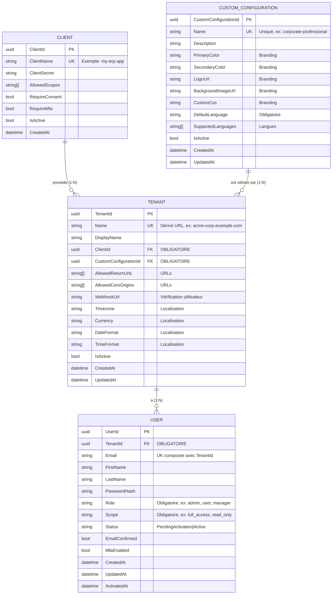

**Légende des Relations :**
- **Client (1) → (N) Tenant** : Un Client possède plusieurs Tenants
- **CustomConfiguration (1) → (N) Tenant** : Une CustomConfiguration peut être partagée par plusieurs Tenants (même de Clients différents)
- **Tenant (N) → (1) Client** : Chaque Tenant appartient à un seul Client (via ClientId - obligatoire)
- **Tenant (N) → (1) CustomConfiguration** : Chaque Tenant doit référencer une CustomConfiguration (via CustomConfigurationId - obligatoire)
- **Tenant (1) → (N) User** : Un Tenant a plusieurs Users, chaque User appartient à UN SEUL Tenant (via TenantId - obligatoire)
- **User (N) → (1) Tenant** : Chaque User appartient à un seul Tenant, avec Role et Scope définis directement dans User
- **CustomConfiguration est INDÉPENDANTE** : N'appartient à aucun Client, peut être réutilisée librement
- **Email unique par Tenant** : Le couple (Email, TenantId) est unique, permettant le même email sur différents Tenants (comptes séparés)

**Relations clés :**
- **1 Client** → **N Tenants** (un client possède plusieurs tenants)
- **1 CustomConfiguration** → **N Tenants** (une configuration peut être utilisée par plusieurs tenants)
- **1 Tenant** → **1 Client** (un tenant appartient à un seul client via ClientName)
- **1 Tenant** → **1 CustomConfiguration** (chaque tenant doit avoir une configuration - **obligatoire**)
- **1 Tenant** → **N Users** (un tenant a plusieurs utilisateurs, chaque User appartient à UN SEUL Tenant avec Role + Scope)
- **CustomConfiguration est indépendante** (pas de propriétaire Client)
- **Email unique par Tenant** (même email utilisable sur plusieurs Tenants = comptes distincts)

**Flux de données :**
1. Une **CustomConfiguration** est créée de manière **indépendante** (n'appartient à aucun Client)
2. Un **Client** crée un **Tenant** et **doit** lui associer une **CustomConfiguration** existante (obligatoire)
3. Plusieurs **Tenants** (même de Clients différents) peuvent référencer la même **CustomConfiguration** (mutualisation)
4. Des **Users** sont créés **directement dans un Tenant** avec role/scope spécifiques (TenantId obligatoire)
5. Le couple **(Email, TenantId)** est unique : même email utilisable sur plusieurs Tenants (comptes isolés)

---

## 🎯 Pourquoi cette Architecture ?

### Séparation des Responsabilités
- **Client** = Configuration OAuth2 globale (scopes, PKCE, secrets)
- **CustomConfiguration** = Configuration visuelle et linguistique réutilisable (branding + langues)
- **Tenant** = Configuration contextuelle (URLs, webhook, localisation) + référence à une CustomConfiguration
- **User** = Identité avec appartenance à un seul Tenant + rôle/périmètre

### Flexibilité
- Une application peut avoir plusieurs environnements (prod/staging) → 1 Client, 2 Tenants, 1 CustomConfiguration partagée
- Une plateforme B2B peut gérer plusieurs clients finaux → 1 Client, N Tenants, chacun avec sa propre CustomConfiguration ou partagée
- Un utilisateur consultant peut avoir plusieurs comptes séparés → même email, M comptes sur M Tenants différents
- **Plusieurs applications peuvent partager le même branding** → N Clients, M Tenants, 1 CustomConfiguration partagée

### Réutilisabilité
- **CustomConfiguration indépendante** : Peut être créée une fois et réutilisée par plusieurs Tenants
- **Mutualisation du branding** : Plusieurs Tenants (même de Clients différents) peuvent partager la même charte graphique
- **Gestion centralisée** : Modifier une CustomConfiguration met à jour instantanément tous les Tenants qui l'utilisent
- **Catalogue de configurations** : Possibilité de créer un catalogue de CustomConfigurations prédéfinies

### Sécurité
- Les redirect URIs sont validées par Tenant (isolation)
- Les CORS origins sont validées par Tenant (pas de cross-tenant XSS)
- Les utilisateurs ne peuvent accéder qu'au Tenant de leur compte (isolation stricte)
- Les Roles et Scopes sont définis par compte (un email peut être "admin" sur tenant-A et "viewer" sur tenant-B via comptes séparés)
- Isolation des mots de passe : chaque compte (email+tenant) a son propre mot de passe

### Évolutivité
- Nouveaux clients finaux = nouveaux Tenants (pas de modification du Client)
- Nouveaux environnements = nouveaux Tenants (isolation complète)
- Nouveaux utilisateurs = création avec TenantId + Role + Scope (pas de gestion multi-tenant complexe)

---

# PARTIE 1 : BESOINS FONCTIONNELS

## 🎯 Besoins Métier

### Besoin 1 : Permettre à une application tierce de gérer ses propres clients OAuth2

**Contexte:**
Une entreprise possède une application métier (ERP, CRM, plateforme SaaS) et souhaite permettre à ses utilisateurs de s'authentifier via Johodp sans gérer elle-même l'infrastructure d'authentification.

**Besoin:**
L'application tierce doit pouvoir créer et gérer ses propres configurations OAuth2 (appelées "clients") de manière autonome et sécurisée.

**Solution:**
- L'application tierce s'authentifie auprès de Johodp en mode "machine-to-machine" (client credentials OAuth2)
- Elle peut ensuite créer un ou plusieurs clients OAuth2 via l'API Johodp
- Chaque client représente une application ou un environnement (ex: prod, staging, dev)

**Bénéfices:**
- Autonomie complète de l'application tierce
- Pas besoin d'intervention manuelle d'un administrateur Johodp
- Intégration rapide et automatisable (scripts, CI/CD)

---

### Besoin 2 : Permettre à une application tierce de gérer ses espaces clients (tenants)

**Contexte:**
Une application tierce peut avoir plusieurs clients finaux (B2B) ou plusieurs environnements qui nécessitent des configurations différentes (URLs, règles métier, localisation).

**Besoin:**
L'application tierce doit pouvoir créer des espaces isolés (tenants) pour chacun de ses clients finaux, avec :
- Des URLs de redirection spécifiques
- Une référence à une configuration de branding partageable (CustomConfiguration)
- Des paramètres de localisation (timezone, devise, formats de date/heure)

**Solution:**
- L'application tierce crée d'abord un client OAuth2 (Besoin 1)
- Elle crée ou réutilise une CustomConfiguration pour le branding et les langues
- Elle crée ensuite un ou plusieurs tenants associés à ce client et à une CustomConfiguration
- Chaque tenant a ses propres configurations techniques (URLs) et de localisation

**Bénéfices:**
- Isolation des clients finaux (white-label)
- Mutualisation du branding entre plusieurs tenants
- Gestion multi-environnement facilitée
- Localisation spécifique par tenant

---

### Besoin 2bis : Mutualiser les configurations visuelles entre tenants

**Contexte:**
Plusieurs tenants (même de clients différents) peuvent vouloir partager la même charte graphique pour réduire les coûts de maintenance et garantir une cohérence visuelle.

**Besoin:**
L'application tierce doit pouvoir créer des configurations de branding réutilisables (CustomConfiguration) qui peuvent être partagées entre plusieurs tenants.

**Solution:**
- L'application tierce crée une CustomConfiguration indépendante via l'API : `POST /api/custom-configurations`
- Elle configure le branding (logo, couleurs, CSS) et les langues supportées
- Plusieurs tenants peuvent référencer la même CustomConfiguration
- Les modifications de la CustomConfiguration sont automatiquement appliquées à tous les tenants qui l'utilisent

**Bénéfices:**
- Réduction des coûts de maintenance (une seule configuration à mettre à jour)
- Cohérence visuelle garantie entre plusieurs tenants
- Possibilité de créer un catalogue de configurations prédéfinies
- Flexibilité : chaque tenant peut aussi avoir sa propre CustomConfiguration unique

---

### Besoin 3 : Valider les utilisateurs selon les règles métier de l'application tierce

**Contexte:**
L'application tierce a ses propres règles métier pour accepter ou refuser un nouvel utilisateur (vérification d'un numéro de client, validation d'un contrat, contrôle de quota, etc.).

**Besoin:**
Avant de créer un utilisateur dans Johodp, l'application tierce doit pouvoir appliquer ses règles de validation métier.

**Solution:**
- L'application tierce configure un endpoint de vérification (webhook) lors de la création du tenant
- Lors d'une demande d'inscription, Johodp notifie l'application tierce
- L'application tierce valide les informations (appels API internes, vérifications en base, etc.)
- Si valide, elle appelle l'API Johodp pour finaliser la création de l'utilisateur
- Sinon, elle rejette la demande

**Bénéfices:**
- L'application tierce garde le contrôle total sur qui peut accéder à ses services
- Johodp ne crée jamais d'utilisateur sans validation préalable
- Flexibilité totale pour implémenter n'importe quelle règle métier

---

### Besoin 4 : Permettre aux utilisateurs de créer leur compte via l'application tierce

**Contexte:**
Un utilisateur final découvre l'application tierce et souhaite créer un compte.

**Besoin:**
L'utilisateur doit pouvoir remplir un formulaire d'inscription avec le branding de l'application tierce, puis recevoir un email pour activer son compte.

**Solution:**
- L'application redirige vers la page d'inscription Johodp (avec branding du tenant)
- L'utilisateur remplit le formulaire (email, nom, prénom)
- Johodp notifie l'application tierce pour validation (Besoin 3)
- L'application tierce valide et crée l'utilisateur via l'API
- Johodp envoie un email avec un lien d'activation
- L'utilisateur active son compte en créant son mot de passe

**Bénéfices:**
- Expérience utilisateur fluide et personnalisée
- Sécurité : validation en deux étapes (métier + email)
- Pas de gestion de mot de passe côté application tierce

---

### Besoin 5 : Authentifier les utilisateurs de manière sécurisée (Single Sign-On)

**Contexte:**
Un utilisateur existant veut se connecter à l'application tierce.

**Besoin:**
L'utilisateur doit pouvoir se connecter une seule fois et accéder à toutes les applications du tenant sans ressaisir ses identifiants (SSO).

**Solution:**
- L'application redirige vers la page de login Johodp
- L'utilisateur entre email et mot de passe
- Johodp vérifie les credentials et la validité du tenant
- Johodp génère un code d'autorisation OAuth2
- L'application échange le code contre des tokens (access, refresh, id)
- L'application peut maintenant appeler ses APIs avec l'access token

**Bénéfices:**
- Sécurité renforcée (OAuth2 + PKCE)
- Expérience utilisateur simplifiée (SSO)
- Pas de gestion de session côté application tierce

---

### Besoin 6 : Isoler les utilisateurs par tenant (multi-tenancy)

**Contexte:**
Une application tierce a plusieurs clients finaux qui ne doivent pas voir les données des autres.

**Besoin:**
Un utilisateur ne doit pouvoir se connecter qu'aux tenants auxquels il a explicitement accès.

**Solution:**
- Chaque utilisateur a une liste de tenants autorisés (URLs sans caractères spéciaux)
- L'URL du tenant est transmise via `acr_values=tenant:<url>` (ex: `tenant:https://acme-corp.example.com` nettoyé en `acme-corp-example-com`)
- Lors de la connexion, Johodp vérifie que le tenant demandé est dans la liste
- Si oui, l'authentification réussit
- Si non, l'authentification échoue

**Bénéfices:**
- Isolation stricte des données
- Conformité RGPD (séparation des données clients)
- Gestion fine des accès

---

### Besoin 7 : Personnaliser l'apparence des pages d'authentification

**Contexte:**
Chaque client final de l'application tierce veut son propre branding (logo, couleurs, charte graphique).

**Besoin:**
Les pages de login, inscription et activation doivent afficher le branding du tenant concerné.

**Solution:**
- Chaque tenant configure son branding (logo, couleurs, CSS custom)
- Johodp génère dynamiquement un fichier CSS par tenant
- Les pages d'authentification chargent ce CSS automatiquement

**Bénéfices:**
- Expérience white-label complète
- Cohérence visuelle avec l'application tierce
- Pas de développement front-end côté application tierce

---

### Besoin 8 : Gérer les paramètres régionaux par tenant

**Contexte:**
Les clients finaux sont dans différents pays avec des langues, fuseaux horaires et devises différents.

**Besoin:**
Chaque tenant doit pouvoir configurer ses paramètres régionaux (langue, timezone, devise, format de date).

**Solution:**
- Chaque tenant configure ses paramètres de localisation
- L'application tierce récupère ces paramètres via l'API
- Les interfaces utilisateur s'adaptent automatiquement

**Bénéfices:**
- Expérience utilisateur localisée
- Conformité avec les attentes régionales
- Centralisation de la configuration i18n

---

### Besoin 9 : Renouveler les sessions utilisateur de manière transparente

**Contexte:**
Un utilisateur connecté ne doit pas être déconnecté brusquement après expiration du token.

**Besoin:**
L'application doit pouvoir renouveler automatiquement les tokens sans intervention de l'utilisateur.

**Solution:**
- Lors de l'authentification, Johodp fournit un refresh token (validité 15 jours)
- Avant expiration de l'access token, l'application échange le refresh token contre de nouveaux tokens
- L'utilisateur reste connecté sans interruption

**Bénéfices:**
- Expérience utilisateur fluide
- Sécurité maintenue (tokens courts + renouvellement)
- Pas de re-authentification fréquente

---

### Besoin 10 : Authentifier l'application tierce elle-même (machine-to-machine)

**Contexte:**
L'application tierce doit pouvoir appeler les APIs Johodp pour créer des clients, des tenants et des utilisateurs.

**Besoin:**
L'application tierce doit s'authentifier de manière sécurisée sans interaction utilisateur.

**Solution:**
- L'application tierce utilise le flux "client credentials" OAuth2
- Elle envoie son client_id et client_secret à Johodp
- Johodp retourne un access token avec les permissions appropriées
- L'application utilise ce token pour appeler les APIs d'administration

**Bénéfices:**
- Sécurité : pas de mot de passe utilisateur, pas de clé API statique
- Standard OAuth2
- Traçabilité des actions (quel client a fait quoi)

---

# PARTIE 2 : SPÉCIFICATIONS TECHNIQUES

## 🔧 Architecture OAuth2/OIDC

### Flux d'Authentification
Johodp implémente le standard OAuth2 avec les extensions suivantes :
- **Authorization Code Flow** avec PKCE (Proof Key for Code Exchange)
- **Client Credentials Flow** pour l'authentification machine-to-machine
- **Refresh Token Flow** pour le renouvellement de session
- Support complet d'OpenID Connect (OIDC) pour l'identité utilisateur

### Sécurité
- PKCE obligatoire pour tous les clients publics (SPA, applications mobiles)
- Client secret requis pour les clients confidentiels (backends)
- Validation stricte des redirect URIs et CORS origins
- Tokens JWT signés avec rotation des clés de signature
- Access tokens courts (1h) + refresh tokens longs (15 jours)

---

## 🎯 Cas d'Usage Techniques

### UC-00: Authentification de l'Application Tierce (Client Credentials)

**Acteur Principal:** Application tierce (système)

**Préconditions:**
- L'application tierce a reçu un client_id et client_secret de Johodp
- Le client est configuré avec le grant_type "client_credentials"

**Scénario Principal:**
1. L'application tierce envoie une requête POST `/connect/token` avec:
   ```json
   {
     "grant_type": "client_credentials",
     "client_id": "third-party-app",
     "client_secret": "secret-value",
     "scope": "johodp.admin"
   }
   ```
2. Johodp valide le client_id et client_secret
3. Johodp vérifie que le client a le droit d'utiliser le scope demandé
4. Johodp génère un access_token avec les claims appropriés:
   ```json
   {
     "sub": "third-party-app",
     "client_id": "third-party-app",
     "scope": ["johodp.admin"],
     "exp": 3600
   }
   ```
5. L'application tierce reçoit le token et peut maintenant appeler les APIs

**Règles de Gestion:**
- RG-CLIENT-CRED-01: Le client_secret doit être stocké de manière sécurisée (hashed en base)
- RG-CLIENT-CRED-02: L'access_token expire après 1 heure
- RG-CLIENT-CRED-03: Pas de refresh_token pour ce flux (l'app redemande un token)
- RG-CLIENT-CRED-04: Le scope "johodp.admin" permet de créer clients, tenants et utilisateurs

**Postconditions:**
- L'application tierce a un access_token valide pour appeler les APIs d'administration
- Toutes les actions sont tracées avec le client_id source

---

### UC-01: Création d'un Client OAuth2 par l'Application Tierce

**Acteur Principal:** Application tierce (authentifiée via client credentials)

**Préconditions:**
- L'application tierce a un access_token valide avec le scope "johodp.admin" (UC-00 complété)
- Un ClientName unique est disponible

**Scénario Principal:**
1. L'application tierce envoie une requête POST `/api/clients` avec:
   ```http
   Authorization: Bearer <access_token>
   Content-Type: application/json
   
   {
     "clientName": "my-app",
     "allowedScopes": ["openid", "profile", "email"],
     "requireConsent": true
   }
   ```
2. Johodp valide l'access_token (signature, expiration, scope)
3. Le système crée un agrégat `Client` dans l'état suivant:
   - `RequireClientSecret = true` (PKCE avec client secret)
   - `RequirePkce = true` (Protection PKCE obligatoire)
   - `IsActive = true`
4. Le système retourne le `ClientDto` avec un `ClientId` (GUID)
5. **Note:** Le client est créé SANS tenant associé (pas de redirect URIs)
6. Le client n'est PAS visible pour IdentityServer tant qu'il n'a pas de tenant

**Règles de Gestion:**
- RG-CLIENT-01: L'access_token DOIT avoir le scope "johodp.admin"
- RG-CLIENT-02: Un clientName doit être unique dans le système
- RG-CLIENT-03: Un client sans tenant n'est pas visible pour IdentityServer (sécurité)
- RG-CLIENT-04: Les scopes doivent être des valeurs valides (openid, profile, email, api)
- RG-CLIENT-05: L'action est tracée avec le client_id appelant (audit trail)

**Postconditions:**
- Un client est créé mais non fonctionnel (besoin d'un tenant)
- Le client n'apparaît pas dans IdentityServer
- L'application tierce peut maintenant créer des tenants pour ce client

---

### UC-01bis: Création d'une CustomConfiguration

**Acteur Principal:** Application tierce (authentifiée via client credentials)

**Préconditions:**
- L'application tierce a un access_token valide avec le scope "johodp.admin" (UC-00 complété)
- Un nom unique est disponible pour la CustomConfiguration

**Scénario Principal:**
1. L'application tierce envoie une requête POST `/api/custom-configurations` avec:
   ```http
   Authorization: Bearer <access_token>
   Content-Type: application/json
   
   {
     "name": "corporate-professional",
     "description": "Configuration pour applications d'entreprise professionnelles",
     "defaultLanguage": "fr-FR",
     "branding": {
       "primaryColor": "#003366",
       "secondaryColor": "#6c757d",
       "logoUrl": "https://cdn.example.com/logos/corporate.png",
       "backgroundImageUrl": "https://cdn.example.com/backgrounds/office.jpg",
       "customCss": ":root { --border-radius: 8px; }"
     },
     "languages": {
       "supportedLanguages": ["fr-FR", "en-US", "de-DE"],
       "defaultLanguage": "fr-FR"
     }
   }
   ```
2. Johodp valide l'access_token (signature, expiration, scope "johodp.admin")
3. Le système vérifie que le nom est unique
4. Le système crée l'agrégat `CustomConfiguration` avec:
   - `Name` (unique, identifiant lisible)
   - `Description` (optionnelle)
   - `Branding` (couleurs, logo, image de fond, CSS custom)
   - `Languages` (langues supportées + langue par défaut)
   - `IsActive = true`
5. Le système persiste la configuration
6. Le système retourne le `CustomConfigurationDto` avec un `CustomConfigurationId` (GUID)

**Règles de Gestion:**
- RG-CUSTOMCONFIG-01: L'access_token DOIT avoir le scope "johodp.admin"
- RG-CUSTOMCONFIG-02: Le `Name` doit être unique dans le système
- RG-CUSTOMCONFIG-03: Le `DefaultLanguage` est obligatoire et doit être dans `SupportedLanguages`
- RG-CUSTOMCONFIG-04: Une CustomConfiguration peut être créée sans être immédiatement utilisée
- RG-CUSTOMCONFIG-05: La CustomConfiguration est **indépendante** (pas de ClientId)
- RG-CUSTOMCONFIG-06: L'action est tracée avec le client_id appelant (audit trail)

**Postconditions:**
- Une CustomConfiguration est créée et active
- Elle peut être référencée par n'importe quel Tenant
- Elle peut être partagée entre plusieurs Tenants (même de Clients différents)

---

### UC-02: Création d'un Tenant par l'Application Tierce

**Acteur Principal:** Application tierce (authentifiée via client credentials)

**Préconditions:**
- L'application tierce a un access_token valide avec le scope "johodp.admin" (UC-00)
- Un client existe déjà (UC-01 complété)
- Une CustomConfiguration existe déjà (UC-01bis complété) OU sera créée avant
- Le ClientName du client est connu
- L'application tierce a configuré un endpoint de vérification utilisateur (webhook)

**Scénario Principal:**
1. L'application tierce envoie POST `/api/tenant` avec:
   ```http
   Authorization: Bearer <access_token>
   Content-Type: application/json
   
   {
     "name": "acme-corp-example-com",
     "tenantUrl": "https://acme-corp.example.com",
     "displayName": "ACME Corporation",
     "clientName": "my-app",
     "customConfigurationId": "guid-of-custom-config",
     "allowedReturnUrls": ["http://localhost:4200/callback"],
     "allowedCorsOrigins": ["http://localhost:4200"],
     "userVerificationEndpoint": "https://api.acme.com/webhooks/johodp/verify-user",
     "localization": {
       "timezone": "Europe/Paris",
       "currency": "EUR",
       "dateFormat": "dd/MM/yyyy",
       "timeFormat": "HH:mm"
     }
   }
   ```
2. Johodp valide l'access_token (signature, expiration, scope "johodp.admin")
3. Le système vérifie que le client existe
4. Le système vérifie que la CustomConfiguration existe et est active
5. Le système crée l'agrégat `Tenant` avec:
   - Association avec le client (via ClientName)
   - **Référence obligatoire à la CustomConfiguration** (via CustomConfigurationId)
   - Validation des URLs de redirection (format URI absolu)
   - Validation des CORS origins (format URI autorité uniquement, pas de path)
   - **Stockage de l'endpoint de vérification utilisateur**
   - Configuration de la localisation (timezone, currency, formats)
6. Le système met à jour le client pour ajouter le tenant dans `AssociatedTenantIds`
7. Le système persiste les changements
8. Le client devient VISIBLE pour IdentityServer (a des redirect URIs)

**Règles de Gestion:**
- RG-TENANT-01: L'access_token DOIT avoir le scope "johodp.admin"
- RG-TENANT-02: Un tenant DOIT avoir un client associé (ClientName obligatoire)
- RG-TENANT-03: Un tenant ne peut être associé qu'à UN SEUL client (relation 1-1)
- RG-TENANT-04: Le client doit exister AVANT la création du tenant
- RG-TENANT-05: **Un tenant DOIT référencer une CustomConfiguration** (CustomConfigurationId obligatoire)
- RG-TENANT-06: **La CustomConfiguration doit exister et être active**
- RG-TENANT-07: Un tenant doit avoir au moins une URL de redirection
- RG-TENANT-08: Les CORS origins doivent être des URIs d'autorité uniquement (pas de path)
  * ✅ Valide: `http://localhost:4200`, `https://app.acme.com`
  * ❌ Invalide: `http://localhost:4200/callback`, `https://app.acme.com/path`
- RG-TENANT-09: AllowedCorsOrigins géré au niveau Tenant (migration depuis Client)
- RG-TENANT-10: CustomClientStore agrège CORS depuis tous les tenants associés au client
- RG-TENANT-11: Un nom de tenant doit être unique dans le système et dérivé de l'URL (ex: `https://acme-corp.example.com` → `acme-corp-example-com`)
- RG-TENANT-12: **L'endpoint de vérification utilisateur DOIT être une URL HTTPS en production**
- RG-TENANT-13: **L'endpoint sera appelé pour chaque demande d'inscription**
- RG-TENANT-14: L'action est tracée avec le client_id appelant (audit trail)
- RG-TENANT-15: **Le paramètre `acr_values` doit contenir l'URL nettoyée: `acr_values=tenant:acme-corp-example-com`**
- RG-TENANT-16: **Plusieurs Tenants (même de Clients différents) peuvent référencer la même CustomConfiguration**

**Postconditions:**
- Le tenant est créé et actif
- Le tenant référence une CustomConfiguration (branding + langues)
- Le client devient visible pour IdentityServer
- Les redirect URIs et CORS origins sont agrégés dynamiquement
- **L'endpoint de vérification utilisateur est enregistré et prêt à être appelé**
- L'application tierce peut maintenant gérer les inscriptions utilisateur
- **Le branding de la CustomConfiguration sera appliqué aux pages d'authentification**

---

### UC-03: Récupération Dynamique d'un Client par IdentityServer

**Acteur Principal:** IdentityServer (système)

**Préconditions:**
- Un client existe avec au moins un tenant associé
- Une requête OAuth2 arrive avec le ClientName

**Scénario Principal:**
1. IdentityServer appelle `CustomClientStore.FindClientByIdAsync(clientName)`
2. Le système récupère le `Client` depuis la base de données
3. Le système récupère TOUS les tenants associés (`AssociatedTenantIds`)
4. Le système agrège dynamiquement:
   - `RedirectUris`: Union de tous les `AllowedReturnUrls` des tenants
   - `AllowedCorsOrigins`: Union de tous les `AllowedCorsOrigins` des tenants
   - `PostLogoutRedirectUris`: Mêmes valeurs que RedirectUris
5. **Cas particulier 1:** Si le client n'a aucun tenant → retourne `null` (non visible)
6. **Cas particulier 2:** Si les tenants n'ont aucune redirect URI → retourne `null` (non visible)
7. Le système retourne un `Duende.IdentityServer.Models.Client` configuré

**Règles de Gestion:**
- RG-DYNAMIC-01: Les redirect URIs sont agrégées en temps réel (pas de cache)
- RG-DYNAMIC-02: Les CORS origins sont agrégées en temps réel (pas de cache)
- RG-DYNAMIC-03: Un client sans tenant n'est jamais visible
- RG-DYNAMIC-04: Un client avec tenants mais sans redirect URIs n'est jamais visible
- RG-DYNAMIC-05: Les redirections sont dédupliquées (même URL dans plusieurs tenants = une seule entrée)

**Postconditions:**
- IdentityServer reçoit un client valide OU null
- Le client est prêt pour le flux OAuth2/OIDC

---

### UC-04: Flux d'Onboarding Utilisateur avec Vérification Tierce

**Acteur Principal:** Utilisateur final

**Préconditions:**
- Un tenant existe avec un client associé
- **L'application tierce a configuré son endpoint de vérification (UC-02)**

**Scénario Principal:**
1. L'utilisateur clique sur "Créer un compte" dans l'application tierce
2. L'application redirige vers `/account/onboarding?acr_values=tenant:acme-corp-example-com` (URL nettoyée)
3. Johodp affiche le formulaire d'onboarding avec le branding du tenant (logo, couleurs)
4. L'utilisateur remplit: email, firstName, lastName
5. L'utilisateur soumet le formulaire
6. Le système vérifie que le couple (email, tenantId) n'existe pas déjà
7. **Le système envoie une notification HTTP POST vers l'endpoint de vérification du tenant:**
   ```http
   POST https://api.acme.com/webhooks/johodp/verify-user
   Content-Type: application/json
   X-Johodp-Signature: <HMAC signature>
   
   {
     "requestId": "uuid",
     "tenantId": "acme-corp-example-com",
     "tenantUrl": "https://acme-corp.example.com",
     "email": "user@example.com",
     "firstName": "John",
     "lastName": "Doe",
     "timestamp": "2025-11-25T10:30:00Z"
   }
   ```
8. Le système affiche la page "En attente de validation par ACME Corporation"
9. **Scénario asynchrone côté application tierce:**
   - L'application reçoit la notification webhook
   - Elle valide la signature HMAC (sécurité)
   - Elle applique ses règles métier (ex: vérifier si l'email correspond à un client existant)
   - **Si valide**, elle appelle POST `/api/users/register` avec son access_token:
     ```http
     Authorization: Bearer <access_token>
     Content-Type: application/json
     
     {
       "email": "user@example.com",
       "firstName": "John",
       "lastName": "Doe",
       "tenantId": "acme-corp-example-com",
       "role": "user",
       "scope": "default",
       "createAsPending": true
     }
     ```
   - **Si invalide**, elle ne fait rien (l'utilisateur reste en attente)
10. Le système crée l'utilisateur en statut `PendingActivation` avec TenantId, Role et Scope
11. Le système génère un token d'activation
12. Le système envoie un email avec le lien d'activation
13. L'utilisateur clique sur le lien d'activation

**Règles de Gestion:**
- RG-ONBOARD-01: Le couple (email, tenantId) doit être unique (composite unique constraint)
- RG-ONBOARD-02: **La notification webhook inclut une signature HMAC pour sécurité**
- RG-ONBOARD-03: **L'application tierce a 5 minutes pour valider (timeout)**
- RG-ONBOARD-04: **Si timeout, l'utilisateur reçoit un message "Veuillez réessayer plus tard"**
- RG-ONBOARD-05: L'utilisateur ne peut pas s'auto-activer (doit passer par validation tierce)
- RG-ONBOARD-06: Le tenant doit être actif (`IsActive = true`)
- RG-ONBOARD-07: Le branding du tenant est appliqué (CSS, logo, couleurs)
- RG-ONBOARD-08: **L'appel à `/api/users/register` DOIT inclure un access_token valide avec scope "johodp.admin"**
- RG-ONBOARD-09: **TenantId, Role et Scope sont obligatoires lors de la création** (pas de format legacy multi-tenant)

**Postconditions:**
- Un utilisateur en statut `PendingActivation` est créé (si validé par l'app tierce)
- Un token d'activation est généré et envoyé par email
- L'application tierce a tracé la demande dans ses logs

---

### UC-05: Activation de Compte Utilisateur

**Acteur Principal:** Utilisateur final

**Préconditions:**
- Un utilisateur existe en statut `PendingActivation`
- L'utilisateur a reçu un email avec un token d'activation

**Scénario Principal:**
1. L'utilisateur clique sur le lien d'activation:
   `/account/activate?token=<token>&userId=<guid>&tenant=acme-corp-example-com`
2. Johodp affiche le formulaire d'activation avec:
   - Email masqué (ex: `j***n@example.com`)
   - Branding du tenant
   - Champs de mot de passe (nouveau + confirmation)
3. L'utilisateur entre et confirme son mot de passe
4. L'utilisateur soumet le formulaire
5. Le système vérifie le token avec `UserManager.VerifyUserTokenAsync`
6. Le système hache le mot de passe avec `IPasswordHasher`
7. Le système appelle `user.SetPasswordHash(hashedPassword)`
8. Le système appelle `user.Activate()` (domain event: `UserActivatedEvent`)
9. Le système confirme l'email avec `UserManager.ConfirmEmailAsync`
10. Le système change le statut de `PendingActivation` à `Active`
11. Le système connecte automatiquement l'utilisateur
12. Le système redirige vers la page de succès

**Règles de Gestion:**
- RG-ACTIVATE-01: Le token ne peut être utilisé qu'une seule fois
- RG-ACTIVATE-02: Le token expire après 24h (configurable)
- RG-ACTIVATE-03: L'utilisateur doit être en statut `PendingActivation`
- RG-ACTIVATE-04: Le mot de passe doit respecter les règles de complexité
- RG-ACTIVATE-05: L'utilisateur est automatiquement connecté après activation

**Postconditions:**
- L'utilisateur passe en statut `Active`
- L'email est confirmé (`EmailConfirmed = true`)
- Un cookie de session est créé
- L'utilisateur peut maintenant se connecter normalement

---

### UC-06: Authentification OAuth2 avec PKCE (SPA)

**Acteur Principal:** Utilisateur final via Application SPA

**Préconditions:**
- Un client existe avec un tenant configuré
- Un utilisateur actif existe dans le système
- L'application SPA est configurée avec le client OAuth2

**Scénario Principal:**
1. L'utilisateur clique sur "Se connecter" dans la SPA
2. La SPA génère un `code_verifier` et calcule le `code_challenge` (PKCE)
3. La SPA redirige vers:
   ```
   /connect/authorize?
     client_id=my-app&
     response_type=code&
     scope=openid profile email&
     redirect_uri=http://localhost:4200/callback&
     code_challenge=<challenge>&
     code_challenge_method=S256&
     acr_values=tenant:acme-corp-example-com
   ```
   Note: `acme-corp-example-com` est dérivé de l'URL `https://acme-corp.example.com`
4. IdentityServer vérifie le client via `CustomClientStore`
5. L'utilisateur est redirigé vers `/account/login` (pas authentifié)
6. L'utilisateur entre email et mot de passe
7. Le système recherche l'utilisateur par le couple (email, tenantId) via `FindByEmailAndTenantAsync`
8. Le système vérifie le mot de passe via `UserManager.CheckPasswordAsync`
9. Le système vérifie que le TenantId de l'utilisateur correspond au tenant demandé (isolation stricte)
10. Le système crée une session (cookie "Cookies")
11. IdentityServer génère un `authorization_code`
12. IdentityServer redirige vers: `http://localhost:4200/callback?code=<code>`
13. La SPA échange le code contre un token:
    ```
    POST /connect/token
    {
      "grant_type": "authorization_code",
      "code": "<code>",
      "redirect_uri": "http://localhost:4200/callback",
      "client_id": "my-app",
      "code_verifier": "<original_verifier>"
    }
    ```
14. IdentityServer valide le PKCE (code_verifier vs code_challenge)
15. IdentityServer retourne:
    ```json
    {
      "access_token": "eyJ...",
      "id_token": "eyJ...",
      "refresh_token": "...",
      "expires_in": 3600,
      "token_type": "Bearer"
    }
    ```
    Le `id_token` décodé contient les claims suivants:
    ```json
    {
      "sub": "user-guid",
      "email": "user@example.com",
      "given_name": "John",
      "family_name": "Doe",
      "tenant_id": "acme-corp-example-com",
      "tenant_role": "user",
      "tenant_scope": "default"
    }
    ```
    Note: Le token contient les claims du compte utilisateur (Role et Scope stockés dans User).
16. La SPA stocke les tokens et peut appeler l'API

**Règles de Gestion:**
- RG-OAUTH-01: PKCE est obligatoire (RequirePkce = true)
- RG-OAUTH-02: Le redirect_uri DOIT être dans AllowedReturnUrls du tenant
- RG-OAUTH-03: L'origine CORS DOIT être dans AllowedCorsOrigins du tenant
- RG-OAUTH-04: L'utilisateur DOIT appartenir au tenant demandé (vérifié via `user.TenantId == tenantId`)
- RG-OAUTH-05: La recherche utilisateur utilise (email, tenantId) comme clé composite
- RG-OAUTH-06: Le code d'autorisation expire après 5 minutes
- RG-OAUTH-07: L'access_token expire après 1 heure (configurable)
- RG-OAUTH-08: Le refresh_token permet de renouveler l'access_token (sliding 15 jours)

**Postconditions:**
- L'utilisateur est authentifié dans la SPA
- La SPA a un access_token pour appeler l'API
- La SPA a un refresh_token pour renouveler la session

---

### UC-07: Appel API Protégé avec Access Token

**Acteur Principal:** Application SPA

**Préconditions:**
- La SPA a obtenu un access_token (UC-06 complété)
- L'API Johodp expose des endpoints protégés

**Scénario Principal:**
1. La SPA appelle une API protégée:
   ```
   GET /api/users/me
   Authorization: Bearer eyJ...
   ```
2. Le middleware JWT d'ASP.NET Core valide le token:
   - Signature valide (clé de signature IdentityServer)
   - Token non expiré
   - Issuer valide (IdentityServer)
   - Audience valide (API)
3. Le middleware extrait les claims du token:
   - `sub`: User ID
   - `email`: Email
   - `role`: Rôles
   - `scope`: Scopes autorisés
4. Le controller retourne les données demandées
5. La SPA reçoit la réponse JSON

**Règles de Gestion:**
- RG-API-01: Le token DOIT être signé par IdentityServer
- RG-API-02: Le token ne peut pas être expiré
- RG-API-03: Les scopes du token doivent correspondre à l'endpoint appelé
- RG-API-04: Les erreurs de validation retournent 401 Unauthorized

**Postconditions:**
- Les données sont retournées à la SPA
- Le token reste valide pour d'autres appels

---

### UC-08: Renouvellement de Token avec Refresh Token

**Acteur Principal:** Application SPA

**Préconditions:**
- La SPA a un refresh_token valide
- L'access_token est expiré ou proche de l'expiration

**Scénario Principal:**
1. La SPA détecte que l'access_token va expirer (< 5 minutes)
2. La SPA appelle:
   ```
   POST /connect/token
   {
     "grant_type": "refresh_token",
     "refresh_token": "<refresh_token>",
     "client_id": "my-app"
   }
   ```
3. IdentityServer valide le refresh_token:
   - Token non expiré
   - Token non révoqué
   - Client ID correspond
4. IdentityServer génère un nouvel access_token ET un nouveau refresh_token
5. IdentityServer révoque l'ancien refresh_token (one-time use)
6. IdentityServer retourne:
   ```json
   {
     "access_token": "eyJ... (nouveau)",
     "refresh_token": "... (nouveau)",
     "expires_in": 3600
   }
   ```
7. La SPA remplace les anciens tokens par les nouveaux

**Règles de Gestion:**
- RG-REFRESH-01: Les refresh_tokens sont "one-time use" (usage unique)
- RG-REFRESH-02: Le refresh_token expire après 15 jours (sliding)
- RG-REFRESH-03: Chaque renouvellement réinitialise le délai de 15 jours
- RG-REFRESH-04: Un refresh_token révoqué ne peut plus être utilisé

**Postconditions:**
- La SPA a un nouvel access_token valide
- La SPA a un nouveau refresh_token
- L'ancien refresh_token est révoqué

---

### UC-09: Personnalisation du Branding par Tenant (via CustomConfiguration)

**Acteur Principal:** Application SPA

**Préconditions:**
- Un tenant existe avec une CustomConfiguration configurée

**Scénario Principal:**
1. La SPA appelle GET `/api/tenant/{tenantId}/branding.css`
2. Le système récupère le tenant
3. Le système récupère la CustomConfiguration associée au tenant (via CustomConfigurationId)
4. Le système génère un fichier CSS dynamique avec:
   - `--primary-color`: Couleur primaire de la CustomConfiguration
   - `--secondary-color`: Couleur secondaire de la CustomConfiguration
   - `--logo-base64`: URL du logo de la CustomConfiguration
   - `--image-base64`: URL de l'image de fond de la CustomConfiguration
   - Custom CSS de la CustomConfiguration
5. Le système retourne le CSS avec Content-Type: `text/css`
6. La SPA inclut ce CSS dans sa page de login

**Règles de Gestion:**
- RG-BRAND-01: Le CSS est généré dynamiquement à chaque requête
- RG-BRAND-02: Les valeurs par défaut sont utilisées si non configurées
- RG-BRAND-03: Le custom CSS est injecté après les variables CSS
- RG-BRAND-04: Le branding provient de la CustomConfiguration (pas du Tenant directement)
- RG-BRAND-05: Plusieurs Tenants partageant la même CustomConfiguration auront le même branding

**Postconditions:**
- La page de login affiche le branding de la CustomConfiguration
- L'expérience utilisateur est personnalisée
- Les modifications de la CustomConfiguration sont appliquées à tous les Tenants qui l'utilisent

---

### UC-10: Récupération des Informations de Localisation

**Acteur Principal:** Application SPA

**Préconditions:**
- Un tenant existe avec des paramètres de localisation et une CustomConfiguration

**Scénario Principal:**
1. La SPA appelle GET `/api/tenant/{tenantId}/language`
2. Le système récupère le tenant
3. Le système récupère la CustomConfiguration associée (pour les langues)
4. Le système retourne:
   ```json
   {
     "tenantId": "acme-corp",
     "defaultLanguage": "fr-FR",
     "supportedLanguages": ["fr-FR", "en-US", "de-DE"],
     "dateFormat": "dd/MM/yyyy",
     "timeFormat": "HH:mm",
     "timezone": "Europe/Paris",
     "currency": "EUR"
   }
   ```
   Note: `defaultLanguage` et `supportedLanguages` proviennent de la CustomConfiguration,
   tandis que `dateFormat`, `timeFormat`, `timezone`, `currency` sont spécifiques au Tenant.
3. La SPA configure son système i18n avec ces valeurs

**Règles de Gestion:**
- RG-I18N-01: Le defaultLanguage vient de la CustomConfiguration (obligatoire)
- RG-I18N-02: Les supportedLanguages viennent de la CustomConfiguration (incluent toujours le defaultLanguage)
- RG-I18N-03: Le timezone, currency, dateFormat et timeFormat sont spécifiques au Tenant (valeurs par défaut si non configurés)
- RG-I18N-04: Les informations de langue sont partagées entre Tenants utilisant la même CustomConfiguration
- RG-I18N-05: Les informations de localisation (formats, timezone) sont propres à chaque Tenant

**Postconditions:**
- La SPA affiche les dates, heures et montants dans le format du tenant
- La SPA affiche les langues disponibles de la CustomConfiguration
- L'expérience utilisateur est localisée selon le Tenant et la CustomConfiguration

---

## 🔐 Règles de Sécurité Transversales

### SEC-01: Validation des Redirect URIs
- **Règle:** Seules les URLs configurées dans `AllowedReturnUrls` des tenants sont acceptées
- **Impact:** Empêche les attaques Open Redirect
- **Validation:** IdentityServer vérifie automatiquement via CustomClientStore

### SEC-02: CORS Origins
- **Règle:** Seules les origines configurées dans `AllowedCorsOrigins` peuvent appeler l'API
- **Impact:** Empêche les requêtes cross-origin non autorisées
- **Validation:** Middleware CORS d'ASP.NET Core

### SEC-03: PKCE Obligatoire
- **Règle:** PKCE est requis pour tous les clients (RequirePkce = true)
- **Impact:** Protection contre l'interception du code d'autorisation
- **Validation:** IdentityServer refuse les requêtes sans PKCE

### SEC-04: Token Expiration
- **Règle:** Access tokens expirent après 1h, refresh tokens après 15 jours
- **Impact:** Limite la durée de vie des tokens compromis
- **Validation:** IdentityServer vérifie automatiquement

### SEC-05: Isolation Tenant
- **Règle:** Un utilisateur ne peut accéder qu'aux tenants dans sa liste TenantIds
- **Impact:** Empêche l'accès cross-tenant non autorisé
- **Validation:** AccountController vérifie à chaque connexion

---

## 📊 Diagramme de Séquence Complet

```
SPA              IdP (Johodp)         CustomClientStore    Database
 |                    |                       |                |
 |-- Auth Request --->|                       |                |
 |    (PKCE)          |                       |                |
 |                    |-- Get Client -------->|                |
 |                    |                       |-- Query ------>|
 |                    |                       |<-- Client -----|
 |                    |                       |-- Get Tenants->|
 |                    |                       |<-- Tenants ----|
 |                    |<-- Aggregate URIs ----|                |
 |                    |                       |                |
 |<-- Redirect to Login-|                     |                |
 |                    |                       |                |
 |-- Login Form ----->|                       |                |
 |    (credentials)   |                       |                |
 |                    |-- Verify Password --->|                |
 |                    |<-- User Valid --------|                |
 |                    |-- Create Session ---->|                |
 |<-- Authorization Code-|                    |                |
 |                    |                       |                |
 |-- Token Request -->|                       |                |
 |    (code + PKCE)   |                       |                |
 |                    |-- Validate PKCE ----->|                |
 |                    |-- Generate Tokens --->|                |
 |<-- Access Token ---|                       |                |
 |    + Refresh Token |                       |                |
 |                    |                       |                |
 |-- API Call ------->|                       |                |
 |    (Bearer token)  |                       |                |
 |                    |-- Validate Token ---->|                |
 |<-- Protected Data -|                       |                |
```

---

## 🎭 Scénarios d'Erreur

### ERR-01: Client sans Tenant
- **Situation:** Un client est créé mais aucun tenant n'est associé
- **Comportement:** CustomClientStore retourne `null`
- **Résultat:** IdentityServer rejette la requête OAuth2 (client inconnu)

### ERR-02: Tenant sans Redirect URIs
- **Situation:** Un tenant est créé mais sans AllowedReturnUrls
- **Comportement:** CustomClientStore retourne `null`
- **Résultat:** IdentityServer rejette la requête OAuth2 (client invalide)

### ERR-03: Utilisateur sans Accès au Tenant
- **Situation:** Un utilisateur essaie de se connecter à un tenant non autorisé
- **Comportement:** AccountController refuse la connexion
- **Résultat:** Message "User does not have access to this tenant"

### ERR-04: Redirect URI Non Autorisée
- **Situation:** Une SPA demande une redirect_uri non dans AllowedReturnUrls
- **Comportement:** IdentityServer rejette la requête
- **Résultat:** Erreur OAuth2 "invalid_request"

### ERR-05: Token Expiré
- **Situation:** Une SPA utilise un access_token expiré
- **Comportement:** Le middleware JWT rejette la requête
- **Résultat:** 401 Unauthorized

### ERR-06: Activation avec Token Invalide
- **Situation:** Un utilisateur essaie d'activer son compte avec un token expiré
- **Comportement:** UserManager.VerifyUserTokenAsync retourne false
- **Résultat:** Message "Invalid or expired activation token"

---

## 🧪 Scénarios de Test

### TEST-01: Workflow Complet SPA
1. Créer client
2. Créer CustomConfiguration (branding + langues)
3. Créer tenant avec redirect URIs + CORS + référence à CustomConfiguration
4. Créer utilisateur en PendingActivation
5. Activer l'utilisateur
6. Flux OAuth2 complet avec PKCE
7. Appel API avec access_token
8. Renouvellement avec refresh_token

### TEST-02: Multi-Tenant
1. Créer 2 tenants (tenant-A, tenant-B)
2. Créer utilisateur avec accès à tenant-A uniquement
3. Tenter connexion avec tenant-A → Succès
4. Tenter connexion avec tenant-B → Refusé
5. Ajouter tenant-B à l'utilisateur
6. Tenter connexion avec tenant-B → Succès

### TEST-03: Sécurité CORS
1. Configurer tenant avec CORS origin = `http://localhost:4200` (AllowedCorsOrigins au niveau Tenant)
2. Tenter requête depuis `http://localhost:4200` → Accepté
3. Tenter requête depuis `http://evil.com` dans navigateur → Refusé (CORS)
4. **⚠️ Tenter requête avec curl depuis n'importe où → Accepté (CORS ne protège pas !)**
5. **✅ Solution:** Implémenter authentication + authorization pour vraie sécurité

### TEST-04: Branding Dynamique (CustomConfiguration Partagée)
1. Créer custom-config-rouge avec logo rouge
2. Créer custom-config-bleu avec logo bleu
3. Créer tenant-A référençant custom-config-rouge
4. Créer tenant-B référençant custom-config-rouge (même config)
5. Créer tenant-C référençant custom-config-bleu
6. Récupérer `/api/tenant/tenant-A/branding.css` → CSS rouge
7. Récupérer `/api/tenant/tenant-B/branding.css` → CSS rouge (partagé)
8. Récupérer `/api/tenant/tenant-C/branding.css` → CSS bleu
9. Modifier custom-config-rouge (changer couleur)
10. Vérifier tenant-A et tenant-B → Nouvelle couleur appliquée automatiquement

### TEST-05: CustomConfiguration Indépendante
1. Créer custom-config-1 (pas de Client associé)
2. Créer client-A
3. Créer client-B
4. Créer tenant-A1 (client-A) référençant custom-config-1
5. Créer tenant-B1 (client-B) référençant custom-config-1 (partage cross-client)
6. Vérifier que les deux tenants utilisent le même branding
7. Supprimer custom-config-1 → Doit échouer (tenants actifs l'utilisent)
8. Désactiver tenant-A1 et tenant-B1
9. Supprimer custom-config-1 → Succès

---

## 📚 Références

- Architecture DDD: `ARCHITECTURE.md`
- Flux de compte: `ACCOUNT_FLOWS.md`
- Endpoints API: `API_ENDPOINTS.md`
- Onboarding: `ONBOARDING_FLOW.md`

---

## 📊 Diagrammes Mermaid (Synthèse UC-00 → UC-11)

### Vue Globale (Création & Activation Écosystème)
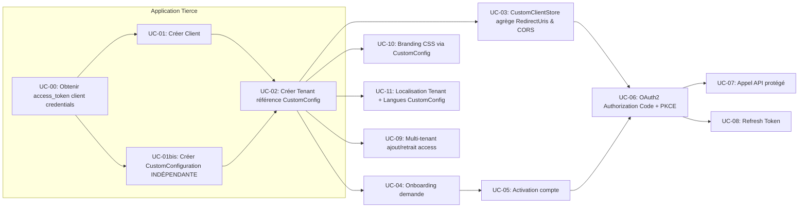

### UC-04: Flux d'Onboarding avec Vérification Tierce
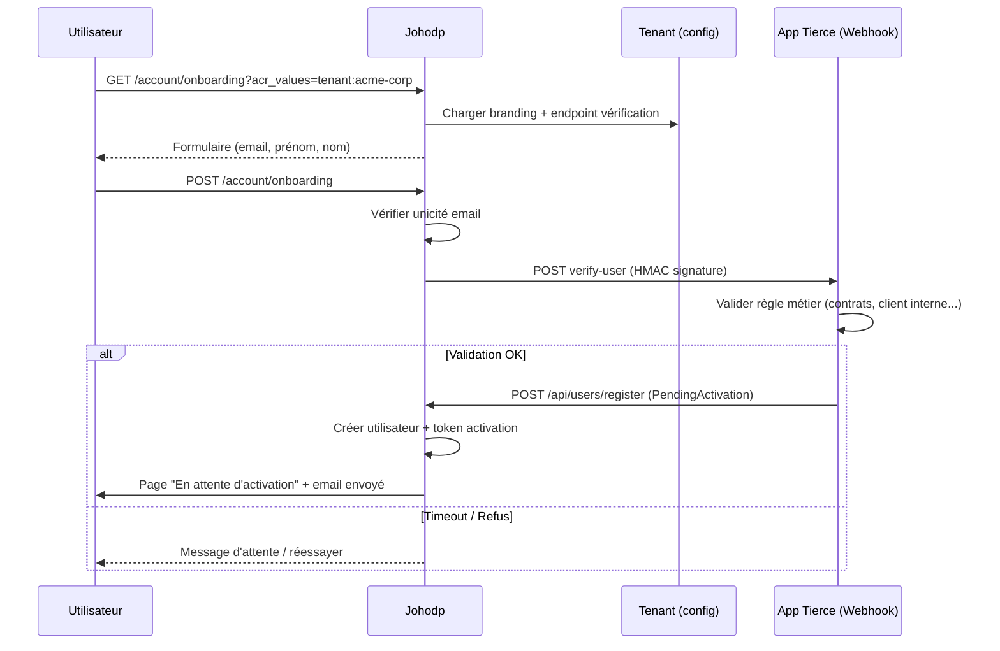

### UC-05: Activation du Compte
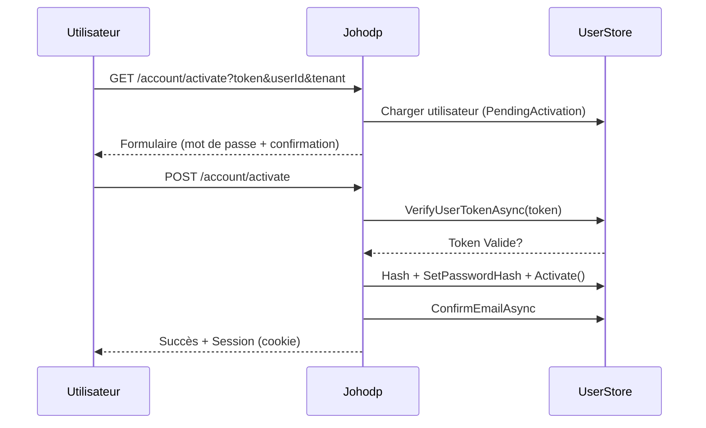

### UC-06: Authorization Code Flow avec PKCE
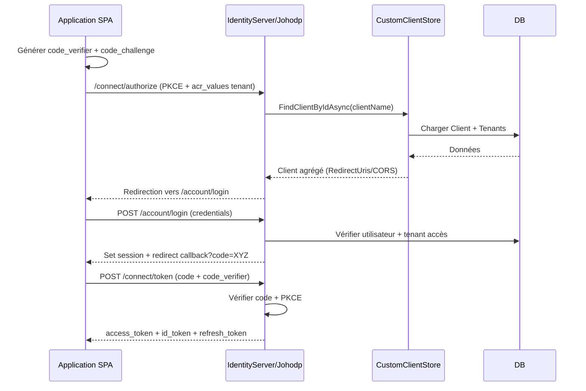

### UC-07: Appel API Protégé
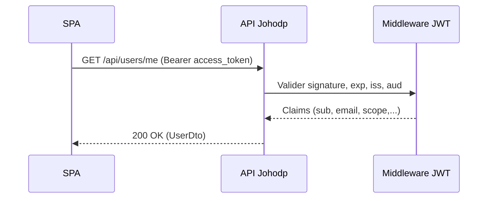

### UC-08: Renouvellement Refresh Token
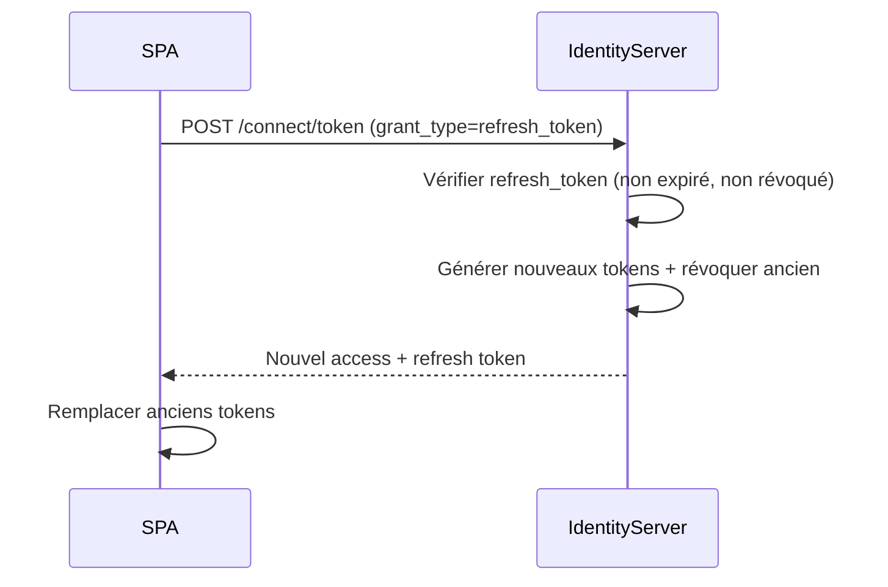

### UC-09: Multi-Tenant (Ajout/Retrait)
```mermaid
flowchart LR
   Admin[Admin System] --> POSTAdd[POST /api/users/{user}/tenants/{tenant}]
   POSTAdd --> Domain[User.AddTenantId]
   Domain --> Persist[Save Changes]
   Persist --> Access[Utilisateur peut se connecter via tenant]
   Admin --> DELRem[DELETE /api/users/{user}/tenants/{tenant}]
   DELRem --> DomainRem[User.RemoveTenantId]
   DomainRem --> PersistRem[Save Changes]
   PersistRem --> Revoke[Accès révoqué]
```

### UC-10: Branding CSS
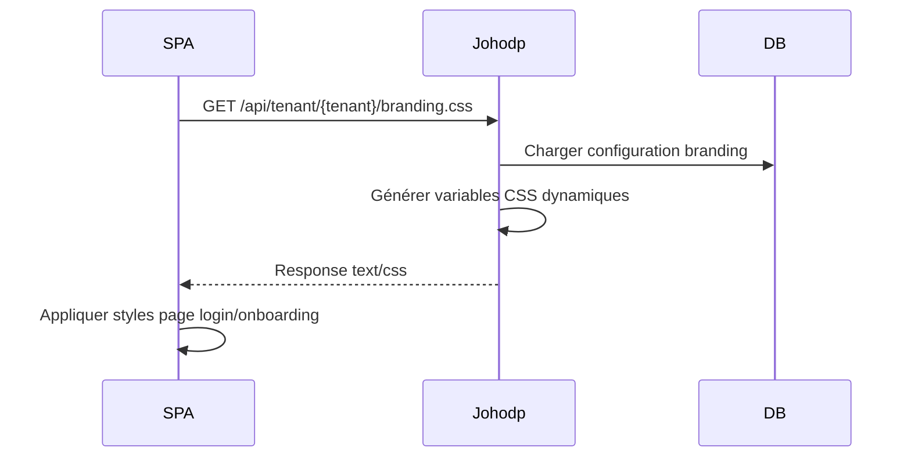

### UC-11: Localisation
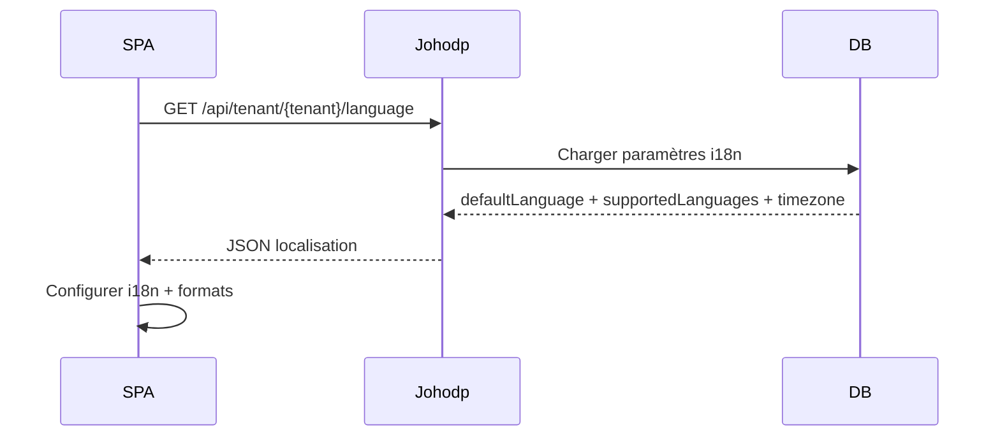

### UC-03 / Agrégation Dynamique (Focus Tenants)
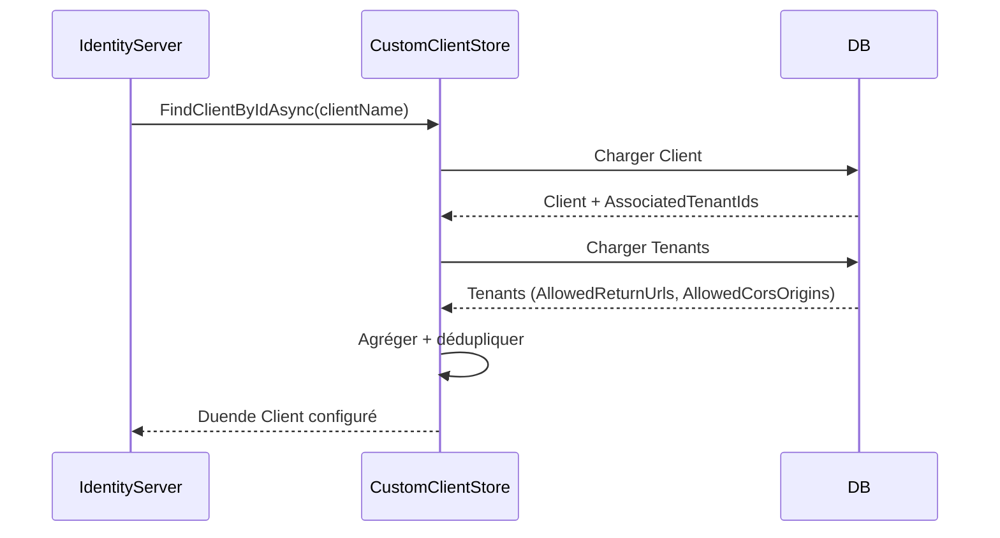

### Vue d'État Utilisateur (Pending → Active)
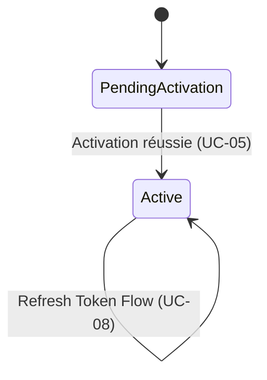

---
