# 📋 Besoins et Cas d'Usage de Johodp Identity Provider

## Vue d'ensemble

Johodp est un Identity Provider multi-tenant basé sur OAuth2/OIDC, conçu pour permettre aux applications tierces de déléguer l'authentification et la gestion des utilisateurs tout en conservant le contrôle sur qui peut accéder à leurs services.

---

# CHAPITRE 0 : CONCEPTS FONDAMENTAUX

## 🏗️ Modèle de Données : Clients, Tenants, CustomConfigurations et Utilisateurs

### Qu'est-ce qu'un **Client** ?

Un **Client** représente une **application tierce** qui souhaite utiliser Johodp comme système d'authentification. C'est l'entité racine dans la hiérarchie OAuth2.

**Caractéristiques techniques :**
- Identifié par un `ClientId` (GUID) et un `ClientName` (ex: "my-app")
- Possède un `ClientSecret` pour l'authentification machine-to-machine
- Configure les `AllowedScopes` (openid, profile, email, api)
- Définit les règles OAuth2 : `RequirePkce`, `RequireClientSecret`, `RequireConsent`

**Métaphore :**
> Un Client est comme une **entreprise** qui possède un ou plusieurs magasins (tenants). L'entreprise a une identité unique, mais chaque magasin a sa propre adresse et peut choisir sa décoration parmi un catalogue partagé (CustomConfigurations).

**Exemples concrets :**
- Une application ERP d'entreprise
- Une plateforme SaaS B2B
- Un CRM multi-clients
- Une application mobile avec backend

**Cycle de vie :**
1. L'application tierce s'authentifie auprès de Johodp (client credentials)
2. Elle crée un Client via l'API : `POST /api/clients`
3. À ce stade, le Client existe mais **n'est pas visible pour IdentityServer** (pas de redirect URIs)
4. Le Client devient opérationnel uniquement après création d'au moins un Tenant

**Règles importantes :**
- ✅ Un Client peut avoir **plusieurs Tenants** (relation 1-to-many)
- ✅ Un Client sans Tenant **ne peut pas effectuer d'authentification OAuth2**
- ✅ Le `ClientName` doit être **unique** dans tout le système
- ✅ Les redirect URIs et CORS origins sont **agrégés depuis les Tenants**

---

### Qu'est-ce qu'une **CustomConfiguration** ?

Une **CustomConfiguration** représente une **configuration de branding et de localisation partageable** entre plusieurs tenants. Elle est **complètement indépendante** des Clients et permet de mutualiser des configurations visuelles et linguistiques.

**Caractéristiques techniques :**
- Identifiée par un `CustomConfigurationId` (GUID) et un `Name` (unique, ex: "corporate-blue")
- **Indépendante** : n'appartient à aucun Client spécifique
- **Partageable** : peut être utilisée par plusieurs Tenants (même de Clients différents)
- Configure le **Branding** :
  - `PrimaryColor`, `SecondaryColor` (couleurs de la charte graphique)
  - `LogoUrl` (URL du logo affiché sur les pages d'authentification)
  - `BackgroundImageUrl` (image de fond personnalisée)
  - `CustomCss` (CSS personnalisé pour un contrôle total de l'apparence)
- Configure les **Langues** :
  - `SupportedLanguages` (liste des langues disponibles, ex: ["fr-FR", "en-US"])
  - `DefaultLanguage` (langue par défaut, obligatoire)
- Possède un statut `IsActive` (permet de désactiver temporairement)
- Horodatée : `CreatedAt`, `UpdatedAt`

**Métaphore :**
> Une CustomConfiguration est comme un **catalogue de décoration** dans un centre commercial. Plusieurs magasins (Tenants) peuvent choisir le même thème visuel (configuration), et ce catalogue existe indépendamment des entreprises (Clients) qui l'utilisent.

**Exemples concrets :**
- **Configuration "Corporate Professional"** :
  - Couleurs : Bleu foncé (#003366) + Gris (#6c757d)
  - Langues : Français, Anglais
  - Utilisée par : Tenants de plusieurs applications d'entreprise

- **Configuration "Startup Modern"** :
  - Couleurs : Orange vif (#ff6b35) + Blanc
  - CSS custom : Animations modernes, fonts Google
  - Utilisée par : Plusieurs startups SaaS partageant la même identité visuelle

- **Configuration "Banking Secure"** :
  - Couleurs : Vert (#28a745) + Or (#ffc107)
  - Logo : Logo bancaire officiel
  - Utilisée par : Différents portails bancaires d'une même institution

**Cycle de vie :**
1. Une application tierce crée une CustomConfiguration via l'API : `POST /api/custom-configurations`
2. Elle configure le branding (couleurs, logo, CSS) et les langues supportées
3. La CustomConfiguration est créée avec `IsActive = true`
4. Elle peut être référencée par **n'importe quel Tenant** (même d'un autre Client)
5. Les Tenants utilisant cette configuration affichent automatiquement le branding configuré
6. La configuration peut être mise à jour (`PUT /api/custom-configurations/{id}`)
7. Les changements sont appliqués instantanément à tous les Tenants qui l'utilisent

**Règles importantes :**
- ✅ Une CustomConfiguration est **indépendante** (pas de ClientId)
- ✅ Une CustomConfiguration peut être **partagée** par plusieurs Tenants (relation 1-to-many)
- ✅ Le `Name` doit être **unique** dans tout le système
- ✅ Le `DefaultLanguage` est **obligatoire** (validation stricte)
- ✅ Les `SupportedLanguages` doivent **inclure** le `DefaultLanguage`
- ✅ Une CustomConfiguration peut exister **sans être utilisée** par aucun Tenant
- ✅ La suppression d'une CustomConfiguration **échoue** si elle est référencée par des Tenants actifs

---

### Qu'est-ce qu'un **Tenant** ?

Un **Tenant** représente un **espace isolé** au sein d'un Client. Il permet à l'application tierce de gérer plusieurs clients finaux (B2B), environnements (prod/staging) ou marques (white-label) de manière indépendante.

**Caractéristiques techniques :**
- Identifié par un `TenantId` (GUID) et un `Name` (ex: "acme-corp-example-com", dérivé de l'URL)
- Associé à **un seul Client** (relation many-to-1 via `ClientName`)
- **Référence obligatoirement une CustomConfiguration** via `CustomConfigurationId` (relation many-to-1)
- Configure les **redirect URIs** (`AllowedReturnUrls`) : où l'utilisateur est renvoyé après authentification
- Configure les **CORS origins** (`AllowedCorsOrigins`) : quels domaines peuvent appeler l'API
- Configure un **endpoint de vérification utilisateur** (webhook) pour valider les inscriptions
- Configure la **localisation** : `Timezone`, `Currency`, `DateFormat`, `TimeFormat`

**Métaphore :**
> Un Tenant est comme un **magasin** dans une chaîne. Chaque magasin a sa propre adresse (URL), choisit sa décoration dans un catalogue (CustomConfiguration), son fuseau horaire (localisation), et son système de validation d'entrée (webhook).

**Exemples concrets :**
- **Client = SaaS CRM :**
  - Tenant 1 : `acme-corp` → Client final ACME Corporation, CustomConfiguration "Corporate Professional"
  - Tenant 2 : `globex-inc` → Client final Globex Inc, CustomConfiguration "Startup Modern"
- **Client = Application Entreprise :**
  - Tenant 1 : `production` → Environnement de production, CustomConfiguration "Banking Secure"
  - Tenant 2 : `staging` → Environnement de test, CustomConfiguration "Banking Secure" (partagée)
- **Client = Plateforme White-Label :**
  - Tenant 1 : `brand-a` → Marque A, CustomConfiguration personnalisée "Brand A Style"
  - Tenant 2 : `brand-b` → Marque B, CustomConfiguration personnalisée "Brand B Style"

**Cycle de vie :**
1. L'application tierce crée d'abord une CustomConfiguration (ou réutilise une existante)
2. Elle crée ensuite un Tenant via l'API : `POST /api/tenant`
3. Elle fournit les redirect URIs, CORS origins, CustomConfigurationId, localisation et webhook
4. Le Tenant est automatiquement associé au Client (via ClientName)
5. Le Tenant référence la CustomConfiguration (via CustomConfigurationId - **obligatoire**)
6. Le Client devient **visible pour IdentityServer** (agrégation des redirect URIs)
7. Les utilisateurs peuvent maintenant s'authentifier via ce Tenant avec le branding de la CustomConfiguration

**Règles importantes :**
- ✅ Un Tenant appartient à **un seul Client** (pas de partage entre Clients)
- ✅ Un Tenant **doit référencer** une CustomConfiguration (relation obligatoire)
- ✅ Plusieurs Tenants peuvent **partager** la même CustomConfiguration (mutualisation)
- ✅ Un Tenant doit avoir **au moins une redirect URI** (sinon non opérationnel)
- ✅ Les CORS origins sont des **URIs d'autorité uniquement** (pas de path) :
  - ✅ Valide : `http://localhost:4200`, `https://app.acme.com`
  - ❌ Invalide : `http://localhost:4200/callback`
- ✅ Le `Name` du Tenant est **dérivé de l'URL** (ex: `https://acme.com` → `acme-com`)
- ✅ Le **webhook** est appelé à chaque demande d'inscription (validation métier)
- ✅ La **localisation** (timezone, currency, formats) est spécifique au Tenant (pas dans CustomConfiguration)

**Format `acr_values` :**
Lors de l'authentification, le Tenant est identifié par le paramètre `acr_values` :
```
/connect/authorize?acr_values=tenant:acme-corp-example-com
```
L'URL complète `https://acme-corp.example.com` est nettoyée en `acme-corp-example-com`.

---

### Qu'est-ce qu'un **Utilisateur** (User) ?

Un **Utilisateur** représente une **personne physique** qui peut s'authentifier sur un ou plusieurs Tenants. C'est l'entité centrale de l'authentification.

**Caractéristiques techniques :**
- Identifié par un `UserId` (GUID) et un `Email` (unique dans tout le système)
- Possède des données d'identité : `FirstName`, `LastName`, `PhoneNumber`
- A un statut : `PendingActivation` (en attente) ou `Active` (activé)
- **Multi-tenant** : associé à une liste de `UserTenants` (relation many-to-many)
- Chaque association `UserTenant` contient :
  - `TenantId` : le Tenant auquel l'utilisateur a accès
  - `Role` : le rôle fourni par l'application tierce (ex: "admin", "user", "manager")
  - `Scope` : le périmètre fourni par l'application tierce (ex: "full_access", "read_only", "department_sales")
- Stocke le `PasswordHash` (jamais en clair)
- Peut avoir une authentification multi-facteurs (MFA, à venir)

**Métaphore :**
> Un Utilisateur est comme une **carte de membre** qui donne accès à plusieurs magasins. Pour chaque magasin (Tenant), la carte indique le niveau d'accès (Role) et la zone autorisée (Scope).

**Exemples concrets :**
- **Utilisateur Simple :**
  - Email : `john@acme.com`
  - Accès : 1 Tenant (`acme-corp`)
  - Role : `user`
  - Scope : `default`

- **Consultant Multi-Client :**
  - Email : `consultant@agency.com`
  - Accès :
    - Tenant `client-a` → Role: `architect`, Scope: `project_alpha`
    - Tenant `client-b` → Role: `developer`, Scope: `project_beta`
    - Tenant `client-c` → Role: `reviewer`, Scope: `all_projects`

- **Manager Multi-Départements :**
  - Email : `manager@company.com`
  - Accès :
    - Tenant `dept-sales` → Role: `manager`, Scope: `region_north`
    - Tenant `dept-marketing` → Role: `viewer`, Scope: `all_campaigns`

**Cycle de vie :**
1. **Inscription (Onboarding) :**
   - L'utilisateur remplit le formulaire sur `/account/onboarding?acr_values=tenant:xxx`
   - Johodp envoie une notification webhook à l'application tierce
   - L'application valide selon ses règles métier (contrat, quota, etc.)
   - Si valide, elle crée l'utilisateur via `POST /api/users/register` avec la liste des Tenants
   - L'utilisateur reçoit un email d'activation

2. **Activation :**
   - L'utilisateur clique sur le lien d'activation
   - Il définit son mot de passe
   - Son statut passe de `PendingActivation` à `Active`

3. **Authentification :**
   - L'utilisateur se connecte via `/connect/authorize?acr_values=tenant:xxx`
   - Johodp vérifie qu'il a accès au Tenant demandé
   - Il reçoit un JWT contenant uniquement les claims du Tenant spécifique :
     ```json
     {
       "tenant_id": "guid-tenant",
       "tenant_role": "admin",
       "tenant_scope": "full_access"
     }
     ```

4. **Gestion Multi-Tenant :**
   - Ajout d'accès : `POST /api/users/{userId}/tenants` avec `role` et `scope`
   - Modification : `PUT /api/users/{userId}/tenants/{tenantId}` avec nouveaux `role` et `scope`
   - Retrait : `DELETE /api/users/{userId}/tenants/{tenantId}`

**Règles importantes :**
- ✅ Un Utilisateur peut avoir accès à **plusieurs Tenants** (multi-tenant)
- ✅ Chaque association Tenant a son propre **Role** et **Scope** (fournis par l'app tierce)
- ✅ L'email est **unique** dans tout le système (pas de doublons)
- ✅ Un Utilisateur **ne peut se connecter qu'aux Tenants auxquels il a accès**
- ✅ Les **Role** et **Scope** sont des **strings libres** (pas de validation stricte, c'est l'app tierce qui décide)
- ✅ Lors de la connexion, le JWT contient **uniquement** les claims du Tenant demandé (isolation)

---

## 🔗 Relations entre Entités

```
┌──────────────────────┐
│       Client         │ (Application Tierce)
│  - ClientId          │ Exemple: "my-erp-app"
│  - ClientName        │
│  - ClientSecret      │
└──────┬───────────────┘
       │
       │ 1-to-many
       │
       ▼
┌──────────────────────┐       ┌──────────────────────┐
│        Tenant        │──────►│  CustomConfiguration │
│  - TenantId          │ N:1   │  - ConfigId          │
│  - Name              │       │  - Name (unique)     │
│  - ClientName (FK)   │       │  - Branding          │
│  - CustomConfigId(FK)│       │  - Languages         │
│  - RedirectURIs      │       │  - IsActive          │
│  - CORS Origins      │       └──────────────────────┘
│  - Webhook           │                ▲
│  - Localization      │                │
└──────────┬───────────┘                │
           │                            │
           │ many-to-many               │ Plusieurs Tenants
           │ (via UserTenant)           │ peuvent partager
           │                            │ la même config
           ▼
   ┌───────────────────┐         ┌──────────────────┐
   │   UserTenant      │◄────────│      User        │ (Personne)
   │  - UserId         │         │  - UserId        │ Exemple: "john@acme.com"
   │  - TenantId       │         │  - Email         │
   │  - Role           │         │  - FirstName     │
   │  - Scope          │         │  - Status        │
   │  - CreatedAt      │         │  - PasswordHash  │
   └───────────────────┘         └──────────────────┘
```

**Relations clés :**
- **1 Client** → **N Tenants** (un client possède plusieurs tenants)
- **1 CustomConfiguration** → **N Tenants** (une configuration peut être utilisée par plusieurs tenants)
- **1 Tenant** → **1 Client** (un tenant appartient à un seul client via ClientName)
- **1 Tenant** → **1 CustomConfiguration** (chaque tenant doit avoir une configuration - **obligatoire**)
- **N Users** → **M Tenants** (many-to-many via UserTenant avec Role + Scope)
- **CustomConfiguration est indépendante** (pas de propriétaire Client)

**Flux de données :**
1. Une **CustomConfiguration** est créée de manière **indépendante** (n'appartient à aucun Client)
2. Un **Client** crée un **Tenant** et **doit** lui associer une **CustomConfiguration** existante (obligatoire)
3. Plusieurs **Tenants** (même de Clients différents) peuvent référencer la même **CustomConfiguration** (mutualisation)
4. Des **Users** sont associés à des **Tenants** via **UserTenant** avec role/scope spécifiques

---

## 🎯 Pourquoi cette Architecture ?

### Séparation des Responsabilités
- **Client** = Configuration OAuth2 globale (scopes, PKCE, secrets)
- **CustomConfiguration** = Configuration visuelle et linguistique réutilisable (branding + langues)
- **Tenant** = Configuration contextuelle (URLs, webhook, localisation) + référence à une CustomConfiguration
- **User** = Identité avec accès multi-tenant + rôles/périmètres

### Flexibilité
- Une application peut avoir plusieurs environnements (prod/staging) → 1 Client, 2 Tenants, 1 CustomConfiguration partagée
- Une plateforme B2B peut gérer plusieurs clients finaux → 1 Client, N Tenants, chacun avec sa propre CustomConfiguration ou partagée
- Un utilisateur peut travailler pour plusieurs clients → 1 User, M Tenants
- **Plusieurs applications peuvent partager le même branding** → N Clients, M Tenants, 1 CustomConfiguration partagée

### Réutilisabilité
- **CustomConfiguration indépendante** : Peut être créée une fois et réutilisée par plusieurs Tenants
- **Mutualisation du branding** : Plusieurs Tenants (même de Clients différents) peuvent partager la même charte graphique
- **Gestion centralisée** : Modifier une CustomConfiguration met à jour instantanément tous les Tenants qui l'utilisent
- **Catalogue de configurations** : Possibilité de créer un catalogue de CustomConfigurations prédéfinies

### Sécurité
- Les redirect URIs sont validées par Tenant (isolation)
- Les CORS origins sont validées par Tenant (pas de cross-tenant XSS)
- Les utilisateurs ne peuvent accéder qu'aux Tenants autorisés (validation stricte)
- Les Roles et Scopes sont contextuels (un utilisateur peut être "admin" sur tenant-A et "viewer" sur tenant-B)

### Évolutivité
- Nouveaux clients finaux = nouveaux Tenants (pas de modification du Client)
- Nouveaux environnements = nouveaux Tenants (isolation complète)
- Nouveaux utilisateurs = création avec liste de Tenants + Roles/Scopes

---

# PARTIE 1 : BESOINS FONCTIONNELS

## 🎯 Besoins Métier

### Besoin 1 : Permettre à une application tierce de gérer ses propres clients OAuth2

**Contexte:**
Une entreprise possède une application métier (ERP, CRM, plateforme SaaS) et souhaite permettre à ses utilisateurs de s'authentifier via Johodp sans gérer elle-même l'infrastructure d'authentification.

**Besoin:**
L'application tierce doit pouvoir créer et gérer ses propres configurations OAuth2 (appelées "clients") de manière autonome et sécurisée.

**Solution:**
- L'application tierce s'authentifie auprès de Johodp en mode "machine-to-machine" (client credentials OAuth2)
- Elle peut ensuite créer un ou plusieurs clients OAuth2 via l'API Johodp
- Chaque client représente une application ou un environnement (ex: prod, staging, dev)

**Bénéfices:**
- Autonomie complète de l'application tierce
- Pas besoin d'intervention manuelle d'un administrateur Johodp
- Intégration rapide et automatisable (scripts, CI/CD)

---

### Besoin 2 : Permettre à une application tierce de gérer ses espaces clients (tenants)

**Contexte:**
Une application tierce peut avoir plusieurs clients finaux (B2B) ou plusieurs environnements qui nécessitent des configurations différentes (URLs, règles métier, localisation).

**Besoin:**
L'application tierce doit pouvoir créer des espaces isolés (tenants) pour chacun de ses clients finaux, avec :
- Des URLs de redirection spécifiques
- Une référence à une configuration de branding partageable (CustomConfiguration)
- Des paramètres de localisation (timezone, devise, formats de date/heure)

**Solution:**
- L'application tierce crée d'abord un client OAuth2 (Besoin 1)
- Elle crée ou réutilise une CustomConfiguration pour le branding et les langues
- Elle crée ensuite un ou plusieurs tenants associés à ce client et à une CustomConfiguration
- Chaque tenant a ses propres configurations techniques (URLs) et de localisation

**Bénéfices:**
- Isolation des clients finaux (white-label)
- Mutualisation du branding entre plusieurs tenants
- Gestion multi-environnement facilitée
- Localisation spécifique par tenant

---

### Besoin 2bis : Mutualiser les configurations visuelles entre tenants

**Contexte:**
Plusieurs tenants (même de clients différents) peuvent vouloir partager la même charte graphique pour réduire les coûts de maintenance et garantir une cohérence visuelle.

**Besoin:**
L'application tierce doit pouvoir créer des configurations de branding réutilisables (CustomConfiguration) qui peuvent être partagées entre plusieurs tenants.

**Solution:**
- L'application tierce crée une CustomConfiguration indépendante via l'API : `POST /api/custom-configurations`
- Elle configure le branding (logo, couleurs, CSS) et les langues supportées
- Plusieurs tenants peuvent référencer la même CustomConfiguration
- Les modifications de la CustomConfiguration sont automatiquement appliquées à tous les tenants qui l'utilisent

**Bénéfices:**
- Réduction des coûts de maintenance (une seule configuration à mettre à jour)
- Cohérence visuelle garantie entre plusieurs tenants
- Possibilité de créer un catalogue de configurations prédéfinies
- Flexibilité : chaque tenant peut aussi avoir sa propre CustomConfiguration unique

---

### Besoin 3 : Valider les utilisateurs selon les règles métier de l'application tierce

**Contexte:**
L'application tierce a ses propres règles métier pour accepter ou refuser un nouvel utilisateur (vérification d'un numéro de client, validation d'un contrat, contrôle de quota, etc.).

**Besoin:**
Avant de créer un utilisateur dans Johodp, l'application tierce doit pouvoir appliquer ses règles de validation métier.

**Solution:**
- L'application tierce configure un endpoint de vérification (webhook) lors de la création du tenant
- Lors d'une demande d'inscription, Johodp notifie l'application tierce
- L'application tierce valide les informations (appels API internes, vérifications en base, etc.)
- Si valide, elle appelle l'API Johodp pour finaliser la création de l'utilisateur
- Sinon, elle rejette la demande

**Bénéfices:**
- L'application tierce garde le contrôle total sur qui peut accéder à ses services
- Johodp ne crée jamais d'utilisateur sans validation préalable
- Flexibilité totale pour implémenter n'importe quelle règle métier

---

### Besoin 4 : Permettre aux utilisateurs de créer leur compte via l'application tierce

**Contexte:**
Un utilisateur final découvre l'application tierce et souhaite créer un compte.

**Besoin:**
L'utilisateur doit pouvoir remplir un formulaire d'inscription avec le branding de l'application tierce, puis recevoir un email pour activer son compte.

**Solution:**
- L'application redirige vers la page d'inscription Johodp (avec branding du tenant)
- L'utilisateur remplit le formulaire (email, nom, prénom)
- Johodp notifie l'application tierce pour validation (Besoin 3)
- L'application tierce valide et crée l'utilisateur via l'API
- Johodp envoie un email avec un lien d'activation
- L'utilisateur active son compte en créant son mot de passe

**Bénéfices:**
- Expérience utilisateur fluide et personnalisée
- Sécurité : validation en deux étapes (métier + email)
- Pas de gestion de mot de passe côté application tierce

---

### Besoin 5 : Authentifier les utilisateurs de manière sécurisée (Single Sign-On)

**Contexte:**
Un utilisateur existant veut se connecter à l'application tierce.

**Besoin:**
L'utilisateur doit pouvoir se connecter une seule fois et accéder à toutes les applications du tenant sans ressaisir ses identifiants (SSO).

**Solution:**
- L'application redirige vers la page de login Johodp
- L'utilisateur entre email et mot de passe
- Johodp vérifie les credentials et la validité du tenant
- Johodp génère un code d'autorisation OAuth2
- L'application échange le code contre des tokens (access, refresh, id)
- L'application peut maintenant appeler ses APIs avec l'access token

**Bénéfices:**
- Sécurité renforcée (OAuth2 + PKCE)
- Expérience utilisateur simplifiée (SSO)
- Pas de gestion de session côté application tierce

---

### Besoin 6 : Isoler les utilisateurs par tenant (multi-tenancy)

**Contexte:**
Une application tierce a plusieurs clients finaux qui ne doivent pas voir les données des autres.

**Besoin:**
Un utilisateur ne doit pouvoir se connecter qu'aux tenants auxquels il a explicitement accès.

**Solution:**
- Chaque utilisateur a une liste de tenants autorisés (URLs sans caractères spéciaux)
- L'URL du tenant est transmise via `acr_values=tenant:<url>` (ex: `tenant:https://acme-corp.example.com` nettoyé en `acme-corp-example-com`)
- Lors de la connexion, Johodp vérifie que le tenant demandé est dans la liste
- Si oui, l'authentification réussit
- Si non, l'authentification échoue

**Bénéfices:**
- Isolation stricte des données
- Conformité RGPD (séparation des données clients)
- Gestion fine des accès

---

### Besoin 7 : Personnaliser l'apparence des pages d'authentification

**Contexte:**
Chaque client final de l'application tierce veut son propre branding (logo, couleurs, charte graphique).

**Besoin:**
Les pages de login, inscription et activation doivent afficher le branding du tenant concerné.

**Solution:**
- Chaque tenant configure son branding (logo, couleurs, CSS custom)
- Johodp génère dynamiquement un fichier CSS par tenant
- Les pages d'authentification chargent ce CSS automatiquement

**Bénéfices:**
- Expérience white-label complète
- Cohérence visuelle avec l'application tierce
- Pas de développement front-end côté application tierce

---

### Besoin 8 : Gérer les paramètres régionaux par tenant

**Contexte:**
Les clients finaux sont dans différents pays avec des langues, fuseaux horaires et devises différents.

**Besoin:**
Chaque tenant doit pouvoir configurer ses paramètres régionaux (langue, timezone, devise, format de date).

**Solution:**
- Chaque tenant configure ses paramètres de localisation
- L'application tierce récupère ces paramètres via l'API
- Les interfaces utilisateur s'adaptent automatiquement

**Bénéfices:**
- Expérience utilisateur localisée
- Conformité avec les attentes régionales
- Centralisation de la configuration i18n

---

### Besoin 9 : Renouveler les sessions utilisateur de manière transparente

**Contexte:**
Un utilisateur connecté ne doit pas être déconnecté brusquement après expiration du token.

**Besoin:**
L'application doit pouvoir renouveler automatiquement les tokens sans intervention de l'utilisateur.

**Solution:**
- Lors de l'authentification, Johodp fournit un refresh token (validité 15 jours)
- Avant expiration de l'access token, l'application échange le refresh token contre de nouveaux tokens
- L'utilisateur reste connecté sans interruption

**Bénéfices:**
- Expérience utilisateur fluide
- Sécurité maintenue (tokens courts + renouvellement)
- Pas de re-authentification fréquente

---

### Besoin 10 : Authentifier l'application tierce elle-même (machine-to-machine)

**Contexte:**
L'application tierce doit pouvoir appeler les APIs Johodp pour créer des clients, des tenants et des utilisateurs.

**Besoin:**
L'application tierce doit s'authentifier de manière sécurisée sans interaction utilisateur.

**Solution:**
- L'application tierce utilise le flux "client credentials" OAuth2
- Elle envoie son client_id et client_secret à Johodp
- Johodp retourne un access token avec les permissions appropriées
- L'application utilise ce token pour appeler les APIs d'administration

**Bénéfices:**
- Sécurité : pas de mot de passe utilisateur, pas de clé API statique
- Standard OAuth2
- Traçabilité des actions (quel client a fait quoi)

---

# PARTIE 2 : SPÉCIFICATIONS TECHNIQUES

## 🔧 Architecture OAuth2/OIDC

### Flux d'Authentification
Johodp implémente le standard OAuth2 avec les extensions suivantes :
- **Authorization Code Flow** avec PKCE (Proof Key for Code Exchange)
- **Client Credentials Flow** pour l'authentification machine-to-machine
- **Refresh Token Flow** pour le renouvellement de session
- Support complet d'OpenID Connect (OIDC) pour l'identité utilisateur

### Sécurité
- PKCE obligatoire pour tous les clients publics (SPA, applications mobiles)
- Client secret requis pour les clients confidentiels (backends)
- Validation stricte des redirect URIs et CORS origins
- Tokens JWT signés avec rotation des clés de signature
- Access tokens courts (1h) + refresh tokens longs (15 jours)

---

## 🎯 Cas d'Usage Techniques

### UC-00: Authentification de l'Application Tierce (Client Credentials)

**Acteur Principal:** Application tierce (système)

**Préconditions:**
- L'application tierce a reçu un client_id et client_secret de Johodp
- Le client est configuré avec le grant_type "client_credentials"

**Scénario Principal:**
1. L'application tierce envoie une requête POST `/connect/token` avec:
   ```json
   {
     "grant_type": "client_credentials",
     "client_id": "third-party-app",
     "client_secret": "secret-value",
     "scope": "johodp.admin"
   }
   ```
2. Johodp valide le client_id et client_secret
3. Johodp vérifie que le client a le droit d'utiliser le scope demandé
4. Johodp génère un access_token avec les claims appropriés:
   ```json
   {
     "sub": "third-party-app",
     "client_id": "third-party-app",
     "scope": ["johodp.admin"],
     "exp": 3600
   }
   ```
5. L'application tierce reçoit le token et peut maintenant appeler les APIs

**Règles de Gestion:**
- RG-CLIENT-CRED-01: Le client_secret doit être stocké de manière sécurisée (hashed en base)
- RG-CLIENT-CRED-02: L'access_token expire après 1 heure
- RG-CLIENT-CRED-03: Pas de refresh_token pour ce flux (l'app redemande un token)
- RG-CLIENT-CRED-04: Le scope "johodp.admin" permet de créer clients, tenants et utilisateurs

**Postconditions:**
- L'application tierce a un access_token valide pour appeler les APIs d'administration
- Toutes les actions sont tracées avec le client_id source

---

### UC-01: Création d'un Client OAuth2 par l'Application Tierce

**Acteur Principal:** Application tierce (authentifiée via client credentials)

**Préconditions:**
- L'application tierce a un access_token valide avec le scope "johodp.admin" (UC-00 complété)
- Un ClientName unique est disponible

**Scénario Principal:**
1. L'application tierce envoie une requête POST `/api/clients` avec:
   ```http
   Authorization: Bearer <access_token>
   Content-Type: application/json
   
   {
     "clientName": "my-app",
     "allowedScopes": ["openid", "profile", "email"],
     "requireConsent": true
   }
   ```
2. Johodp valide l'access_token (signature, expiration, scope)
3. Le système crée un agrégat `Client` dans l'état suivant:
   - `RequireClientSecret = true` (PKCE avec client secret)
   - `RequirePkce = true` (Protection PKCE obligatoire)
   - `IsActive = true`
4. Le système retourne le `ClientDto` avec un `ClientId` (GUID)
5. **Note:** Le client est créé SANS tenant associé (pas de redirect URIs)
6. Le client n'est PAS visible pour IdentityServer tant qu'il n'a pas de tenant

**Règles de Gestion:**
- RG-CLIENT-01: L'access_token DOIT avoir le scope "johodp.admin"
- RG-CLIENT-02: Un clientName doit être unique dans le système
- RG-CLIENT-03: Un client sans tenant n'est pas visible pour IdentityServer (sécurité)
- RG-CLIENT-04: Les scopes doivent être des valeurs valides (openid, profile, email, api)
- RG-CLIENT-05: L'action est tracée avec le client_id appelant (audit trail)

**Postconditions:**
- Un client est créé mais non fonctionnel (besoin d'un tenant)
- Le client n'apparaît pas dans IdentityServer
- L'application tierce peut maintenant créer des tenants pour ce client

---

### UC-01bis: Création d'une CustomConfiguration

**Acteur Principal:** Application tierce (authentifiée via client credentials)

**Préconditions:**
- L'application tierce a un access_token valide avec le scope "johodp.admin" (UC-00 complété)
- Un nom unique est disponible pour la CustomConfiguration

**Scénario Principal:**
1. L'application tierce envoie une requête POST `/api/custom-configurations` avec:
   ```http
   Authorization: Bearer <access_token>
   Content-Type: application/json
   
   {
     "name": "corporate-professional",
     "description": "Configuration pour applications d'entreprise professionnelles",
     "defaultLanguage": "fr-FR",
     "branding": {
       "primaryColor": "#003366",
       "secondaryColor": "#6c757d",
       "logoUrl": "https://cdn.example.com/logos/corporate.png",
       "backgroundImageUrl": "https://cdn.example.com/backgrounds/office.jpg",
       "customCss": ":root { --border-radius: 8px; }"
     },
     "languages": {
       "supportedLanguages": ["fr-FR", "en-US", "de-DE"],
       "defaultLanguage": "fr-FR"
     }
   }
   ```
2. Johodp valide l'access_token (signature, expiration, scope "johodp.admin")
3. Le système vérifie que le nom est unique
4. Le système crée l'agrégat `CustomConfiguration` avec:
   - `Name` (unique, identifiant lisible)
   - `Description` (optionnelle)
   - `Branding` (couleurs, logo, image de fond, CSS custom)
   - `Languages` (langues supportées + langue par défaut)
   - `IsActive = true`
5. Le système persiste la configuration
6. Le système retourne le `CustomConfigurationDto` avec un `CustomConfigurationId` (GUID)

**Règles de Gestion:**
- RG-CUSTOMCONFIG-01: L'access_token DOIT avoir le scope "johodp.admin"
- RG-CUSTOMCONFIG-02: Le `Name` doit être unique dans le système
- RG-CUSTOMCONFIG-03: Le `DefaultLanguage` est obligatoire et doit être dans `SupportedLanguages`
- RG-CUSTOMCONFIG-04: Une CustomConfiguration peut être créée sans être immédiatement utilisée
- RG-CUSTOMCONFIG-05: La CustomConfiguration est **indépendante** (pas de ClientId)
- RG-CUSTOMCONFIG-06: L'action est tracée avec le client_id appelant (audit trail)

**Postconditions:**
- Une CustomConfiguration est créée et active
- Elle peut être référencée par n'importe quel Tenant
- Elle peut être partagée entre plusieurs Tenants (même de Clients différents)

---

### UC-02: Création d'un Tenant par l'Application Tierce

**Acteur Principal:** Application tierce (authentifiée via client credentials)

**Préconditions:**
- L'application tierce a un access_token valide avec le scope "johodp.admin" (UC-00)
- Un client existe déjà (UC-01 complété)
- Une CustomConfiguration existe déjà (UC-01bis complété) OU sera créée avant
- Le ClientName du client est connu
- L'application tierce a configuré un endpoint de vérification utilisateur (webhook)

**Scénario Principal:**
1. L'application tierce envoie POST `/api/tenant` avec:
   ```http
   Authorization: Bearer <access_token>
   Content-Type: application/json
   
   {
     "name": "acme-corp-example-com",
     "tenantUrl": "https://acme-corp.example.com",
     "displayName": "ACME Corporation",
     "clientName": "my-app",
     "customConfigurationId": "guid-of-custom-config",
     "allowedReturnUrls": ["http://localhost:4200/callback"],
     "allowedCorsOrigins": ["http://localhost:4200"],
     "userVerificationEndpoint": "https://api.acme.com/webhooks/johodp/verify-user",
     "localization": {
       "timezone": "Europe/Paris",
       "currency": "EUR",
       "dateFormat": "dd/MM/yyyy",
       "timeFormat": "HH:mm"
     }
   }
   ```
2. Johodp valide l'access_token (signature, expiration, scope "johodp.admin")
3. Le système vérifie que le client existe
4. Le système vérifie que la CustomConfiguration existe et est active
5. Le système crée l'agrégat `Tenant` avec:
   - Association avec le client (via ClientName)
   - **Référence obligatoire à la CustomConfiguration** (via CustomConfigurationId)
   - Validation des URLs de redirection (format URI absolu)
   - Validation des CORS origins (format URI autorité uniquement, pas de path)
   - **Stockage de l'endpoint de vérification utilisateur**
   - Configuration de la localisation (timezone, currency, formats)
6. Le système met à jour le client pour ajouter le tenant dans `AssociatedTenantIds`
7. Le système persiste les changements
8. Le client devient VISIBLE pour IdentityServer (a des redirect URIs)

**Règles de Gestion:**
- RG-TENANT-01: L'access_token DOIT avoir le scope "johodp.admin"
- RG-TENANT-02: Un tenant DOIT avoir un client associé (ClientName obligatoire)
- RG-TENANT-03: Un tenant ne peut être associé qu'à UN SEUL client (relation 1-1)
- RG-TENANT-04: Le client doit exister AVANT la création du tenant
- RG-TENANT-05: **Un tenant DOIT référencer une CustomConfiguration** (CustomConfigurationId obligatoire)
- RG-TENANT-06: **La CustomConfiguration doit exister et être active**
- RG-TENANT-07: Un tenant doit avoir au moins une URL de redirection
- RG-TENANT-08: Les CORS origins doivent être des URIs d'autorité uniquement (pas de path)
  * ✅ Valide: `http://localhost:4200`, `https://app.acme.com`
  * ❌ Invalide: `http://localhost:4200/callback`, `https://app.acme.com/path`
- RG-TENANT-09: AllowedCorsOrigins géré au niveau Tenant (migration depuis Client)
- RG-TENANT-10: CustomClientStore agrège CORS depuis tous les tenants associés au client
- RG-TENANT-11: Un nom de tenant doit être unique dans le système et dérivé de l'URL (ex: `https://acme-corp.example.com` → `acme-corp-example-com`)
- RG-TENANT-12: **L'endpoint de vérification utilisateur DOIT être une URL HTTPS en production**
- RG-TENANT-13: **L'endpoint sera appelé pour chaque demande d'inscription**
- RG-TENANT-14: L'action est tracée avec le client_id appelant (audit trail)
- RG-TENANT-15: **Le paramètre `acr_values` doit contenir l'URL nettoyée: `acr_values=tenant:acme-corp-example-com`**
- RG-TENANT-16: **Plusieurs Tenants (même de Clients différents) peuvent référencer la même CustomConfiguration**

**Postconditions:**
- Le tenant est créé et actif
- Le tenant référence une CustomConfiguration (branding + langues)
- Le client devient visible pour IdentityServer
- Les redirect URIs et CORS origins sont agrégés dynamiquement
- **L'endpoint de vérification utilisateur est enregistré et prêt à être appelé**
- L'application tierce peut maintenant gérer les inscriptions utilisateur
- **Le branding de la CustomConfiguration sera appliqué aux pages d'authentification**

---

### UC-03: Récupération Dynamique d'un Client par IdentityServer

**Acteur Principal:** IdentityServer (système)

**Préconditions:**
- Un client existe avec au moins un tenant associé
- Une requête OAuth2 arrive avec le ClientName

**Scénario Principal:**
1. IdentityServer appelle `CustomClientStore.FindClientByIdAsync(clientName)`
2. Le système récupère le `Client` depuis la base de données
3. Le système récupère TOUS les tenants associés (`AssociatedTenantIds`)
4. Le système agrège dynamiquement:
   - `RedirectUris`: Union de tous les `AllowedReturnUrls` des tenants
   - `AllowedCorsOrigins`: Union de tous les `AllowedCorsOrigins` des tenants
   - `PostLogoutRedirectUris`: Mêmes valeurs que RedirectUris
5. **Cas particulier 1:** Si le client n'a aucun tenant → retourne `null` (non visible)
6. **Cas particulier 2:** Si les tenants n'ont aucune redirect URI → retourne `null` (non visible)
7. Le système retourne un `Duende.IdentityServer.Models.Client` configuré

**Règles de Gestion:**
- RG-DYNAMIC-01: Les redirect URIs sont agrégées en temps réel (pas de cache)
- RG-DYNAMIC-02: Les CORS origins sont agrégées en temps réel (pas de cache)
- RG-DYNAMIC-03: Un client sans tenant n'est jamais visible
- RG-DYNAMIC-04: Un client avec tenants mais sans redirect URIs n'est jamais visible
- RG-DYNAMIC-05: Les redirections sont dédupliquées (même URL dans plusieurs tenants = une seule entrée)

**Postconditions:**
- IdentityServer reçoit un client valide OU null
- Le client est prêt pour le flux OAuth2/OIDC

---

### UC-04: Flux d'Onboarding Utilisateur avec Vérification Tierce

**Acteur Principal:** Utilisateur final

**Préconditions:**
- Un tenant existe avec un client associé
- **L'application tierce a configuré son endpoint de vérification (UC-02)**

**Scénario Principal:**
1. L'utilisateur clique sur "Créer un compte" dans l'application tierce
2. L'application redirige vers `/account/onboarding?acr_values=tenant:acme-corp-example-com` (URL nettoyée)
3. Johodp affiche le formulaire d'onboarding avec le branding du tenant (logo, couleurs)
4. L'utilisateur remplit: email, firstName, lastName
5. L'utilisateur soumet le formulaire
6. Le système vérifie que l'email n'existe pas déjà
7. **Le système envoie une notification HTTP POST vers l'endpoint de vérification du tenant:**
   ```http
   POST https://api.acme.com/webhooks/johodp/verify-user
   Content-Type: application/json
   X-Johodp-Signature: <HMAC signature>
   
   {
     "requestId": "uuid",
     "tenantId": "acme-corp-example-com",
     "tenantUrl": "https://acme-corp.example.com",
     "email": "user@example.com",
     "firstName": "John",
     "lastName": "Doe",
     "timestamp": "2025-11-25T10:30:00Z"
   }
   ```
8. Le système affiche la page "En attente de validation par ACME Corporation"
9. **Scénario asynchrone côté application tierce:**
   - L'application reçoit la notification webhook
   - Elle valide la signature HMAC (sécurité)
   - Elle applique ses règles métier (ex: vérifier si l'email correspond à un client existant)
   - **Si valide**, elle appelle POST `/api/users/register` avec son access_token:
     ```http
     Authorization: Bearer <access_token>
     Content-Type: application/json
     
     {
       "email": "user@example.com",
       "firstName": "John",
       "lastName": "Doe",
       "tenants": [
         {
           "tenantId": "acme-corp-example-com",
           "role": "user",
           "scope": "default"
         }
       ],
       "createAsPending": true
     }
     ```
     Note: Le format legacy avec `tenantId` simple est encore supporté (ajouté avec role="user", scope="default")
   - **Si invalide**, elle ne fait rien (l'utilisateur reste en attente)
10. Le système crée l'utilisateur en statut `PendingActivation`
11. Le système génère un token d'activation
12. Le système envoie un email avec le lien d'activation
13. L'utilisateur clique sur le lien d'activation

**Règles de Gestion:**
- RG-ONBOARD-01: L'email doit être unique dans tout le système
- RG-ONBOARD-02: **La notification webhook inclut une signature HMAC pour sécurité**
- RG-ONBOARD-03: **L'application tierce a 5 minutes pour valider (timeout)**
- RG-ONBOARD-04: **Si timeout, l'utilisateur reçoit un message "Veuillez réessayer plus tard"**
- RG-ONBOARD-05: L'utilisateur ne peut pas s'auto-activer (doit passer par validation tierce)
- RG-ONBOARD-06: Le tenant doit être actif (`IsActive = true`)
- RG-ONBOARD-07: Le branding du tenant est appliqué (CSS, logo, couleurs)
- RG-ONBOARD-08: **L'appel à `/api/users/register` DOIT inclure un access_token valide avec scope "johodp.admin"**

**Postconditions:**
- Un utilisateur en statut `PendingActivation` est créé (si validé par l'app tierce)
- Un token d'activation est généré et envoyé par email
- L'application tierce a tracé la demande dans ses logs

---

### UC-05: Activation de Compte Utilisateur

**Acteur Principal:** Utilisateur final

**Préconditions:**
- Un utilisateur existe en statut `PendingActivation`
- L'utilisateur a reçu un email avec un token d'activation

**Scénario Principal:**
1. L'utilisateur clique sur le lien d'activation:
   `/account/activate?token=<token>&userId=<guid>&tenant=acme-corp-example-com`
2. Johodp affiche le formulaire d'activation avec:
   - Email masqué (ex: `j***n@example.com`)
   - Branding du tenant
   - Champs de mot de passe (nouveau + confirmation)
3. L'utilisateur entre et confirme son mot de passe
4. L'utilisateur soumet le formulaire
5. Le système vérifie le token avec `UserManager.VerifyUserTokenAsync`
6. Le système hache le mot de passe avec `IPasswordHasher`
7. Le système appelle `user.SetPasswordHash(hashedPassword)`
8. Le système appelle `user.Activate()` (domain event: `UserActivatedEvent`)
9. Le système confirme l'email avec `UserManager.ConfirmEmailAsync`
10. Le système change le statut de `PendingActivation` à `Active`
11. Le système connecte automatiquement l'utilisateur
12. Le système redirige vers la page de succès

**Règles de Gestion:**
- RG-ACTIVATE-01: Le token ne peut être utilisé qu'une seule fois
- RG-ACTIVATE-02: Le token expire après 24h (configurable)
- RG-ACTIVATE-03: L'utilisateur doit être en statut `PendingActivation`
- RG-ACTIVATE-04: Le mot de passe doit respecter les règles de complexité
- RG-ACTIVATE-05: L'utilisateur est automatiquement connecté après activation

**Postconditions:**
- L'utilisateur passe en statut `Active`
- L'email est confirmé (`EmailConfirmed = true`)
- Un cookie de session est créé
- L'utilisateur peut maintenant se connecter normalement

---

### UC-06: Authentification OAuth2 avec PKCE (SPA)

**Acteur Principal:** Utilisateur final via Application SPA

**Préconditions:**
- Un client existe avec un tenant configuré
- Un utilisateur actif existe dans le système
- L'application SPA est configurée avec le client OAuth2

**Scénario Principal:**
1. L'utilisateur clique sur "Se connecter" dans la SPA
2. La SPA génère un `code_verifier` et calcule le `code_challenge` (PKCE)
3. La SPA redirige vers:
   ```
   /connect/authorize?
     client_id=my-app&
     response_type=code&
     scope=openid profile email&
     redirect_uri=http://localhost:4200/callback&
     code_challenge=<challenge>&
     code_challenge_method=S256&
     acr_values=tenant:acme-corp-example-com
   ```
   Note: `acme-corp-example-com` est dérivé de l'URL `https://acme-corp.example.com`
4. IdentityServer vérifie le client via `CustomClientStore`
5. L'utilisateur est redirigé vers `/account/login` (pas authentifié)
6. L'utilisateur entre email et mot de passe
7. Le système vérifie les credentials via `UserManager.CheckPasswordAsync`
8. Le système vérifie que l'utilisateur a accès au tenant demandé
9. Le système crée une session (cookie "Cookies")
10. IdentityServer génère un `authorization_code`
11. IdentityServer redirige vers: `http://localhost:4200/callback?code=<code>`
12. La SPA échange le code contre un token:
    ```
    POST /connect/token
    {
      "grant_type": "authorization_code",
      "code": "<code>",
      "redirect_uri": "http://localhost:4200/callback",
      "client_id": "my-app",
      "code_verifier": "<original_verifier>"
    }
    ```
13. IdentityServer valide le PKCE (code_verifier vs code_challenge)
14. IdentityServer retourne:
    ```json
    {
      "access_token": "eyJ...",
      "id_token": "eyJ...",
      "refresh_token": "...",
      "expires_in": 3600,
      "token_type": "Bearer"
    }
    ```
    Le `id_token` décodé contient les claims suivants:
    ```json
    {
      "sub": "user-guid",
      "email": "user@example.com",
      "given_name": "John",
      "family_name": "Doe",
      "tenant_id": "acme-corp-example-com",
      "tenant_role": "user",
      "tenant_scope": "default"
    }
    ```
    Note: Le token contient **uniquement** les claims du tenant demandé (isolation).
15. La SPA stocke les tokens et peut appeler l'API

**Règles de Gestion:**
- RG-OAUTH-01: PKCE est obligatoire (RequirePkce = true)
- RG-OAUTH-02: Le redirect_uri DOIT être dans AllowedReturnUrls du tenant
- RG-OAUTH-03: L'origine CORS DOIT être dans AllowedCorsOrigins du tenant
- RG-OAUTH-04: L'utilisateur DOIT avoir accès au tenant demandé (vérifié via `user.BelongsToTenant(tenantId)`)
- RG-OAUTH-05: Le code d'autorisation expire après 5 minutes
- RG-OAUTH-06: L'access_token expire après 1 heure (configurable)
- RG-OAUTH-07: Le refresh_token permet de renouveler l'access_token (sliding 15 jours)

**Postconditions:**
- L'utilisateur est authentifié dans la SPA
- La SPA a un access_token pour appeler l'API
- La SPA a un refresh_token pour renouveler la session

---

### UC-07: Appel API Protégé avec Access Token

**Acteur Principal:** Application SPA

**Préconditions:**
- La SPA a obtenu un access_token (UC-06 complété)
- L'API Johodp expose des endpoints protégés

**Scénario Principal:**
1. La SPA appelle une API protégée:
   ```
   GET /api/users/me
   Authorization: Bearer eyJ...
   ```
2. Le middleware JWT d'ASP.NET Core valide le token:
   - Signature valide (clé de signature IdentityServer)
   - Token non expiré
   - Issuer valide (IdentityServer)
   - Audience valide (API)
3. Le middleware extrait les claims du token:
   - `sub`: User ID
   - `email`: Email
   - `role`: Rôles
   - `scope`: Scopes autorisés
4. Le controller retourne les données demandées
5. La SPA reçoit la réponse JSON

**Règles de Gestion:**
- RG-API-01: Le token DOIT être signé par IdentityServer
- RG-API-02: Le token ne peut pas être expiré
- RG-API-03: Les scopes du token doivent correspondre à l'endpoint appelé
- RG-API-04: Les erreurs de validation retournent 401 Unauthorized

**Postconditions:**
- Les données sont retournées à la SPA
- Le token reste valide pour d'autres appels

---

### UC-08: Renouvellement de Token avec Refresh Token

**Acteur Principal:** Application SPA

**Préconditions:**
- La SPA a un refresh_token valide
- L'access_token est expiré ou proche de l'expiration

**Scénario Principal:**
1. La SPA détecte que l'access_token va expirer (< 5 minutes)
2. La SPA appelle:
   ```
   POST /connect/token
   {
     "grant_type": "refresh_token",
     "refresh_token": "<refresh_token>",
     "client_id": "my-app"
   }
   ```
3. IdentityServer valide le refresh_token:
   - Token non expiré
   - Token non révoqué
   - Client ID correspond
4. IdentityServer génère un nouvel access_token ET un nouveau refresh_token
5. IdentityServer révoque l'ancien refresh_token (one-time use)
6. IdentityServer retourne:
   ```json
   {
     "access_token": "eyJ... (nouveau)",
     "refresh_token": "... (nouveau)",
     "expires_in": 3600
   }
   ```
7. La SPA remplace les anciens tokens par les nouveaux

**Règles de Gestion:**
- RG-REFRESH-01: Les refresh_tokens sont "one-time use" (usage unique)
- RG-REFRESH-02: Le refresh_token expire après 15 jours (sliding)
- RG-REFRESH-03: Chaque renouvellement réinitialise le délai de 15 jours
- RG-REFRESH-04: Un refresh_token révoqué ne peut plus être utilisé

**Postconditions:**
- La SPA a un nouvel access_token valide
- La SPA a un nouveau refresh_token
- L'ancien refresh_token est révoqué

---

### UC-09: Gestion Multi-Tenant pour un Utilisateur

**Acteur Principal:** Administrateur système ou Application tierce

**Préconditions:**
- Un utilisateur existe dans le système
- Plusieurs tenants existent

**Scénario Principal:** Ajout d'un tenant avec role et scope
1. L'administrateur appelle POST `/api/users/{userId}/tenants`
2. Body: `{ "tenantId": "guid", "role": "manager", "scope": "department_sales" }`
3. Le système récupère l'utilisateur
4. Le système vérifie que le tenant existe
5. Le système appelle `user.AddTenant(tenantId, role, scope)` (domain)
6. Une entité `UserTenant` est créée avec les timestamps
7. Le système sauvegarde les changements
8. L'utilisateur peut maintenant s'authentifier avec ce tenant

**Scénario Alternatif 1:** Modification du role/scope
1. L'administrateur appelle PUT `/api/users/{userId}/tenants/{tenantId}`
2. Body: `{ "role": "admin", "scope": "full_access" }`
3. Le système appelle `user.UpdateTenantRoleAndScope(tenantId, role, scope)`
4. L'entité `UserTenant` est mise à jour avec `UpdatedAt`
5. Lors de la prochaine connexion, l'utilisateur aura les nouveaux role/scope

**Scénario Alternatif 2:** Retrait d'accès
1. L'administrateur appelle DELETE `/api/users/{userId}/tenants/{tenantId}`
2. Le système appelle `user.RemoveTenant(tenantId)`
3. L'entité `UserTenant` est supprimée
4. L'utilisateur ne peut plus s'authentifier avec ce tenant

**Règles de Gestion:**
- RG-MULTITENANT-01: Un utilisateur peut avoir accès à plusieurs tenants avec role/scope différents
- RG-MULTITENANT-02: Chaque association `UserTenant` a un `Role` et un `Scope` obligatoires (strings non vides)
- RG-MULTITENANT-03: À la connexion, l'utilisateur DOIT avoir le tenant demandé dans sa liste `UserTenants`
- RG-MULTITENANT-04: Un utilisateur sans tenant ne peut pas se connecter
- RG-MULTITENANT-05: Les Role et Scope sont des strings libres (définis par l'application tierce)
- RG-MULTITENANT-06: Le JWT contient uniquement le role/scope du tenant de connexion (isolation)
- RG-MULTITENANT-07: Un utilisateur ne peut pas avoir deux associations avec le même tenant (unicité)

**Postconditions:**
- L'utilisateur a accès au tenant spécifié avec role et scope définis
- L'utilisateur peut s'authentifier via ce tenant
- Le JWT généré contiendra `tenant_id`, `tenant_role`, et `tenant_scope`

---

### UC-10: Personnalisation du Branding par Tenant (via CustomConfiguration)

**Acteur Principal:** Application SPA

**Préconditions:**
- Un tenant existe avec une CustomConfiguration configurée

**Scénario Principal:**
1. La SPA appelle GET `/api/tenant/{tenantId}/branding.css`
2. Le système récupère le tenant
3. Le système récupère la CustomConfiguration associée au tenant (via CustomConfigurationId)
4. Le système génère un fichier CSS dynamique avec:
   - `--primary-color`: Couleur primaire de la CustomConfiguration
   - `--secondary-color`: Couleur secondaire de la CustomConfiguration
   - `--logo-base64`: URL du logo de la CustomConfiguration
   - `--image-base64`: URL de l'image de fond de la CustomConfiguration
   - Custom CSS de la CustomConfiguration
5. Le système retourne le CSS avec Content-Type: `text/css`
6. La SPA inclut ce CSS dans sa page de login

**Règles de Gestion:**
- RG-BRAND-01: Le CSS est généré dynamiquement à chaque requête
- RG-BRAND-02: Les valeurs par défaut sont utilisées si non configurées
- RG-BRAND-03: Le custom CSS est injecté après les variables CSS
- RG-BRAND-04: Le branding provient de la CustomConfiguration (pas du Tenant directement)
- RG-BRAND-05: Plusieurs Tenants partageant la même CustomConfiguration auront le même branding

**Postconditions:**
- La page de login affiche le branding de la CustomConfiguration
- L'expérience utilisateur est personnalisée
- Les modifications de la CustomConfiguration sont appliquées à tous les Tenants qui l'utilisent

---

### UC-11: Récupération des Informations de Localisation

**Acteur Principal:** Application SPA

**Préconditions:**
- Un tenant existe avec des paramètres de localisation et une CustomConfiguration

**Scénario Principal:**
1. La SPA appelle GET `/api/tenant/{tenantId}/language`
2. Le système récupère le tenant
3. Le système récupère la CustomConfiguration associée (pour les langues)
4. Le système retourne:
   ```json
   {
     "tenantId": "acme-corp",
     "defaultLanguage": "fr-FR",
     "supportedLanguages": ["fr-FR", "en-US", "de-DE"],
     "dateFormat": "dd/MM/yyyy",
     "timeFormat": "HH:mm",
     "timezone": "Europe/Paris",
     "currency": "EUR"
   }
   ```
   Note: `defaultLanguage` et `supportedLanguages` proviennent de la CustomConfiguration,
   tandis que `dateFormat`, `timeFormat`, `timezone`, `currency` sont spécifiques au Tenant.
3. La SPA configure son système i18n avec ces valeurs

**Règles de Gestion:**
- RG-I18N-01: Le defaultLanguage vient de la CustomConfiguration (obligatoire)
- RG-I18N-02: Les supportedLanguages viennent de la CustomConfiguration (incluent toujours le defaultLanguage)
- RG-I18N-03: Le timezone, currency, dateFormat et timeFormat sont spécifiques au Tenant (valeurs par défaut si non configurés)
- RG-I18N-04: Les informations de langue sont partagées entre Tenants utilisant la même CustomConfiguration
- RG-I18N-05: Les informations de localisation (formats, timezone) sont propres à chaque Tenant

**Postconditions:**
- La SPA affiche les dates, heures et montants dans le format du tenant
- La SPA affiche les langues disponibles de la CustomConfiguration
- L'expérience utilisateur est localisée selon le Tenant et la CustomConfiguration

---

## 🔐 Règles de Sécurité Transversales

### SEC-01: Validation des Redirect URIs
- **Règle:** Seules les URLs configurées dans `AllowedReturnUrls` des tenants sont acceptées
- **Impact:** Empêche les attaques Open Redirect
- **Validation:** IdentityServer vérifie automatiquement via CustomClientStore

### SEC-02: CORS Origins
- **Règle:** Seules les origines configurées dans `AllowedCorsOrigins` peuvent appeler l'API
- **Impact:** Empêche les requêtes cross-origin non autorisées
- **Validation:** Middleware CORS d'ASP.NET Core

### SEC-03: PKCE Obligatoire
- **Règle:** PKCE est requis pour tous les clients (RequirePkce = true)
- **Impact:** Protection contre l'interception du code d'autorisation
- **Validation:** IdentityServer refuse les requêtes sans PKCE

### SEC-04: Token Expiration
- **Règle:** Access tokens expirent après 1h, refresh tokens après 15 jours
- **Impact:** Limite la durée de vie des tokens compromis
- **Validation:** IdentityServer vérifie automatiquement

### SEC-05: Isolation Tenant
- **Règle:** Un utilisateur ne peut accéder qu'aux tenants dans sa liste TenantIds
- **Impact:** Empêche l'accès cross-tenant non autorisé
- **Validation:** AccountController vérifie à chaque connexion

---

## 📊 Diagramme de Séquence Complet

```
SPA              IdP (Johodp)         CustomClientStore    Database
 |                    |                       |                |
 |-- Auth Request --->|                       |                |
 |    (PKCE)          |                       |                |
 |                    |-- Get Client -------->|                |
 |                    |                       |-- Query ------>|
 |                    |                       |<-- Client -----|
 |                    |                       |-- Get Tenants->|
 |                    |                       |<-- Tenants ----|
 |                    |<-- Aggregate URIs ----|                |
 |                    |                       |                |
 |<-- Redirect to Login-|                     |                |
 |                    |                       |                |
 |-- Login Form ----->|                       |                |
 |    (credentials)   |                       |                |
 |                    |-- Verify Password --->|                |
 |                    |<-- User Valid --------|                |
 |                    |-- Create Session ---->|                |
 |<-- Authorization Code-|                    |                |
 |                    |                       |                |
 |-- Token Request -->|                       |                |
 |    (code + PKCE)   |                       |                |
 |                    |-- Validate PKCE ----->|                |
 |                    |-- Generate Tokens --->|                |
 |<-- Access Token ---|                       |                |
 |    + Refresh Token |                       |                |
 |                    |                       |                |
 |-- API Call ------->|                       |                |
 |    (Bearer token)  |                       |                |
 |                    |-- Validate Token ---->|                |
 |<-- Protected Data -|                       |                |
```

---

## 🎭 Scénarios d'Erreur

### ERR-01: Client sans Tenant
- **Situation:** Un client est créé mais aucun tenant n'est associé
- **Comportement:** CustomClientStore retourne `null`
- **Résultat:** IdentityServer rejette la requête OAuth2 (client inconnu)

### ERR-02: Tenant sans Redirect URIs
- **Situation:** Un tenant est créé mais sans AllowedReturnUrls
- **Comportement:** CustomClientStore retourne `null`
- **Résultat:** IdentityServer rejette la requête OAuth2 (client invalide)

### ERR-03: Utilisateur sans Accès au Tenant
- **Situation:** Un utilisateur essaie de se connecter à un tenant non autorisé
- **Comportement:** AccountController refuse la connexion
- **Résultat:** Message "User does not have access to this tenant"

### ERR-04: Redirect URI Non Autorisée
- **Situation:** Une SPA demande une redirect_uri non dans AllowedReturnUrls
- **Comportement:** IdentityServer rejette la requête
- **Résultat:** Erreur OAuth2 "invalid_request"

### ERR-05: Token Expiré
- **Situation:** Une SPA utilise un access_token expiré
- **Comportement:** Le middleware JWT rejette la requête
- **Résultat:** 401 Unauthorized

### ERR-06: Activation avec Token Invalide
- **Situation:** Un utilisateur essaie d'activer son compte avec un token expiré
- **Comportement:** UserManager.VerifyUserTokenAsync retourne false
- **Résultat:** Message "Invalid or expired activation token"

---

## 🧪 Scénarios de Test

### TEST-01: Workflow Complet SPA
1. Créer client
2. Créer CustomConfiguration (branding + langues)
3. Créer tenant avec redirect URIs + CORS + référence à CustomConfiguration
4. Créer utilisateur en PendingActivation
5. Activer l'utilisateur
6. Flux OAuth2 complet avec PKCE
7. Appel API avec access_token
8. Renouvellement avec refresh_token

### TEST-02: Multi-Tenant
1. Créer 2 tenants (tenant-A, tenant-B)
2. Créer utilisateur avec accès à tenant-A uniquement
3. Tenter connexion avec tenant-A → Succès
4. Tenter connexion avec tenant-B → Refusé
5. Ajouter tenant-B à l'utilisateur
6. Tenter connexion avec tenant-B → Succès

### TEST-03: Sécurité CORS
1. Configurer tenant avec CORS origin = `http://localhost:4200` (AllowedCorsOrigins au niveau Tenant)
2. Tenter requête depuis `http://localhost:4200` → Accepté
3. Tenter requête depuis `http://evil.com` dans navigateur → Refusé (CORS)
4. **⚠️ Tenter requête avec curl depuis n'importe où → Accepté (CORS ne protège pas !)**
5. **✅ Solution:** Implémenter authentication + authorization pour vraie sécurité

### TEST-04: Branding Dynamique (CustomConfiguration Partagée)
1. Créer custom-config-rouge avec logo rouge
2. Créer custom-config-bleu avec logo bleu
3. Créer tenant-A référençant custom-config-rouge
4. Créer tenant-B référençant custom-config-rouge (même config)
5. Créer tenant-C référençant custom-config-bleu
6. Récupérer `/api/tenant/tenant-A/branding.css` → CSS rouge
7. Récupérer `/api/tenant/tenant-B/branding.css` → CSS rouge (partagé)
8. Récupérer `/api/tenant/tenant-C/branding.css` → CSS bleu
9. Modifier custom-config-rouge (changer couleur)
10. Vérifier tenant-A et tenant-B → Nouvelle couleur appliquée automatiquement

### TEST-05: CustomConfiguration Indépendante
1. Créer custom-config-1 (pas de Client associé)
2. Créer client-A
3. Créer client-B
4. Créer tenant-A1 (client-A) référençant custom-config-1
5. Créer tenant-B1 (client-B) référençant custom-config-1 (partage cross-client)
6. Vérifier que les deux tenants utilisent le même branding
7. Supprimer custom-config-1 → Doit échouer (tenants actifs l'utilisent)
8. Désactiver tenant-A1 et tenant-B1
9. Supprimer custom-config-1 → Succès

---

## 📚 Références

- Architecture DDD: `ARCHITECTURE.md`
- Flux de compte: `ACCOUNT_FLOWS.md`
- Endpoints API: `API_ENDPOINTS.md`
- Onboarding: `ONBOARDING_FLOW.md`

---

## 📊 Diagrammes Mermaid (Synthèse UC-00 → UC-11)

### Vue Globale (Création & Activation Écosystème)

```mermaid
flowchart LR
   subgraph Admin[Application Tierce]
      A0[UC-00: Obtenir access_token client credentials] --> A1[UC-01: Créer Client]
      A0 --> A1bis[UC-01bis: Créer CustomConfiguration INDÉPENDANTE]
      A1 --> A2[UC-02: Créer Tenant référence CustomConfig]
      A1bis --> A2
   end
   A2 --> A3[UC-03: CustomClientStore agrège RedirectUris & CORS]
   A3 --> A4[UC-06: OAuth2 Authorization Code + PKCE]
   A2 --> A5[UC-04: Onboarding demande]
   A5 --> A6[UC-05: Activation compte]
   A6 --> A4
   A4 --> A7[UC-07: Appel API protégé]
   A4 --> A8[UC-08: Refresh Token]
   A2 --> A9[UC-10: Branding CSS via CustomConfig]
   A2 --> A10[UC-11: Localisation Tenant + Langues CustomConfig]
   A2 --> A11[UC-09: Multi-tenant ajout/retrait access]
```


### UC-04: Flux d'Onboarding avec Vérification Tierce

```mermaid
sequenceDiagram
   participant U as Utilisateur
   participant IdP as Johodp
   participant T as Tenant (config)
   participant App as App Tierce (Webhook)
   U->>IdP: GET /account/onboarding?acr_values=tenant:acme-corp
   IdP->>T: Charger branding + endpoint vérification
   IdP-->>U: Formulaire (email, prénom, nom)
   U->>IdP: POST /account/onboarding
   IdP->>IdP: Vérifier unicité email
   IdP->>App: POST verify-user (HMAC signature)
   App->>App: Valider règle métier (contrats, client interne...)
   alt Validation OK
      App->>IdP: POST /api/users/register (PendingActivation)
      IdP->>IdP: Créer utilisateur + token activation
      IdP->>U: Page "En attente d'activation" + email envoyé
   else Timeout / Refus
      IdP-->>U: Message d'attente / réessayer
   end
```


### UC-05: Activation du Compte

```mermaid
sequenceDiagram
   participant U as Utilisateur
   participant IdP as Johodp
   participant Store as UserStore
   U->>IdP: GET /account/activate?token&userId&tenant
   IdP->>Store: Charger utilisateur (PendingActivation)
   IdP-->>U: Formulaire (mot de passe + confirmation)
   U->>IdP: POST /account/activate
   IdP->>Store: VerifyUserTokenAsync(token)
   Store-->>IdP: Token Valide?
   IdP->>Store: Hash + SetPasswordHash + Activate()
   IdP->>Store: ConfirmEmailAsync
   IdP-->>U: Succès + Session (cookie)
```


### UC-06: Authorization Code Flow avec PKCE

```mermaid
sequenceDiagram
   participant SPA as Application SPA
   participant IdP as IdentityServer/Johodp
   participant CS as CustomClientStore
   participant DB as DB
   SPA->>SPA: Générer code_verifier + code_challenge
   SPA->>IdP: /connect/authorize (PKCE + acr_values tenant)
   IdP->>CS: FindClientByIdAsync(clientName)
   CS->>DB: Charger Client + Tenants
   DB-->>CS: Données
   CS-->>IdP: Client agrégé (RedirectUris/CORS)
   IdP-->>SPA: Redirection vers /account/login
   SPA->>IdP: POST /account/login (credentials)
   IdP->>DB: Vérifier utilisateur + tenant accès
   IdP-->>SPA: Set session + redirect callback?code=XYZ
   SPA->>IdP: POST /connect/token (code + code_verifier)
   IdP->>IdP: Vérifier code + PKCE
   IdP-->>SPA: access_token + id_token + refresh_token
```


### UC-07: Appel API Protégé


### UC-08: Renouvellement Refresh Token

```mermaid
sequenceDiagram
   participant SPA as SPA
   participant IdP as IdentityServer
   SPA->>IdP: POST /connect/token (grant_type=refresh_token)
   IdP->>IdP: Vérifier refresh_token (non expiré, non révoqué)
   IdP->>IdP: Générer nouveaux tokens + révoquer ancien
   IdP-->>SPA: Nouvel access + refresh token
   SPA->>SPA: Remplacer anciens tokens
```


### UC-09: Multi-Tenant (Ajout/Retrait)
```mermaid
flowchart LR
   Admin[Admin System] --> POSTAdd[POST /api/users/{user}/tenants/{tenant}]
   POSTAdd --> Domain[User.AddTenantId]
   Domain --> Persist[Save Changes]
   Persist --> Access[Utilisateur peut se connecter via tenant]
   Admin --> DELRem[DELETE /api/users/{user}/tenants/{tenant}]
   DELRem --> DomainRem[User.RemoveTenantId]
   DomainRem --> PersistRem[Save Changes]
   PersistRem --> Revoke[Accès révoqué]
```

### UC-10: Branding CSS

```mermaid
sequenceDiagram
   participant SPA as SPA
   participant IdP as Johodp
   participant DB as DB
   SPA->>IdP: GET /api/tenant/{tenant}/branding.css
   IdP->>DB: Charger configuration branding
   IdP->>IdP: Générer variables CSS dynamiques
   IdP-->>SPA: Response text/css
   SPA->>SPA: Appliquer styles page login/onboarding
```


### UC-11: Localisation


### UC-03 / Agrégation Dynamique (Focus Tenants)

```mermaid
sequenceDiagram
   participant IdP as IdentityServer
   participant Store as CustomClientStore
   participant DB as DB
   IdP->>Store: FindClientByIdAsync(clientName)
   Store->>DB: Charger Client
   DB-->>Store: Client + AssociatedTenantIds
   Store->>DB: Charger Tenants
   DB-->>Store: Tenants (AllowedReturnUrls, AllowedCorsOrigins)
   Store->>Store: Agréger + dédupliquer
   Store-->>IdP: Duende Client configuré
```


### Vue d'État Utilisateur (Pending → Active)

```mermaid
stateDiagram-v2
   [*] --> PendingActivation
   PendingActivation --> Active: Activation réussie (UC-05)
   Active --> Active: Refresh Token Flow (UC-08)
```


---
