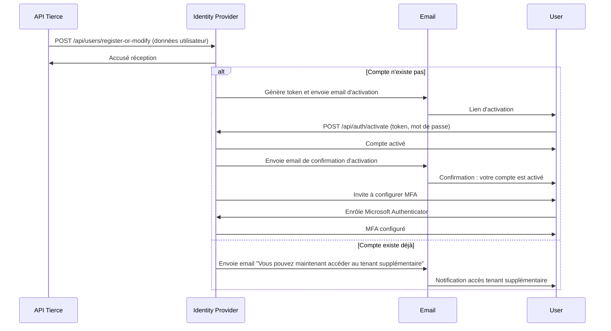
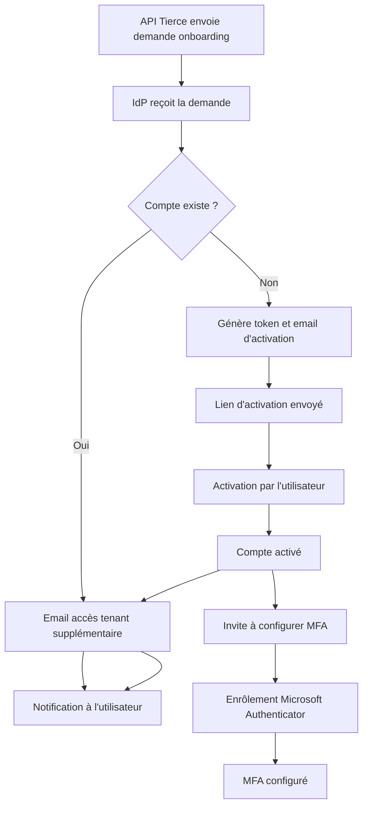
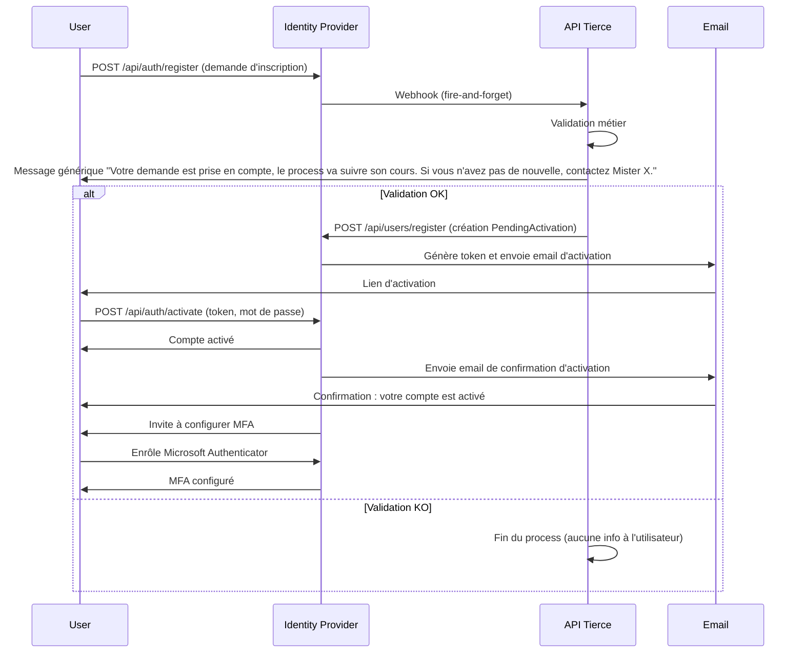
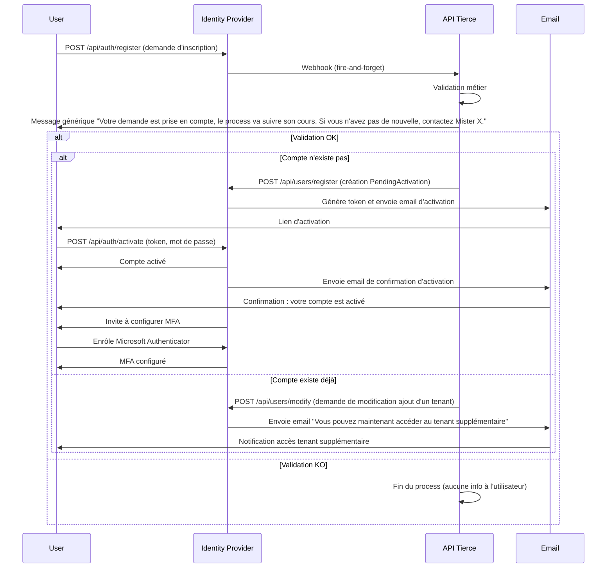
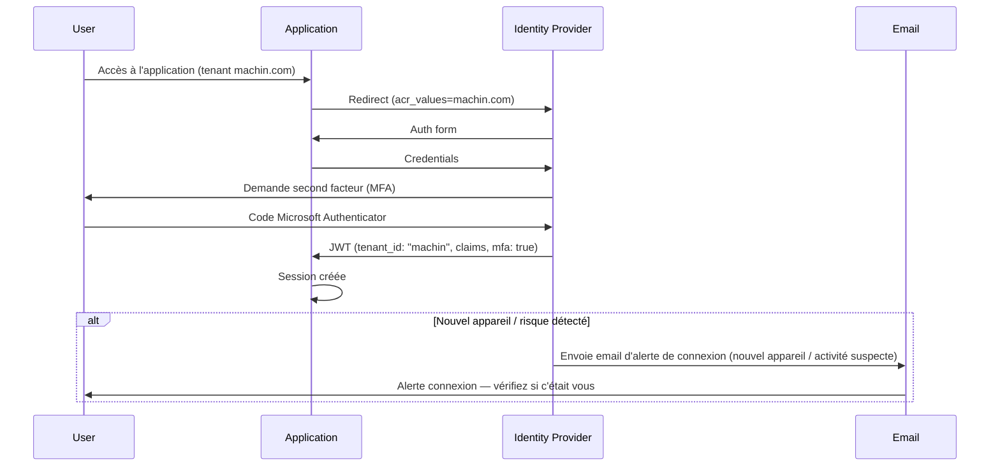
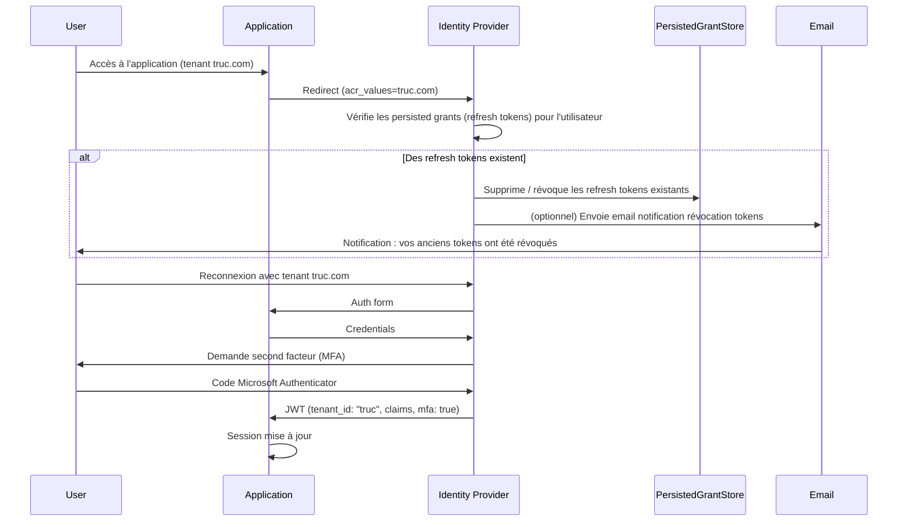
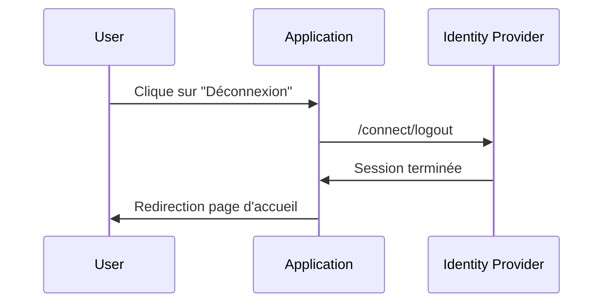
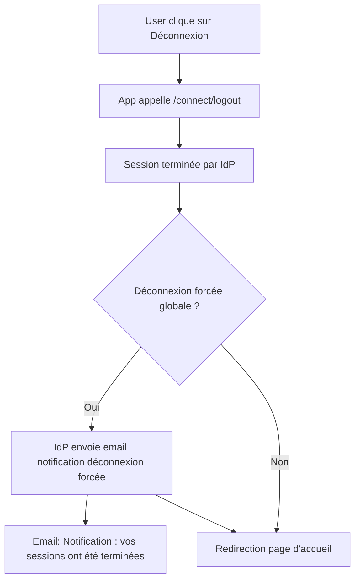
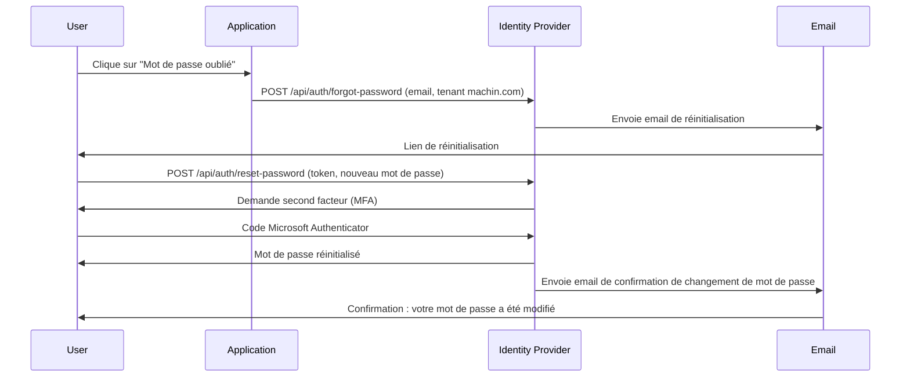
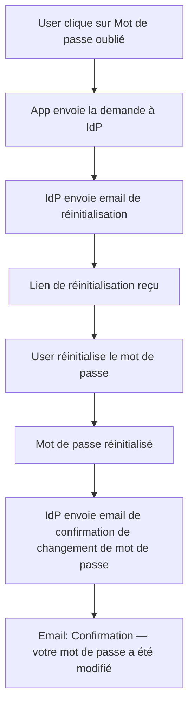

## 1c. Onboarding (création initiée par l'API tierce avec MFA)


### Diagramme de flux - Onboarding (création initiée par l'API tierce avec MFA)

# 🛠️ Identity Flows - Mermaid Diagrams (MFA)

Ce fichier illustre les mêmes use cases que précédemment, mais avec l'ajout d'un second facteur (MFA, ex : Microsoft Authenticator).

## 1. Onboarding (création de compte avec MFA)


## 1d. Onboarding alors que le compte existe déjà (MFA)


## 3. Connexion sur un tenant avec MFA


### Diagramme de flux - Connexion sur un tenant (MFA)
```mermaid
flowchart TD
    A[User accède à l'app] --> B[Redirect vers IdP avec acr_values]
    B --> C[Formulaire d'auth]
    C --> D[Envoi des credentials]
    D --> E[Demande second facteur (MFA)]
    E --> F[User fournit code MFA]
    F --> G[JWT avec tenant et claims, mfa=true]
    G --> H{Nouvel appareil / risque détecté ?}
    H -->|Oui| I[IdP envoie email d'alerte de connexion]
    I --> J[Email: Alerte connexion — vérifiez si c'était vous]
    J --> K[Session créée]
    H -->|Non| K[Session créée]
```

## 4. Connexion ensuite sur un autre tenant avec MFA


### Diagramme de flux - Connexion sur un autre tenant (MFA)
```mermaid
flowchart TD
    A[User accède à l'app truc.com] --> B[Redirect vers IdP avec acr_values]
    B --> C{Des refresh tokens existent ?}
    C -->|Oui| X[IdP supprime / révoque les refresh tokens existants]
    X --> Y[IdP (optionnel) envoie email de notification de révocation]
    Y --> D[Reconnexion avec tenant truc.com]
    C -->|Non| D[Reconnexion avec tenant truc.com]
    D --> E[Formulaire d'auth]
    E --> F[Envoi des credentials]
    F --> G[Demande second facteur (MFA)]
    G --> H[User fournit code MFA]
    H --> I[JWT avec tenant et claims, mfa=true]
    I --> J[Session mise à jour]
```

## 5. Déconnexion


### Diagramme de flux - Déconnexion (MFA)


## 6. Mot de passe oublié avec MFA


### Diagramme de flux - Mot de passe oublié (MFA)


> Note : Tous les flux incluent une étape MFA (Microsoft Authenticator) lors de l'authentification ou de la réinitialisation du mot de passe.