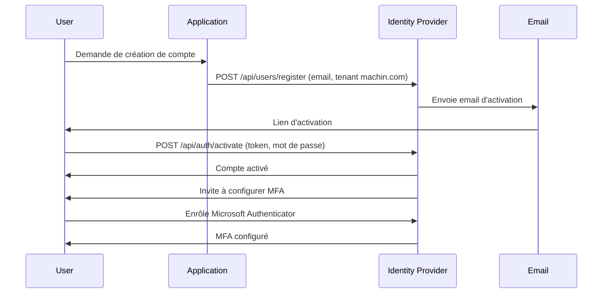
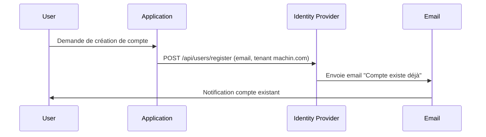
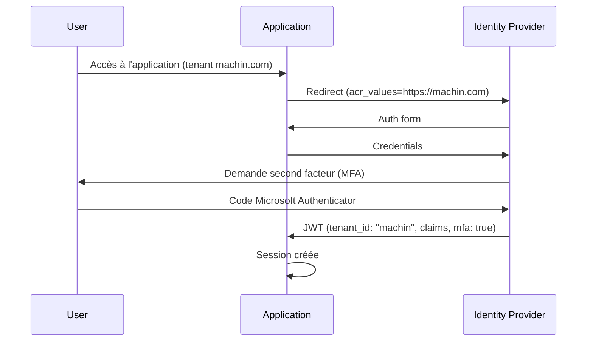
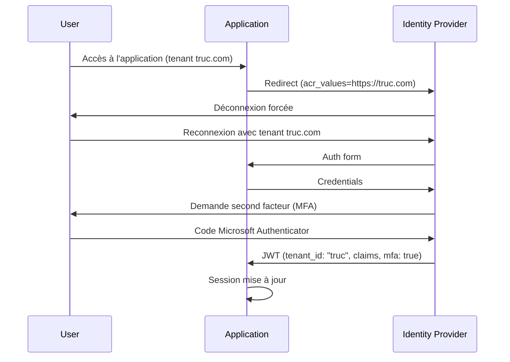
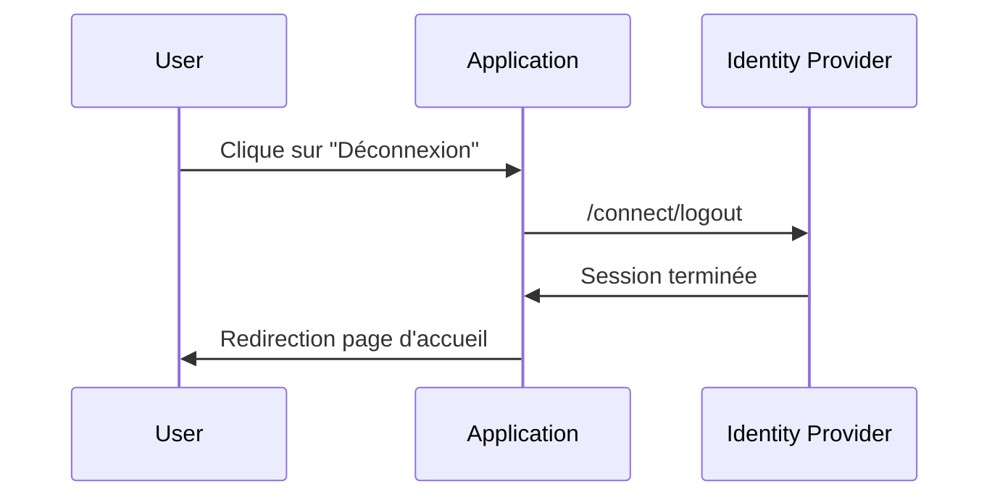
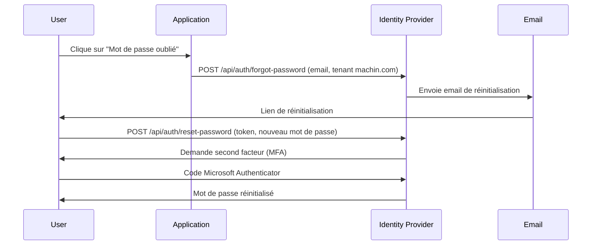

# 🛠️ Identity Flows - Mermaid Diagrams (MFA)

Ce fichier illustre les mêmes use cases que précédemment, mais avec l'ajout d'un second facteur (MFA, ex : Microsoft Authenticator).

## 1. Onboarding (création de compte avec MFA)

## 2. Onboarding alors que le compte existe déjà (MFA)

## 3. Connexion sur un tenant avec MFA

## 4. Connexion ensuite sur un autre tenant avec MFA

## 5. Déconnexion

## 6. Mot de passe oublié avec MFA

> Note : Tous les flux incluent une étape MFA (Microsoft Authenticator) lors de l'authentification ou de la réinitialisation du mot de passe.