## 1c. Onboarding (création initiée par l'API tierce avec MFA)

```mermaid
sequenceDiagram
    participant ApiTierce as API Tierce
    participant IdP as Identity Provider
    participant Email
    participant User

    ApiTierce->>IdP: POST /api/users/register-or-modify (données utilisateur)
    IdP->>ApiTierce: Accusé réception
    alt Compte n'existe pas
        IdP->>Email: Génère token et envoie email d'activation
        Email->>User: Lien d'activation
        User->>IdP: POST /api/auth/activate (token, mot de passe)
        IdP->>User: Compte activé
        IdP->>User: Invite à configurer MFA
        User->>IdP: Enrôle Microsoft Authenticator
        IdP->>User: MFA configuré
    else Compte existe déjà
        IdP->>Email: Envoie email "Vous pouvez maintenant accéder au tenant supplémentaire"
        Email->>User: Notification accès tenant supplémentaire
    end
```

### Diagramme de flux - Onboarding (création initiée par l'API tierce avec MFA)

```mermaid
flowchart TD
    A[API Tierce envoie demande onboarding] --> B[IdP reçoit la demande]
    B --> C{Compte existe ?}
    C -->|Non| D[Génère token et email d'activation]
    D --> E[Lien d'activation envoyé]
    E --> F[Activation par l'utilisateur]
    F --> G[Compte activé]
    G --> H[Invite à configurer MFA]
    H --> I[Enrôlement Microsoft Authenticator]
    I --> J[MFA configuré]
    C -->|Oui| K[Email accès tenant supplémentaire]
    K --> L[Notification à l'utilisateur]
```

# 🛠️ Identity Flows - Mermaid Diagrams (MFA)

Ce fichier illustre les mêmes use cases que précédemment, mais avec l'ajout d'un second facteur (MFA, ex : Microsoft Authenticator).

## 1. Onboarding (création de compte avec MFA)

```mermaid
sequenceDiagram
    participant User
    participant IdP as Identity Provider
    participant ApiTierce as API Tierce
    participant Email

    User->>IdP: POST /api/auth/register (demande d'inscription)
    IdP->>ApiTierce: Webhook (fire-and-forget)
    ApiTierce->>ApiTierce: Validation métier
    ApiTierce->>User: Message générique "Votre demande est prise en compte, le process va suivre son cours. Si vous n'avez pas de nouvelle, contactez Mister X."
    alt Validation OK
        ApiTierce->>IdP: POST /api/users/register (création PendingActivation)
        IdP->>Email: Génère token et envoie email d'activation
        Email->>User: Lien d'activation
        User->>IdP: POST /api/auth/activate (token, mot de passe)
        IdP->>User: Compte activé
        IdP->>User: Invite à configurer MFA
        User->>IdP: Enrôle Microsoft Authenticator
        IdP->>User: MFA configuré
    else Validation KO
        ApiTierce->>ApiTierce: Fin du process (aucune info à l'utilisateur)
    end
```

## 1d. Onboarding alors que le compte existe déjà (MFA)

```mermaid
sequenceDiagram
    participant User
    participant IdP as Identity Provider
    participant ApiTierce as API Tierce
    participant Email

    User->>IdP: POST /api/auth/register (demande d'inscription)
    IdP->>ApiTierce: Webhook (fire-and-forget)
    ApiTierce->>ApiTierce: Validation métier
    ApiTierce->>User: Message générique "Votre demande est prise en compte, le process va suivre son cours. Si vous n'avez pas de nouvelle, contactez Mister X."
    alt Validation OK
        alt Compte n'existe pas
            ApiTierce->>IdP: POST /api/users/register (création PendingActivation)
            IdP->>Email: Génère token et envoie email d'activation
            Email->>User: Lien d'activation
            User->>IdP: POST /api/auth/activate (token, mot de passe)
            IdP->>User: Compte activé
            IdP->>User: Invite à configurer MFA
            User->>IdP: Enrôle Microsoft Authenticator
            IdP->>User: MFA configuré
        else Compte existe déjà
            ApiTierce->>IdP: POST /api/users/modify (demande de modification ajout d'un tenant)
            IdP->>Email: Envoie email "Vous pouvez maintenant accéder au tenant supplémentaire"
            Email->>User: Notification accès tenant supplémentaire
        end
    else Validation KO
        ApiTierce->>ApiTierce: Fin du process (aucune info à l'utilisateur)
    end
```

## 3. Connexion sur un tenant avec MFA

## 4. Connexion ensuite sur un autre tenant avec MFA

```mermaid
sequenceDiagram
    participant User
    participant App as Application
    participant IdP as Identity Provider

    User->>App: Accès à l'application (tenant truc.com)
    App->>IdP: Redirect (acr_values=truc.com)
    IdP->>User: Déconnexion forcée
    User->>IdP: Reconnexion avec tenant truc.com
    IdP->>App: Auth form
    App->>IdP: Credentials
    IdP->>User: Demande second facteur (MFA)
    User->>IdP: Code Microsoft Authenticator
    IdP->>App: JWT (tenant_id: "truc", claims, mfa: true)
    App->>App: Session mise à jour
```

## 5. Déconnexion

```mermaid
sequenceDiagram
    participant User
    participant App as Application
    participant IdP as Identity Provider

    User->>App: Clique sur "Déconnexion"
    App->>IdP: /connect/logout
    IdP->>App: Session terminée
    App->>User: Redirection page d'accueil
```

## 6. Mot de passe oublié avec MFA

```mermaid
sequenceDiagram
    participant User
    participant App as Application
    participant IdP as Identity Provider
    participant Email

    User->>App: Clique sur "Mot de passe oublié"
    App->>IdP: POST /api/auth/forgot-password (email, tenant machin.com)
    IdP->>Email: Envoie email de réinitialisation
    Email->>User: Lien de réinitialisation
    User->>IdP: POST /api/auth/reset-password (token, nouveau mot de passe)
    IdP->>User: Demande second facteur (MFA)
    User->>IdP: Code Microsoft Authenticator
    IdP->>User: Mot de passe réinitialisé
```

> Note : Tous les flux incluent une étape MFA (Microsoft Authenticator) lors de l'authentification ou de la réinitialisation du mot de passe.