# Lecture des diagrammes de séquence

Avant d'explorer les diagrammes suivants, voici un court guide pour lire un diagramme de séquence Mermaid :

- **Participants** : en haut du diagramme, chaque acteur (`participant`) représente une entité (User, App, IdP, Email, etc.).
- **Flux temporel** : le temps s'écoule de haut en bas — les messages sont listés dans l'ordre où ils se produisent.
- **Messages** : une flèche `->>` indique l'envoi d'un message/requête entre participants. Le texte à droite décrit l'action (ex : `POST /api/auth/register`).
- **Blocs conditionnels** : `alt`, `else`, `end` représentent des branches conditionnelles (ex : `alt Validation OK / else Validation KO`).
- **Boucles / options** : `loop`, `opt` permettent d'exprimer des répétitions ou des blocs optionnels.
- **Notes et commentaires** : on peut ajouter des notes ou des commentaires pour clarifier un point métier.
- **Diagrammes de flux** : les `flowchart` après chaque séquence montrent la version simplifiée et conditionnelle du même scénario (décisions, actions principales, envois d'e-mails).

Conseils pratiques : lisez d'abord la séquence pour comprendre la chronologie détaillée, puis consulte le flowchart pour une vue synthétique et les décisions clés (ex : envoi d'e-mail, révocation de tokens).

# 🛠️ Identity Flows - Mermaid Diagrams

## 1. Onboarding (création de compte - compte n'existe pas)
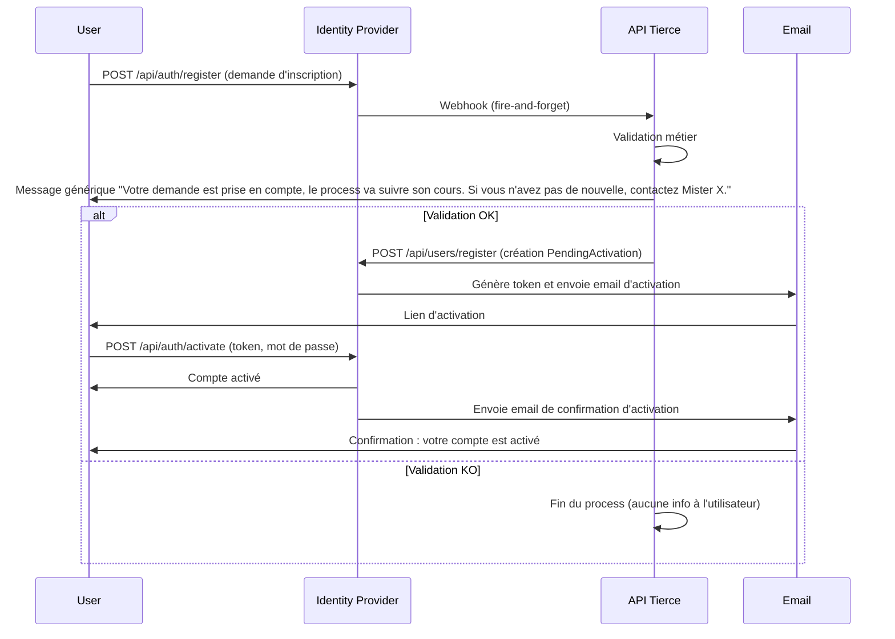

### Diagramme de flux - Onboarding (création de compte)
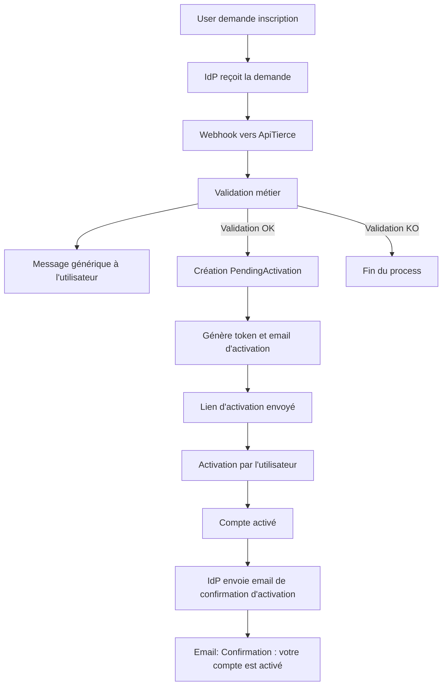

## 1b. Onboarding (modification de compte - compte existe déjà)
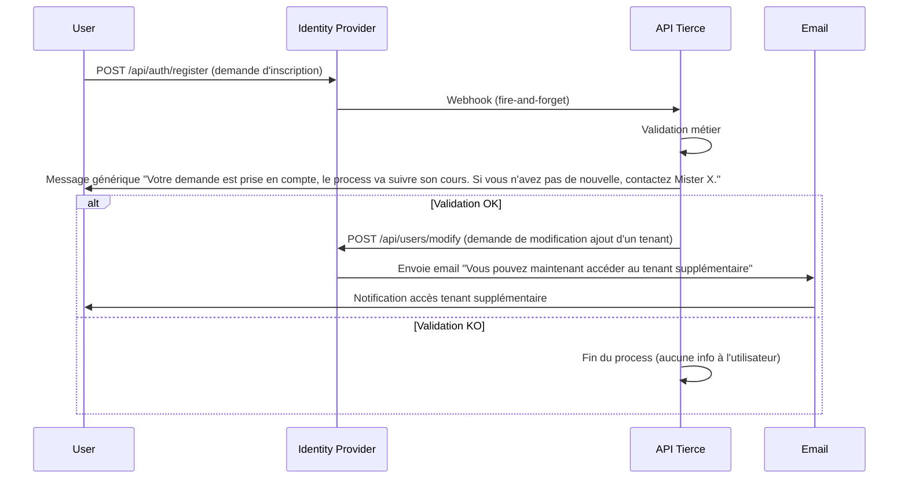

### Diagramme de flux - Onboarding (modification de compte)
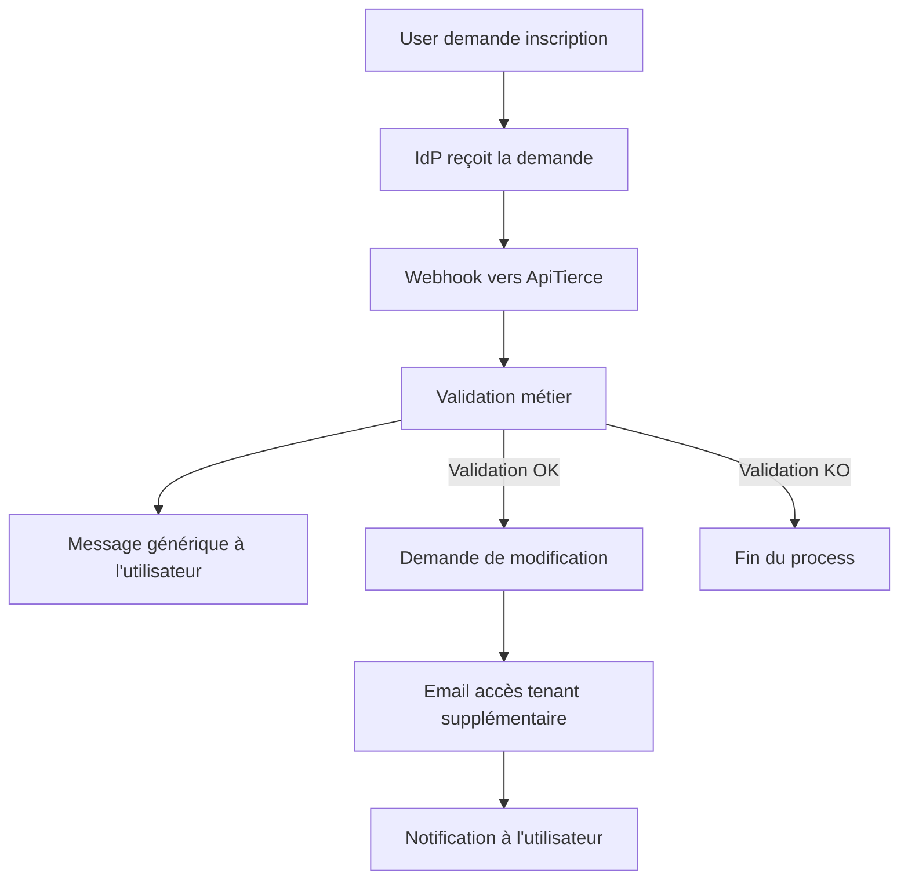

## 1c. Onboarding (création initiée par l'API tierce)
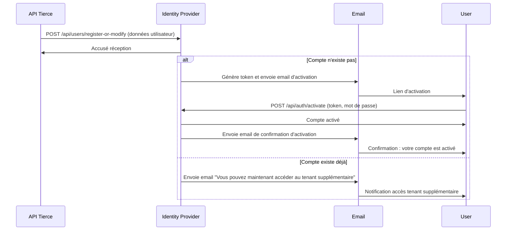

### Diagramme de flux - Onboarding (création initiée par l'API tierce)
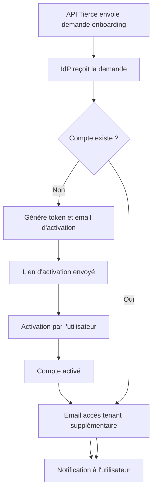
## 1d. Onboarding (création ou modification selon existence du compte, trop compliqué, à ne pas reprendre)
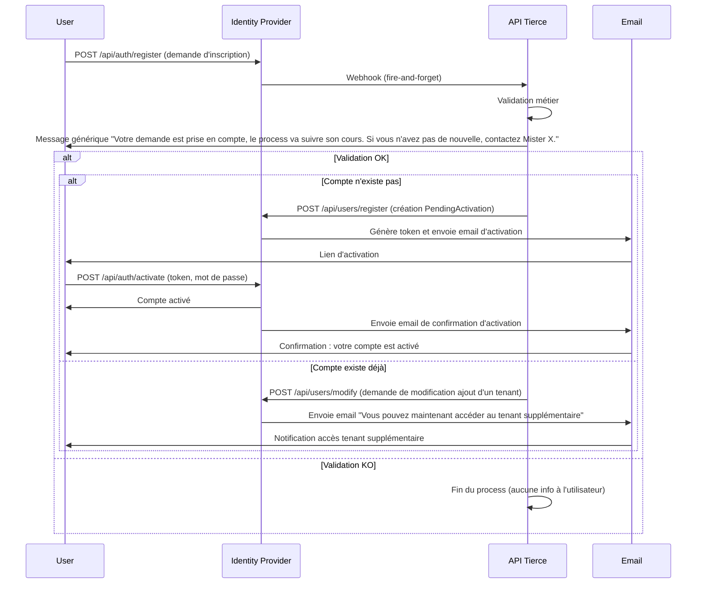

### Diagramme de flux - Onboarding (création ou modification)
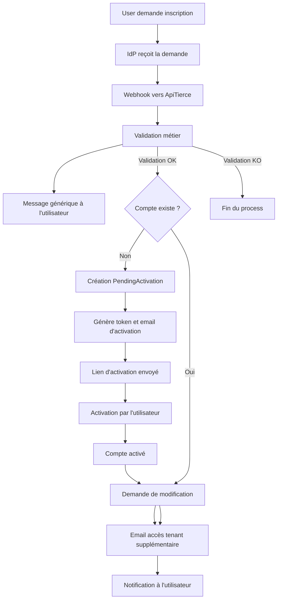


## 3. Connexion sur un tenant
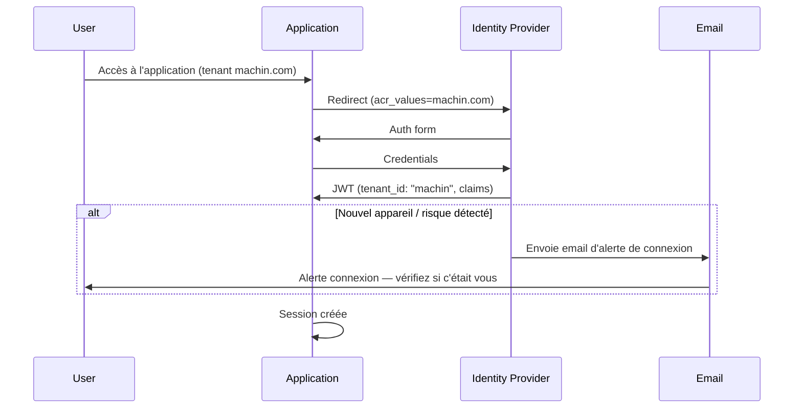

### Diagramme de flux - Connexion sur un tenant
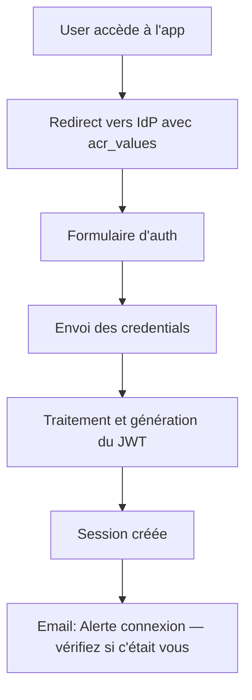

## 4. Connexion ensuite sur un autre tenant
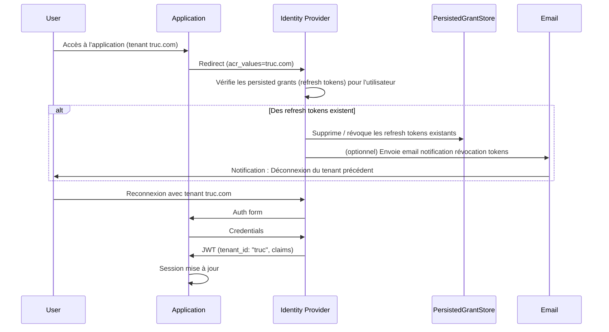

### Diagramme de flux - Connexion sur un autre tenant
```mermaid
flowchart TD
    A[User accède à l'app truc.com] --> B[Redirect vers IdP avec acr_values]
    B --> C{Des refresh tokens existent ?}
    C -->|Oui| X[IdP supprime / révoque les refresh tokens existants]
    X --> Y[IdP (optionnel) envoie email de notification de révocation]
    Y --> D[Reconnexion avec tenant truc.com]
    C -->|Non| D[Reconnexion avec tenant truc.com]
    D --> E[Formulaire d'auth]
    E --> F[Envoi des credentials]
    F --> G[JWT avec tenant et claims]
    G --> H[Session mise à jour]
```

## 5. Déconnexion
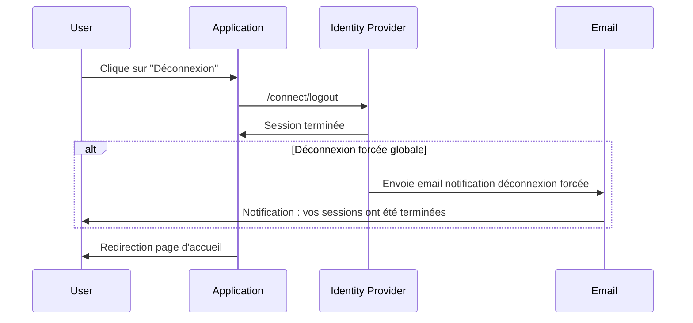

### Diagramme de flux - Déconnexion
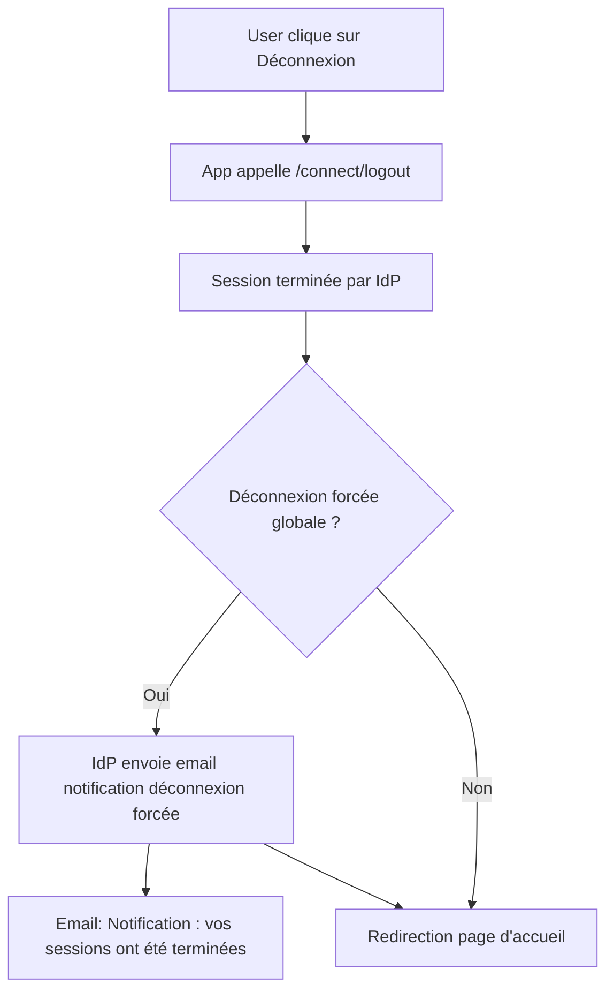

> Note : acr_values doit contenir la baseurl encodée en Punycode pour le domaine, et percent-encoding pour le chemin/query si nécessaire. Ici, les exemples utilisent machin.com et truc.com pour illustrer deux tenants.


## 6. Mot de passe oublié
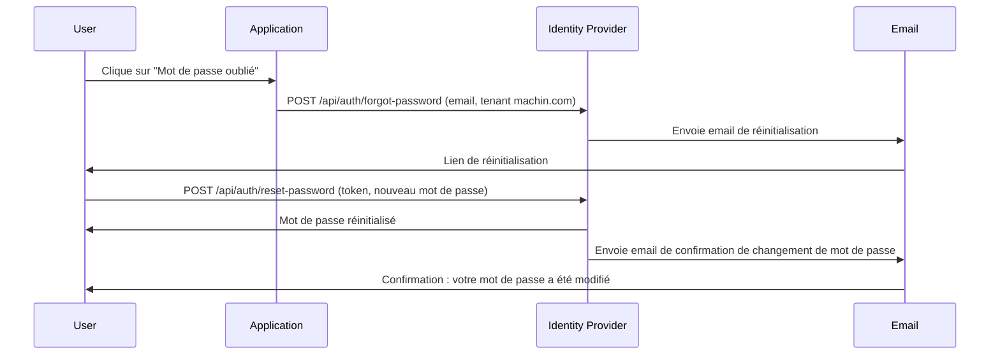

### Diagramme de flux - Mot de passe oublié
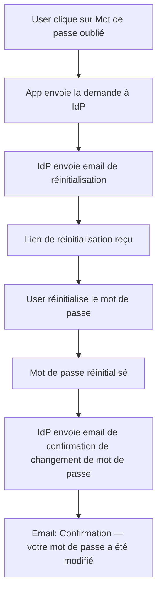
