## 6. Mot de passe oublié

```mermaid
sequenceDiagram
    participant User
    participant App as Application
    participant IdP as Identity Provider
    participant Email

    User->>App: Clique sur "Mot de passe oublié"
    App->>IdP: POST /api/auth/forgot-password (email, tenant machin.com)
    IdP->>Email: Envoie email de réinitialisation
    Email->>User: Lien de réinitialisation
    User->>IdP: POST /api/auth/reset-password (token, nouveau mot de passe)
    IdP->>User: Mot de passe réinitialisé
```

# 🛠️ Identity Flows - Mermaid Diagrams

## 📦 User Registration & Activation (Account Creation)

```mermaid
sequenceDiagram
    participant User
    participant AppTierce as App Tierce
    participant IdP as Identity Provider
    participant Email

    User->>AppTierce: Demande de création de compte
    AppTierce->>IdP: POST /api/users/register (avec email, tenant)
    alt Compte existe déjà
        IdP->>Email: Envoie email "Compte existe déjà"
        Email->>User: Notification compte existant
    else Compte doit exister
        IdP->>Email: Envoie email d'activation
        Email->>User: Lien d'activation
        User->>IdP: POST /api/auth/activate (token, mot de passe)
        IdP->>User: Compte activé
    end
```



## 🔄 Connexion Utilisateur & Changement de Tenant

```mermaid
sequenceDiagram
    participant User
    participant App as Application
    participant IdP as Identity Provider

    User->>App: Accès à l'application (tenant xn--caf-dma)
    App->>IdP: Redirection /connect/authorize?acr_values=tenant:xn--caf-dma
    alt Utilisateur déjà connecté à un autre tenant
        IdP->>User: Déconnexion forcée
        User->>IdP: Reconnexion avec tenant xn--caf-dma
    end
    IdP->>IdP: Vérifie accès au tenant xn--caf-dma
    alt Accès autorisé
        IdP->>User: Authentification réussie
    else Accès refusé
        IdP->>User: Refus de connexion
    end
```



## 🔐 Mot de Passe Oublié - Flux Principal


```mermaid
sequenceDiagram
    participant User
    participant IdP as Identity Provider
    participant Email

    User->>IdP: POST /api/auth/forgot-password (email, tenant)
    alt Email existe
        IdP->>Email: Envoie email de réinitialisation
        Email->>User: Lien de réinitialisation
        User->>IdP: POST /api/auth/reset-password (token, nouveau mot de passe)
        IdP->>User: Mot de passe réinitialisé


    # 🛠️ Identity Flows - Mermaid Diagrams

    ## 1. Onboarding (création de compte)
    ```mermaid
    sequenceDiagram
        participant User
        participant App as Application
        participant IdP as Identity Provider
        participant Email

        User->>App: Demande de création de compte
        App->>IdP: POST /api/users/register (email, tenant machin.com)
        IdP->>Email: Envoie email d'activation
        Email->>User: Lien d'activation
        User->>IdP: POST /api/auth/activate (token, mot de passe)
        IdP->>User: Compte activé
    ```

    ## 2. Onboarding alors que le compte existe déjà
    ```mermaid
    sequenceDiagram
        participant User
        participant App as Application
        participant IdP as Identity Provider
        participant Email

        User->>App: Demande de création de compte
        App->>IdP: POST /api/users/register (email, tenant machin.com)
        IdP->>Email: Envoie email "Compte existe déjà"
        Email->>User: Notification compte existant
    ```

    ## 3. Connexion sur un tenant
    ```mermaid
    sequenceDiagram
        participant User
        participant App as Application
        participant IdP as Identity Provider

        User->>App: Accès à l'application (tenant machin.com)
        App->>IdP: Redirect (acr_values=https://machin.com)
        IdP->>App: Auth form
        App->>IdP: Credentials
        IdP->>App: JWT (tenant_id: "machin", claims)
        App->>App: Session créée
    ```

    ## 4. Connexion ensuite sur un autre tenant
    ```mermaid
    sequenceDiagram
        participant User
        participant App as Application
        participant IdP as Identity Provider

        User->>App: Accès à l'application (tenant truc.com)
        App->>IdP: Redirect (acr_values=https://truc.com)
        IdP->>User: Déconnexion forcée
        User->>IdP: Reconnexion avec tenant truc.com
        IdP->>App: Auth form
        App->>IdP: Credentials
        IdP->>App: JWT (tenant_id: "truc", claims)
        App->>App: Session mise à jour
    ```

    ## 5. Déconnexion
    ```mermaid
    sequenceDiagram
        participant User
        participant App as Application
        participant IdP as Identity Provider

        User->>App: Clique sur "Déconnexion"
        App->>IdP: /connect/logout
        IdP->>App: Session terminée
        App->>User: Redirection page d'accueil
    ```

    > Note : acr_values doit contenir la baseurl encodée en Punycode pour le domaine, et percent-encoding pour le chemin/query si nécessaire. Ici, les exemples utilisent machin.com et truc.com pour illustrer deux tenants.
