# 🛠️ Identity Flows - Mermaid Diagrams

## 📦 User Registration & Activation (Account Creation)

```mermaid
sequenceDiagram
    participant User
    participant AppTierce as App Tierce
    participant IdP as Identity Provider
    participant Email

    User->>AppTierce: Demande de création de compte
    AppTierce->>IdP: POST /api/users/register (avec email, tenant)
    alt Compte existe déjà
        IdP->>Email: Envoie email "Compte existe déjà"
        Email->>User: Notification compte existant
    else Compte doit exister
        IdP->>Email: Envoie email d'activation
        Email->>User: Lien d'activation
        User->>IdP: POST /api/auth/activate (token, mot de passe)
        IdP->>User: Compte activé
    end
```



## 🔄 Connexion Utilisateur & Changement de Tenant

```mermaid
sequenceDiagram
    participant User
    participant App as Application
    participant IdP as Identity Provider

    User->>App: Accès à l'application (tenant xn--caf-dma)
    App->>IdP: Redirection /connect/authorize?acr_values=tenant:xn--caf-dma
    alt Utilisateur déjà connecté à un autre tenant
        IdP->>User: Déconnexion forcée
        User->>IdP: Reconnexion avec tenant xn--caf-dma
    end
    IdP->>IdP: Vérifie accès au tenant xn--caf-dma
    alt Accès autorisé
        IdP->>User: Authentification réussie
    else Accès refusé
        IdP->>User: Refus de connexion
    end
```



## 🔐 Mot de Passe Oublié - Flux Principal


```mermaid
sequenceDiagram
    participant User
    participant IdP as Identity Provider
    participant Email

    User->>IdP: POST /api/auth/forgot-password (email, tenant)
    alt Email existe
        IdP->>Email: Envoie email de réinitialisation
        Email->>User: Lien de réinitialisation
        User->>IdP: POST /api/auth/reset-password (token, nouveau mot de passe)
        IdP->>User: Mot de passe réinitialisé

```
# 🛠️ Identity Flows - Mermaid Diagrams

## 1. Onboarding (création de compte - compte n'existe pas)

```mermaid
sequenceDiagram
    participant User
    participant IdP as Identity Provider
    participant ApiTierce as API Tierce
    participant Email

    User->>IdP: POST /api/auth/register (demande d'inscription)
    IdP->>ApiTierce: Webhook (fire-and-forget)
    ApiTierce->>ApiTierce: Validation métier
    ApiTierce->>User: Message générique "Votre demande est prise en compte, le process va suivre son cours. Si vous n'avez pas de nouvelle, contactez Mister X."
    alt Validation OK
        ApiTierce->>IdP: POST /api/users/register (création PendingActivation)
        IdP->>Email: Génère token et envoie email d'activation
        Email->>User: Lien d'activation
        User->>IdP: POST /api/auth/activate (token, mot de passe)
        IdP->>User: Compte activé
    else Validation KO
        ApiTierce->>ApiTierce: Fin du process (aucune info à l'utilisateur)
    end
```


## 1b. Onboarding (modification de compte - compte existe déjà)

```mermaid
sequenceDiagram
    participant User
    participant IdP as Identity Provider
    participant ApiTierce as API Tierce
    participant Email

    User->>IdP: POST /api/auth/register (demande d'inscription)
    IdP->>ApiTierce: Webhook (fire-and-forget)
    ApiTierce->>ApiTierce: Validation métier
    ApiTierce->>User: Message générique "Votre demande est prise en compte, le process va suivre son cours. Si vous n'avez pas de nouvelle, contactez Mister X."
    alt Validation OK
        ApiTierce->>IdP: POST /api/users/modify (demande de modification ajout d'un tenant)
        IdP->>Email: Envoie email "Vous pouvez maintenant accéder au tenant supplémentaire"
        Email->>User: Notification accès tenant supplémentaire
    else Validation KO
        ApiTierce->>ApiTierce: Fin du process (aucune info à l'utilisateur)
    end
```



## 3. Connexion sur un tenant

```mermaid
sequenceDiagram
    participant User
    participant App as Application
    participant IdP as Identity Provider

    User->>App: Accès à l'application (tenant machin.com)
    App->>IdP: Redirect (acr_values=https://machin.com)
    IdP->>App: Auth form
    App->>IdP: Credentials
    IdP->>App: JWT (tenant_id: "machin", claims)
    App->>App: Session créée
```


## 4. Connexion ensuite sur un autre tenant

```mermaid
sequenceDiagram
    participant User
    participant App as Application
    participant IdP as Identity Provider

    User->>App: Accès à l'application (tenant truc.com)
    App->>IdP: Redirect (acr_values=https://truc.com)
    IdP->>User: Déconnexion forcée
    User->>IdP: Reconnexion avec tenant truc.com
    IdP->>App: Auth form
    App->>IdP: Credentials
    IdP->>App: JWT (tenant_id: "truc", claims)
    App->>App: Session mise à jour
```


## 5. Déconnexion

```mermaid
sequenceDiagram
    participant User
    participant App as Application
    participant IdP as Identity Provider

    User->>App: Clique sur "Déconnexion"
    App->>IdP: /connect/logout
    IdP->>App: Session terminée
    App->>User: Redirection page d'accueil
```


> Note : acr_values doit contenir la baseurl encodée en Punycode pour le domaine, et percent-encoding pour le chemin/query si nécessaire. Ici, les exemples utilisent machin.com et truc.com pour illustrer deux tenants.


## 6. Mot de passe oublié

```mermaid
sequenceDiagram
    participant User
    participant App as Application
    participant IdP as Identity Provider
    participant Email

    User->>App: Clique sur "Mot de passe oublié"
    App->>IdP: POST /api/auth/forgot-password (email, tenant machin.com)
    IdP->>Email: Envoie email de réinitialisation
    Email->>User: Lien de réinitialisation
    User->>IdP: POST /api/auth/reset-password (token, nouveau mot de passe)
    IdP->>User: Mot de passe réinitialisé
```
