# 🛠️ Identity Flows - Mermaid Diagrams

## 1. Onboarding (création de compte - compte n'existe pas)
```mermaid
sequenceDiagram
    participant User
    participant IdP as Identity Provider
    participant ApiTierce as API Tierce
    participant Email

    User->>IdP: POST /api/auth/register (demande d'inscription)
    IdP->>ApiTierce: Webhook (fire-and-forget)
    ApiTierce->>ApiTierce: Validation métier
    ApiTierce->>User: Message générique "Votre demande est prise en compte, le process va suivre son cours. Si vous n'avez pas de nouvelle, contactez Mister X."
    alt Validation OK
        ApiTierce->>IdP: POST /api/users/register (création PendingActivation)
        IdP->>Email: Génère token et envoie email d'activation
        Email->>User: Lien d'activation
        User->>IdP: POST /api/auth/activate (token, mot de passe)
        IdP->>User: Compte activé
    else Validation KO
        ApiTierce->>ApiTierce: Fin du process (aucune info à l'utilisateur)
    end
```

### Diagramme de flux - Onboarding (création de compte)
```mermaid
flowchart TD
    A[User demande inscription] --> B[IdP reçoit la demande]
    B --> C[Webhook vers ApiTierce]
    C --> D[Validation métier]
    D --> E[Message générique à l'utilisateur]
    D -->|Validation OK| F[Création PendingActivation]
    F --> G[Génère token et email d'activation]
    G --> H[Lien d'activation envoyé]
    H --> I[Activation par l'utilisateur]
    I --> J[Compte activé]
    D -->|Validation KO| K[Fin du process]
```

## 1b. Onboarding (modification de compte - compte existe déjà)
```mermaid
sequenceDiagram
    participant User
    participant IdP as Identity Provider
    participant ApiTierce as API Tierce
    participant Email

    User->>IdP: POST /api/auth/register (demande d'inscription)
    IdP->>ApiTierce: Webhook (fire-and-forget)
    ApiTierce->>ApiTierce: Validation métier
    ApiTierce->>User: Message générique "Votre demande est prise en compte, le process va suivre son cours. Si vous n'avez pas de nouvelle, contactez Mister X."
    alt Validation OK
        ApiTierce->>IdP: POST /api/users/modify (demande de modification ajout d'un tenant)
        IdP->>Email: Envoie email "Vous pouvez maintenant accéder au tenant supplémentaire"
        Email->>User: Notification accès tenant supplémentaire
    else Validation KO
        ApiTierce->>ApiTierce: Fin du process (aucune info à l'utilisateur)
    end
```

### Diagramme de flux - Onboarding (modification de compte)
```mermaid
flowchart TD
    A[User demande inscription] --> B[IdP reçoit la demande]
    B --> C[Webhook vers ApiTierce]
    C --> D[Validation métier]
    D --> E[Message générique à l'utilisateur]
    D -->|Validation OK| F[Demande de modification]
    F --> G[Email accès tenant supplémentaire]
    G --> H[Notification à l'utilisateur]
    D -->|Validation KO| I[Fin du process]
```

## 1c. Onboarding (création initiée par l'API tierce)
```mermaid
sequenceDiagram
    participant ApiTierce as API Tierce
    participant IdP as Identity Provider
    participant Email
    participant User

    ApiTierce->>IdP: POST /api/users/register-or-modify (données utilisateur)
    IdP->>ApiTierce: Accusé réception
    alt Compte n'existe pas
        IdP->>Email: Génère token et envoie email d'activation
        Email->>User: Lien d'activation
        User->>IdP: POST /api/auth/activate (token, mot de passe)
        IdP->>User: Compte activé
    else Compte existe déjà
        IdP->>Email: Envoie email "Vous pouvez maintenant accéder au tenant supplémentaire"
        Email->>User: Notification accès tenant supplémentaire
    end
```

### Diagramme de flux - Onboarding (création initiée par l'API tierce)
```mermaid
flowchart TD
    A[API Tierce envoie demande onboarding] --> B[IdP reçoit la demande]
    B --> C{Compte existe ?}
    C -->|Non| D[Génère token et email d'activation]
    D --> E[Lien d'activation envoyé]
    E --> F[Activation par l'utilisateur]
    F --> G[Compte activé]
    C -->|Oui| H[Email accès tenant supplémentaire]
    H --> I[Notification à l'utilisateur]
```
## 1d. Onboarding (création ou modification selon existence du compte, trop compliqué, à ne pas reprendre)
```mermaid
sequenceDiagram
    participant User
    participant IdP as Identity Provider
    participant ApiTierce as API Tierce
    participant Email

    User->>IdP: POST /api/auth/register (demande d'inscription)
    IdP->>ApiTierce: Webhook (fire-and-forget)
    ApiTierce->>ApiTierce: Validation métier
    ApiTierce->>User: Message générique "Votre demande est prise en compte, le process va suivre son cours. Si vous n'avez pas de nouvelle, contactez Mister X."
    alt Validation OK
        alt Compte n'existe pas
            ApiTierce->>IdP: POST /api/users/register (création PendingActivation)
            IdP->>Email: Génère token et envoie email d'activation
            Email->>User: Lien d'activation
            User->>IdP: POST /api/auth/activate (token, mot de passe)
            IdP->>User: Compte activé
        else Compte existe déjà
            ApiTierce->>IdP: POST /api/users/modify (demande de modification ajout d'un tenant)
            IdP->>Email: Envoie email "Vous pouvez maintenant accéder au tenant supplémentaire"
            Email->>User: Notification accès tenant supplémentaire
        end
    else Validation KO
        ApiTierce->>ApiTierce: Fin du process (aucune info à l'utilisateur)
    end
```

### Diagramme de flux - Onboarding (création ou modification)
```mermaid
flowchart TD
    A[User demande inscription] --> B[IdP reçoit la demande]
    B --> C[Webhook vers ApiTierce]
    C --> D[Validation métier]
    D --> E[Message générique à l'utilisateur]
    D -->|Validation OK| F{Compte existe ?}
    F -->|Non| G[Création PendingActivation]
    G --> H[Génère token et email d'activation]
    H --> I[Lien d'activation envoyé]
    I --> J[Activation par l'utilisateur]
    J --> K[Compte activé]
    F -->|Oui| L[Demande de modification]
    L --> M[Email accès tenant supplémentaire]
    M --> N[Notification à l'utilisateur]
    D -->|Validation KO| O[Fin du process]
```

## 3. Connexion sur un tenant
```mermaid
sequenceDiagram
    participant User
    participant App as Application
    participant IdP as Identity Provider

    User->>App: Accès à l'application (tenant machin.com)
    App->>IdP: Redirect (acr_values=machin.com)
    IdP->>App: Auth form
    App->>IdP: Credentials
    IdP->>App: JWT (tenant_id: "machin", claims)
    App->>App: Session créée
```

### Diagramme de flux - Connexion sur un tenant
```mermaid
flowchart TD
    A[User accède à l'app] --> B[Redirect vers IdP avec acr_values]
    B --> C[Formulaire d'auth]
    C --> D[Envoi des credentials]
    D --> E[JWT avec tenant et claims]
    E --> F[Session créée]
```

## 4. Connexion ensuite sur un autre tenant
```mermaid
sequenceDiagram
    participant User
    participant App as Application
    participant IdP as Identity Provider

    User->>App: Accès à l'application (tenant truc.com)
    App->>IdP: Redirect (acr_values=truc.com)
    IdP->>User: Déconnexion forcée
    User->>IdP: Reconnexion avec tenant truc.com
    IdP->>App: Auth form
    App->>IdP: Credentials
    IdP->>App: JWT (tenant_id: "truc", claims)
    App->>App: Session mise à jour
```

### Diagramme de flux - Connexion sur un autre tenant
```mermaid
flowchart TD
    A[User accède à l'app truc.com] --> B[Redirect vers IdP avec acr_values]
    B --> C[Déconnexion forcée]
    C --> D[Reconnexion avec tenant truc.com]
    D --> E[Formulaire d'auth]
    E --> F[Envoi des credentials]
    F --> G[JWT avec tenant et claims]
    G --> H[Session mise à jour]
```

## 5. Déconnexion
```mermaid
sequenceDiagram
    participant User
    participant App as Application
    participant IdP as Identity Provider

    User->>App: Clique sur "Déconnexion"
    App->>IdP: /connect/logout
    IdP->>App: Session terminée
    App->>User: Redirection page d'accueil
```

### Diagramme de flux - Déconnexion
```mermaid
flowchart TD
    A[User clique sur Déconnexion] --> B[App appelle /connect/logout]
    B --> C[Session terminée par IdP]
    C --> D[Redirection page d'accueil]
```

> Note : acr_values doit contenir la baseurl encodée en Punycode pour le domaine, et percent-encoding pour le chemin/query si nécessaire. Ici, les exemples utilisent machin.com et truc.com pour illustrer deux tenants.

## 6. Mot de passe oublié
```mermaid
sequenceDiagram
    participant User
    participant App as Application
    participant IdP as Identity Provider
    participant Email

    User->>App: Clique sur "Mot de passe oublié"
    App->>IdP: POST /api/auth/forgot-password (email, tenant machin.com)
    IdP->>Email: Envoie email de réinitialisation
    Email->>User: Lien de réinitialisation
    User->>IdP: POST /api/auth/reset-password (token, nouveau mot de passe)
    IdP->>User: Mot de passe réinitialisé
```

### Diagramme de flux - Mot de passe oublié
```mermaid
flowchart TD
    A[User clique sur Mot de passe oublié] --> B[App envoie la demande à IdP]
    B --> C[IdP envoie email de réinitialisation]
    C --> D[Lien de réinitialisation reçu]
    D --> E[User réinitialise le mot de passe]
    E --> F[Mot de passe réinitialisé]
```
